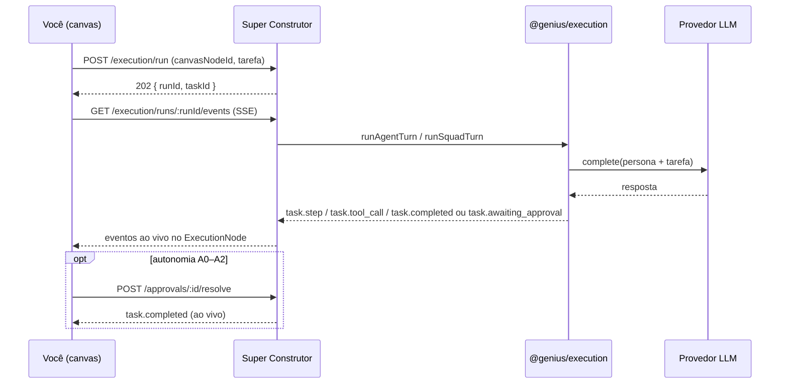

# GeniusAI

Repositório-guarda-chuva com os projetos do GeniusAI. Cada projeto vive na sua própria pasta, com seu próprio `package.json`, README e histórico.

> **Para onde tudo converge:** o [PRD — Genius Allspark](docs/PRD-genius-allspark.md)
> descreve o produto unificado que funde os três projetos deste repositório
> (SO-IA, Foresight, Civilizations) com Hermes Agent, OmniRift e os conceitos
> do Nirvana-OS — regido por quatro leis: nada existe sem o organograma,
> nenhuma missão sem ensaio, nenhum resultado sem recibo, e autonomia se
> conquista, não se configura.
>
> **Como construir, agora:** o
> [Guia de Construção](docs/PRD-genius-allspark-construcao.md) é o plano
> literal — Motor do Canvas, Hub de Provedores LLM, Biblioteca de Agentes &
> Squads, Super Construtor (Companies/Squads/Agents/Mind-Clones/Packs) e
> Motor de Aprendizado com memória indexada — cada etapa com o código
> existente a reaproveitar e um prompt pronto para uma IA construir agora.
> O [PRD de Execução](docs/PRD-genius-allspark-execucao.md) mantém a visão em
> fases mais amplas como contexto complementar.

## Genius Allspark Canvas

> **Quer só ver funcionando?** O
> [Guia de Início Rápido](docs/GUIA-DE-INICIO-RAPIDO.md) tem um vídeo de
> 30 segundos, screenshots passo a passo e o comando de uma linha
> (`npx github:marciobisognin/GeniusAI`) para rodar tudo sem precisar ler
> o resto desta seção.

O monorepo `packages/*` + `apps/*` na raiz é o código do Canvas em si,
seguindo o [Guia de Construção](docs/PRD-genius-allspark-construcao.md) —
**as sete etapas do guia estão completas**, incluindo a Etapa 7 (prova de
integração ponta a ponta, veja a seção dedicada mais abaixo):

| Pacote | Etapa | O que é |
|---|---|---|
| [`packages/canon`](packages/canon/) | 0/1/2/3 | Schemas Zod compartilhados (Agent, Squad, Company, MindClone, Pack, ProviderConfig, LearningFlow, MemoryChunk, Task, Run, Approval, CanvasNode, CanvasEdge) + catálogo de eventos |
| [`packages/providers`](packages/providers/) | 2 | Hub de Provedores LLM: `LLMProviderAdapter` + adapters reais para Anthropic, OpenAI (ChatGPT), Codex (CLI), Ollama e endpoints OpenAI-compatíveis (OpenRouter/vLLM/LM Studio) — generaliza o `AgentRunner` que já existia em `geniusai-civilizations` |
| [`packages/agent-library`](packages/agent-library/) | 3 | Biblioteca de Agentes & Squads: importadores puros (sem executar código de outro projeto) que leem, via AST do TypeScript, os catálogos reais de `so-ia` (12 agentes + 7 squads), `geniusai-foresight` (8 agentes YAML) e `geniusai-civilizations` (4 perfis de civilização) |
| [`packages/execution`](packages/execution/) | 5/6 | Motor de Execução: monta a persona do Agent num prompt de sistema (com contexto de memória indexada opcional, Etapa 6), chama o `LLMProviderAdapter` configurado, decompõe a tarefa entre os membros de um Squad com o líder consolidando, e usa a autonomia (A0–A5) do Agent/líder como gatilho honesto de aprovação humana (A0–A2 sempre pausam) |
| [`packages/learning`](packages/learning/) | 6 | Motor de Aprendizado + Memória Indexada: generaliza uma execução aprovada num `LearningFlow` reutilizável (via LLM), propõe promoção de `Skill` formal quando um padrão se repete N vezes para o mesmo agente, e indexa tudo num índice vetorial local (`vectra`) pesquisável por significado — embedding local por hashing trick, sem depender de nenhuma API externa |
| [`packages/constructor`](packages/constructor/) | 0/1/2/3/4/5/6 | Super Construtor v0: banco SQLite real, CRUD para as treze entidades do canon, `POST /providers/:id/health-check`, `POST /library/import`, "reaproveitar ou criar" (`/agents/match`, `/squads/match` — porte fiel do algoritmo de `so-ia/src/lib/org/matching.ts`), Packs (exportar/importar Company, mais a pasta `packs/` observada), o Motor de Execução (`POST /execution/run`, SSE em `GET /execution/runs/:id/events`, `POST /approvals/:id/resolve`) e o Motor de Aprendizado (toda aprovação gera um `LearningFlow` automaticamente, `GET /memory/search`) |
| [`apps/canvas`](apps/canvas/) | 1/2/3/4/5/6 | O Motor do Canvas Infinito, os painéis "Provedores", "Biblioteca" e **"Memória"** (busca semântica com procedência), a tela **Super Construtor** (montar Company → Squad → Agent com formulários guiados que sugerem reaproveitar antes de criar, mais o wizard de Mind-Clone) e o botão **▶ Executar** em qualquer AgentNode/SquadNode, com o `ExecutionNode` mostrando os passos reais ao vivo (SSE) — incluindo quando o contexto de memória de execuções aprovadas anteriores é injetado — até concluir ou pedir aprovação humana |

Rodar localmente — o jeito mais rápido, via `npx` (instala, compila e liga
os dois servidores sozinho; veja o
[Guia de Início Rápido](docs/GUIA-DE-INICIO-RAPIDO.md) para o passo a
passo visual):

```bash
npx github:marciobisognin/GeniusAI    # direto do GitHub, sem clonar
# ou, já com o repositório clonado:
npx .
```

Ou manualmente, passo a passo:

```bash
npm install
npm run build && npm run test             # todos os workspaces
node packages/constructor/dist/start.js   # Super Construtor em :4001
npm run dev -w apps/canvas                # Canvas em :5173
```

Abra `http://localhost:5173` com o Super Construtor rodando: o badge no
canto superior esquerdo mostra "conectado"; `⌘K`/`Ctrl+K` abre a paleta de
comandos para criar um nó ou buscar um existente pelo nome.

### Como executar uma tarefa de verdade (Etapa 5)

1. Abra **Provedores** e cadastre pelo menos um (ex.: `tipo: ollama`,
   `baseUrl: http://localhost:11434`) — "Testar conexão" chama o adapter de
   verdade no servidor, nunca no navegador.
2. Abra **Biblioteca**, clique em "Importar da Biblioteca" e arraste um
   agente ou squad real para o canvas.
3. No nó criado, escolha o provedor no seletor.
4. Digite uma tarefa em linguagem natural no campo abaixo do nó e clique em
   **▶**.
5. Um `ExecutionNode` novo aparece, ligado ao nó de origem por uma seta, e
   mostra os passos reais ao vivo (via SSE) enquanto o motor:
   - monta a persona do Agent (ou decompõe a tarefa entre os membros do
     Squad, com o líder consolidando) e chama o provedor configurado;
   - conclui direto se a autonomia (do Agent, ou do líder do Squad) for
     **A3+**;
   - pausa em **"Aguardando aprovação"** se for **A0–A2** — os botões
     "Aprovar"/"Rejeitar" aparecem no próprio nó, e a decisão humana
     chega ao vivo pelo mesmo SSE.



### Como o sistema aprende sozinho (Etapa 6)

Toda vez que um humano **aprova** uma execução, o sistema vira isso em
aprendizado reutilizável — sem esperar nenhum comando extra:

| Passo | O que acontece |
|---|---|
| 1. Aprovação | Você clica "Aprovar" num `ExecutionNode` (A0–A2). |
| 2. Generalização | O motor pede ao mesmo provedor LLM para resumir a execução num procedimento reutilizável (`LearningFlow`: padrão da tarefa, passos generalizados, tags). |
| 3. Indexação | O resultado é fatiado e indexado num índice vetorial local (`vectra`) — pesquisável por significado, não só por palavra-chave exata. |
| 4. Promoção de Skill | Se o mesmo padrão se repete (mesmo agente, mesma tag) três vezes ou mais, uma `Skill` formal nasce sozinha na Biblioteca, com `origem: "gerada"`. |
| 5. Próxima execução | Antes de rodar uma tarefa nova, o motor busca os trechos mais relevantes na memória e injeta como contexto — visível no log como `Memória: N trecho(s) relevante(s)... injetado(s)`. |

O aprendizado não acontece mais em silêncio: ao aprovar, um aviso no canto
do canvas conta o que foi registrado ("✦ Aprendizado registrado: ...") — e
quando um padrão se repete o suficiente, o aviso de skill promovida também
aparece na hora.

Para ver isso ao vivo: rode a mesma tarefa duas vezes seguidas (aprovando a
primeira). Na segunda vez, o `ExecutionNode` mostra a linha de "Memória:"
logo no início — o sistema literalmente ficou melhor depois da primeira
aprovação. O painel **Memória** (botão no topo do canvas) deixa buscar por
significado em qualquer momento, mostrando de qual execução/aprovação cada
resultado veio.

> **Primeiro contato:** com o canvas vazio, o centro da tela mostra os três
> primeiros passos (provedor → biblioteca → arrastar e executar) com botões
> que abrem os painéis certos — o guia some sozinho quando o primeiro nó
> nasce.

### Etapa 7 — Integração ponta a ponta (comprovada)

A Etapa 7 não adiciona código novo: ela **prova que as seis etapas
anteriores formam um sistema, não seis protótipos soltos** — rodando o
roteiro de aceitação do [Guia de Construção](docs/PRD-genius-allspark-construcao.md#etapa-7--integração-ponta-a-ponta)
do início ao fim, num navegador real, contra servidores reais, num banco
zerado, sem nenhuma intervenção manual no banco de dados.

| # | Passo do roteiro | Resultado |
|---|---|---|
| 1 | Abrir o canvas vazio | ✅ banco novo, 0 nós |
| 2 | Configurar um provedor Ollama local **e** um provedor cloud no Hub | ✅ os dois cadastrados e "Testar conexão" confirmou os dois saudáveis (chamada real ao adapter) |
| 3 | Importar a Biblioteca | ✅ agentes do so-ia e do foresight disponíveis |
| 4 | Pelo Super Construtor, montar uma Company nova com um Squad reaproveitando um agente da Biblioteca e criando um Mind-Clone novo | ✅ "Squad de Orçamento e Finanças" reaproveitado, "Agente de Atesto de Nota Fiscal" reaproveitado dentro dele, Mind-Clone "Maria Consultora" criado |
| 5 | Arrastar o Squad para o canvas, rodar uma tarefa real | ✅ squad decompôs a tarefa entre os membros e o líder consolidou, chamando o provedor de verdade |
| 6 | Aprovar o resultado | ✅ execução pausou em "Aguardando aprovação" (líder A2) e concluiu ao vivo após aprovar |
| 7 | Ver o Learning Flow gerado e indexado na Memória | ✅ `LearningFlow` real gerado; painel Memória encontrou-o por busca semântica |
| 8 | Rodar uma segunda tarefa parecida e confirmar que o contexto de memória da primeira aparece | ✅ log da segunda execução mostrou "Memória: 1 trecho(s)..." antes de chamar o provedor |
| 9 | Exportar a Company como Pack; importar em ambiente limpo; confirmar equivalência | ✅ Pack exportado contém squad+agente; reimportado numa Company "Ambiente Limpo" nova, com o mesmo squad/agente vinculados |

**16/16 verificações passaram, zero erros de console/página.** Os nove
passos do roteiro rodaram em sequência, sem intervenção manual no banco —
pelo critério do próprio guia, o Genius Allspark Canvas existe de fato.

## Projetos

- **[`geniusai-civilizations/`](geniusai-civilizations/)** — *Watchable AI*: simulação onde civilizações (Roma, Egito, Grécia, Mali) são governadas por agentes autônomos acionados por um CLI de agente (Claude Code / Codex / opencode) ou Ollama, observável em tempo real via uma UI local. Veja o [README do projeto](geniusai-civilizations/README.md) e o [PRD](geniusai-civilizations/docs/PRD-watchable-ai-civilizations.md).
- **[`geniusai-foresight/`](geniusai-foresight/)** — *Strategic Foresight*: squad científico para simulação prospectiva de países, instituições e mercados, com células adaptativas de agentes, evidências point-in-time, Teoria dos Jogos, cenários estocásticos e replay auditável. Veja o [README](geniusai-foresight/README.md) e o [PRD](geniusai-foresight/PRD.md).
- **[`so-ia/`](so-ia/)** — *SO-IA*: front-end premium do Sistema Operacional de IA para empresas privadas e o setor público brasileiro (Modo Empresa / Modo Governo) — Centro de Comando, catálogo de Agentes & Skills, workflows com segregação de funções e caixa de aprovações human-in-the-loop. Veja o [README do projeto](so-ia/README.md) e o [PRD](so-ia/docs/PRD-so-ia-v2.md).

## Licença

MIT — ver [`LICENSE`](LICENSE). Aplica-se a todo o repositório, salvo indicação em contrário dentro de um projeto específico.
