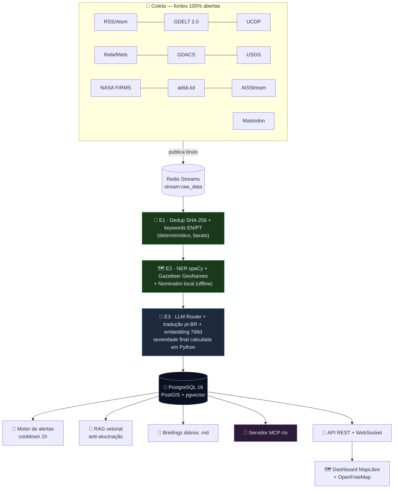

<div align="center">

# 🛰️ ARGUS
### Monitoramento Geopolítico Global — GEOINT/OSINT 100% local

**Coleta → Filtra → Geolocaliza → Analisa → Visualiza** eventos geopolíticos
globais em tempo quase real, usando só **APIs abertas, dados públicos e
software open-source**.

[](#stack-tecnico)
[](#stack-tecnico)
[](#stack-tecnico)
[](#stack-tecnico)
[](#subindo-o-sistema)
[](#mcp-llms)
[](../LICENSE)

*Implementação completa do PRD "Sistema de Monitoramento Geopolítico Global".*
*Projeto independente — não usa nada dos demais projetos deste repositório.*

</div>

---

<a id="sumario"></a>
## 📖 Sumário

- [🎯 O que é o ARGUS](#o-que-e-o-argus)
- [🏗️ Arquitetura](#arquitetura)
- [🧰 Stack técnico](#stack-tecnico)
- [📡 Fontes de dados](#fontes-de-dados)
- [🚀 Subindo o sistema](#subindo-o-sistema)
- [🧠 Perfis de LLM](#perfis-de-llm)
- [🔌 API e endpoints](#api-e-endpoints)
- [🤖 Usando com LLMs de codificação (MCP)](#mcp-llms)
- [⚖️ Regras determinísticas](#regras-deterministicas)
- [🧪 Testes](#testes)
- [⚠️ Limitações conhecidas](#limitacoes-conhecidas)

---

<a id="o-que-e-o-argus"></a>
## 🎯 O que é o ARGUS

| | |
|---|---|
| 🌍 **Local-first** | Roda inteiro em uma máquina via Docker Compose. Nuvem é opcional. |
| 🧮 **Determinístico antes de caro** | Dedup + geocodificação filtram ruído *antes* de qualquer LLM. |
| 🕵️ **Fato vs. inferência** | Todo evento carrega `confidence`, `geo_confidence` e `is_inference` estruturados — não é prosa, é dado consultável. |
| 🌐 **Sempre em pt-BR** | Título e resumo de **toda** notícia — venha de onde vier, em qualquer idioma — chegam traduzidos para português do Brasil, com o original preservado. |
| 🔗 **Sempre rastreável** | Todo evento carrega o link de acesso à fonte original. |
| 💥 **Falha isolada** | Um collector ou provedor de LLM fora do ar não derruba o pipeline (dead-letter no Redis Streams). |

<br/>



> 💡 **Por que é barato:** os estágios **E1** e **E2** são 100% determinísticos
> (sem LLM) e descartam a maior parte do ruído *antes* de qualquer chamada de
> modelo. A LLM só processa o que sobreviveu ao dedup e ao filtro de
> palavras-chave — é isso que torna o custo viável em alto volume.

---

<a id="arquitetura"></a>
## 🏗️ Arquitetura

<table>
<tr><th>Camada</th><th>Responsabilidade</th></tr>
<tr><td><b>Coleta</b></td><td>7 collectors assíncronos cobrindo as 10 fontes abertas, cada um com <code>User-Agent</code> identificável, timeout e retry (<code>tenacity</code>)</td></tr>
<tr><td><b>Fila</b></td><td>Redis Streams com consumer groups, <code>XAUTOCLAIM</code> e dead-letter após 3 falhas</td></tr>
<tr><td><b>Pipeline</b></td><td>3 estágios (E1 dedup → E2 geo → E3 LLM), cada um podendo rodar isoladamente</td></tr>
<tr><td><b>Persistência</b></td><td>PostgreSQL com PostGIS (espacial) e pgvector (semântico), índices GiST/HNSW</td></tr>
<tr><td><b>Análise</b></td><td>Motor de alertas, RAG vetorial, briefings diários, servidor MCP</td></tr>
<tr><td><b>Apresentação</b></td><td>API REST + WebSocket + dashboard MapLibre (PWA offline-first)</td></tr>
</table>

---

<a id="stack-tecnico"></a>
## 🧰 Stack técnico

| Camada | Tecnologia |
|--------|------------|
| API/Backend | FastAPI + Uvicorn + Pydantic-Settings |
| Banco | PostgreSQL 16 + PostGIS (espacial) + pgvector (768d, HNSW) |
| Fila | Redis 7 Streams (consumer groups, XAUTOCLAIM, dead-letter) |
| ORM/Migrações | SQLAlchemy async + asyncpg + Alembic |
| NER | spaCy (`en_core_web_sm`, `pt_core_news_sm`) |
| Geocodificação | Gazetteer GeoNames offline + Nominatim self-hosted |
| LLM local | Ollama (`llama3.1:8b` + `nomic-embed-text`) |
| Mapa | MapLibre GL JS + tiles OpenFreeMap (sem chave) |
| MCP | FastMCP (SDK oficial), transporte stdio |

---

<a id="fontes-de-dados"></a>
## 📡 Fontes de dados (todas abertas)

| Fonte | Domínio | Chave? | Degradação sem chave |
|-------|---------|:------:|-----------------------|
| RSS/Atom (Reuters, AP, Defense News…) | 📰 Notícias | ❌ | — |
| GDELT 2.0 DOC/GEO | 🌐 Eventos globais | ❌ | — |
| UCDP (CC-BY) | ⚔️ Conflito armado | ❌ | — |
| ReliefWeb (UN OCHA) | 🏥 Crises humanitárias | ❌ | — |
| GDACS | 🌪️ Desastres | ❌ | — |
| USGS | 🌋 Sismos | ❌ | — |
| NASA FIRMS | 🔥 Anomalias térmicas | ✅ | Collector pulado (0 itens) |
| adsb.lol | ✈️ Aéreo (inclui militares) | ❌ | — |
| AISStream | 🚢 Naval (AIS) | ✅ | Modo **mock** (posições simuladas) |
| Mastodon | 💬 Social OSINT | ❌ | — |

> 🛡️ Sem uma chave opcional, o collector correspondente **degrada
> graciosamente** em vez de falhar — o sistema continua funcional.

---

<a id="subindo-o-sistema"></a>
## 🚀 Subindo o sistema (passo a passo)

### ✅ Passo 1 — Infraestrutura

```bash
cd argus
cp .env.example .env          # ajuste chaves opcionais se tiver
docker compose up -d          # Postgres+PostGIS+pgvector, Redis, Ollama, Nominatim
```

### ✅ Passo 2 — Modelos locais do Ollama

```bash
docker compose exec ollama ollama pull llama3.1:8b
docker compose exec ollama ollama pull nomic-embed-text
```

### ✅ Passo 3 — Banco e dados de apoio

```bash
python -m venv .venv && source .venv/bin/activate
pip install -e ".[dev]"
python -m spacy download en_core_web_sm && python -m spacy download pt_core_news_sm
alembic upgrade head                      # extensões + tabelas + índices
python scripts/build_gazetteer.py         # GeoNames offline (cities1000 + estreitos/golfos)
```

> 📌 Sem rodar o `build_gazetteer.py`, o sistema usa um seed embutido com as
> principais cidades e chokepoints (Hormuz, Malaca, Bósforo, Suez…).

### ✅ Passo 4 — Rodar

```bash
uvicorn backend.app.main:app --reload     # API + dashboard + agendador
python -m backend.app.queue.workers       # workers do pipeline (outro terminal)
```

🌐 Abra **http://localhost:8000** — mapa com clustering, heatmap, time-slider,
trilhas AIS/ADS-B, feed ao vivo via WebSocket e seletor de perfil LLM.

<details>
<summary>📋 Checklist rápido de verificação (clique para expandir)</summary>

```bash
curl http://localhost:8000/health            # {"status":"ok"}
curl http://localhost:8000/health/deep       # postgres + redis "ok"
docker compose exec postgres psql -U argus -d argus \
  -c "SELECT extversion FROM pg_available_extensions WHERE name IN ('postgis','vector');"
pytest -q                                     # 41 testes (sem serviços externos)
```
</details>

---

<a id="perfis-de-llm"></a>
## 🧠 Perfis de LLM

| Perfil | Comportamento | Custo |
|--------|---------------|:-----:|
| `LOCAL_ONLY` 🟢 *(padrão)* | Só Ollama. Falha local ⇒ item volta à fila; **nada** vai para a nuvem. | $0 |
| `HYBRID` 🟡 | Ollama → OpenRouter (free) → Anthropic. | $ variável |
| `CLOUD_PREFERRED` 🔴 | Nuvem primeiro, Ollama como reserva. | $$ maior |

Troca em runtime: `PUT /api/v1/llm/profile` (ou o seletor do dashboard).
Toda chamada é auditada em `audit_logs` (tokens, custo de `config/models.yaml`,
latência) — o custo do dia aparece no painel.

---

<a id="api-e-endpoints"></a>
## 🔌 API e endpoints

| Rota | Método | Descrição |
|------|:------:|-----------|
| `/health` · `/health/deep` | `GET` | Saúde (deep checa Postgres+Redis) |
| `/api/v1/events` | `GET` | Eventos paginados (categoria, severidade, intervalo, bbox) |
| `/api/v1/map/geojson` | `GET` | FeatureCollection pronto para o mapa |
| `/api/v1/alerts` · `/metrics` | `GET` | Alertas + contadores do pipeline + custo LLM |
| `/api/v1/llm/profile` | `GET`/`PUT` | Perfil de LLM em runtime |
| `/api/v1/ws` | `WS` | Eventos/alertas/posições ao vivo |

---

<a id="mcp-llms"></a>
## 🤖 Usando com LLMs de codificação (MCP)

O ARGUS expõe um **servidor MCP somente leitura** (via [FastMCP](https://github.com/modelcontextprotocol), transporte `stdio`) com 3 ferramentas:

| Tool | O que faz |
|------|-----------|
| `get_recent_events(limit, category)` | Lista os eventos mais recentes |
| `search_events_by_region(lat, lon, radius_km)` | Busca eventos num raio geográfico (PostGIS) |
| `run_rag_query(query)` | Pergunta em linguagem natural respondida via RAG (pgvector), com fontes |

Isso permite que **qualquer assistente de codificação com suporte a MCP**
consulte o ARGUS diretamente durante uma sessão — ex.: *"quais eventos
críticos aconteceram no Golfo Pérsico nas últimas 24h?"* ou *"busque eventos
navais num raio de 200km de Taiwan"*.

O comando do servidor é sempre o mesmo — o que muda é **onde** você cola a
configuração. Use o caminho absoluto do Python do seu venv
(`/caminho/para/argus/.venv/bin/python`, ou `...\.venv\Scripts\python.exe`
no Windows) para garantir que as dependências corretas sejam usadas.

```json
{
  "mcpServers": {
    "argus-geoint": {
      "command": "/caminho/absoluto/para/argus/.venv/bin/python",
      "args": ["-m", "backend.app.mcp.server"],
      "cwd": "/caminho/absoluto/para/argus"
    }
  }
}
```

<details>
<summary><b>🟣 Claude Code (CLI)</b> — clique para expandir</summary>

Opção 1 — via comando (registra no escopo do projeto):
```bash
claude mcp add argus-geoint \
  /caminho/absoluto/para/argus/.venv/bin/python -- -m backend.app.mcp.server
```

Opção 2 — arquivo `.mcp.json` na raiz do projeto onde você roda o Claude Code:
```json
{
  "mcpServers": {
    "argus-geoint": {
      "command": "/caminho/absoluto/para/argus/.venv/bin/python",
      "args": ["-m", "backend.app.mcp.server"],
      "cwd": "/caminho/absoluto/para/argus"
    }
  }
}
```
Depois, dentro da sessão: `/mcp` lista os servidores conectados e as tools disponíveis.
</details>

<details>
<summary><b>🟠 Claude Desktop</b> — clique para expandir</summary>

Edite `claude_desktop_config.json` (menu Settings → Developer → Edit Config)
e adicione o mesmo bloco `mcpServers` do exemplo acima. Reinicie o app.
</details>

<details>
<summary><b>⚫ Cursor</b> — clique para expandir</summary>

Crie `.cursor/mcp.json` na raiz do projeto (ou em `~/.cursor/mcp.json` para
todos os projetos) com o mesmo bloco `mcpServers`. Em *Settings → MCP*, o
servidor `argus-geoint` deve aparecer como conectado.
</details>

<details>
<summary><b>🔵 Windsurf</b> — clique para expandir</summary>

Edite `~/.codeium/windsurf/mcp_config.json` com o mesmo bloco `mcpServers`.
No painel *Windsurf → MCP Servers*, clique em "Refresh" após salvar.
</details>

<details>
<summary><b>🟤 Cline (extensão VS Code)</b> — clique para expandir</summary>

Abra a aba MCP Servers da extensão → *Configure MCP Servers*, que abre o
`cline_mcp_settings.json`. Cole o mesmo bloco `mcpServers`.
</details>

<details>
<summary><b>⚪ GitHub Copilot Chat (VS Code, modo agente)</b> — clique para expandir</summary>

Crie `.vscode/mcp.json` no workspace. O formato do Copilot usa a chave
`servers` (não `mcpServers`) e exige `"type": "stdio"` explícito:
```json
{
  "servers": {
    "argus-geoint": {
      "type": "stdio",
      "command": "/caminho/absoluto/para/argus/.venv/bin/python",
      "args": ["-m", "backend.app.mcp.server"],
      "cwd": "/caminho/absoluto/para/argus"
    }
  }
}
```
</details>

<details>
<summary><b>🟢 Continue.dev</b> — clique para expandir</summary>

Em `config.yaml` (ou `~/.continue/config.yaml`), adicione sob `mcpServers`:
```yaml
mcpServers:
  - name: argus-geoint
    command: /caminho/absoluto/para/argus/.venv/bin/python
    args: ["-m", "backend.app.mcp.server"]
    cwd: /caminho/absoluto/para/argus
```
</details>

<details>
<summary><b>🧪 MCP Inspector</b> (depuração manual) — clique para expandir</summary>

```bash
npx @modelcontextprotocol/inspector \
  /caminho/absoluto/para/argus/.venv/bin/python -m backend.app.mcp.server
```
Abre uma UI web para chamar `get_recent_events`, `search_events_by_region` e
`run_rag_query` manualmente e inspecionar o JSON-RPC trocado.
</details>

> ⚠️ **Sempre confira a documentação oficial da sua ferramenta** — o nome do
> arquivo de configuração e a forma exata do JSON podem mudar entre versões.
> O formato acima (`mcpServers` com `command`/`args`/`cwd`) é o padrão adotado
> pela maioria dos clientes MCP no momento desta escrita.

---

<a id="regras-deterministicas"></a>
## ⚖️ Regras determinísticas que valem saber

| Regra | Como funciona |
|-------|---------------|
| **Severidade** | A LLM apenas *sugere*. `critical` só se mantém com ≥2 fontes independentes **ou** evento em zona de tensão configurada (`stage3_llm_enrich.TENSION_ZONES`); caso contrário, rebaixa um nível. |
| **Alertas** | Cooldown de 1h por `regra+região` (Redis `SET NX EX 3600`). |
| **RAG anti-alucinação** | Responde só com base nos eventos recuperados do pgvector, citando `source_url`; sem cobertura ⇒ `"sem dados suficientes"`. |
| **Fonte social (Mastodon)** | Confiança limitada a 0.4 e `is_inference=true`. |
| **🌐 Link + título e resumo em pt-BR (sempre)** | Independentemente da fonte ou do idioma original, todo evento carrega o **link de acesso** (`source_url`, garantido por `ensure_source_url`, com fallback para o `raw_data`) e **título + resumo traduzidos para português do Brasil**. O título/idioma originais ficam preservados em `original_title`/`source_language`; o dashboard mostra o original pequeno abaixo do traduzido e "(traduzido de …)" no resumo. Briefings e RAG já citam tudo em pt-BR automaticamente. |

---

<a id="testes"></a>
## 🧪 Testes

```bash
pytest -q                      # 41 testes com fakes (sem serviços externos)
ARGUS_PG_TESTS=1 pytest -q     # + integração PostGIS/pgvector (requer docker compose)
```

---

<a id="limitacoes-conhecidas"></a>
## ⚠️ Limitações conhecidas (por desenho)

- 📡 Navios militares frequentemente desligam o AIS; ADS-B militar depende de
  transponder ligado — ausência de sinal é limitação, não falha.
- 🌑 Detecção de "dark ships" (baseline histórico) está documentada como P2, fora do v1.
- 📜 Respeite as licenças: ODbL (adsb.lol), CC-BY (UCDP), atribuição OSM/OpenFreeMap;
  não redistribua dados brutos.

<div align="center">

---

*Feito para operar 100% local — sem depender de nenhum serviço proprietário.*

</div>
