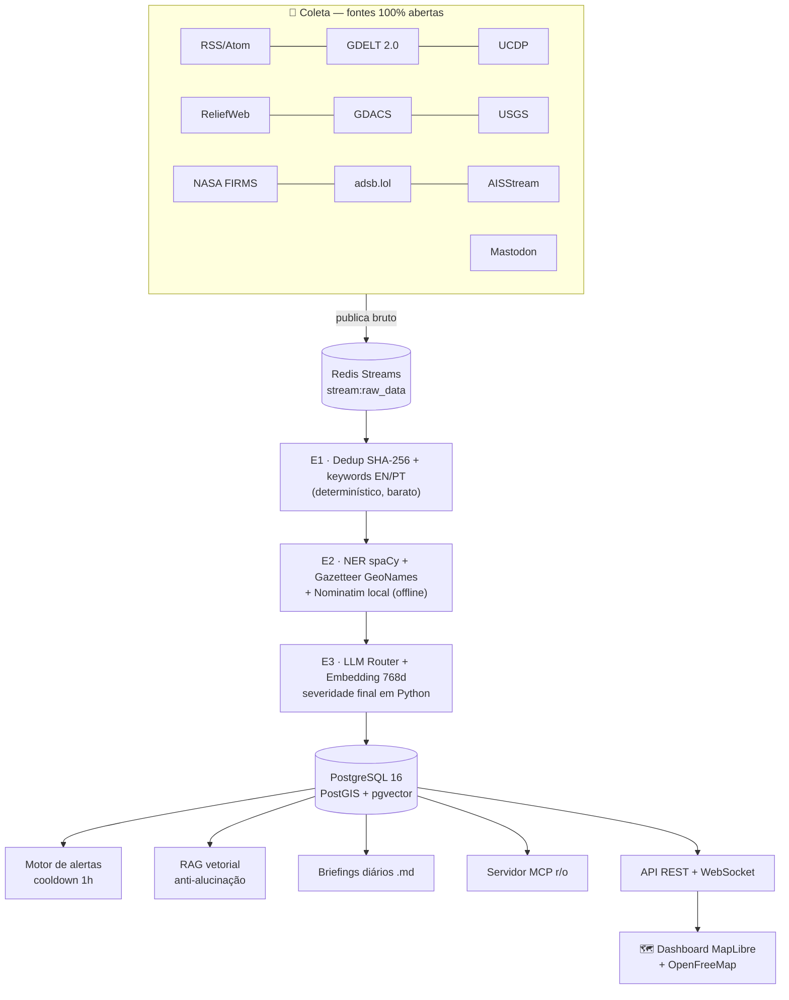

# 🛰️ ARGUS — Monitoramento Geopolítico Global (GEOINT/OSINT local)

Plataforma **local e autocontida** que coleta, filtra, geolocaliza, analisa e
visualiza eventos geopolíticos globais em tempo quase real — usando somente
**APIs abertas, dados públicos e software open-source**, com motor de LLM
híbrido (Ollama local por padrão; nuvem opcional como reforço).

> Implementação completa do PRD "Sistema de Monitoramento Geopolítico Global".
> Projeto independente: não usa nada dos demais projetos deste repositório.

---

## Como funciona (visão geral)



**Por que é barato:** os estágios E1 e E2 são determinísticos e descartam
ruído *antes* de qualquer chamada de LLM. A LLM só vê o que sobreviveu ao
dedup e ao filtro de palavras-chave.

**Fato vs. inferência é dado, não prosa:** todo evento carrega `confidence`,
`geo_confidence` e `is_inference` estruturados — consultáveis na API e
visíveis no mapa (pontos translúcidos = inferência).

---

## Stack

| Camada | Tecnologia |
|--------|------------|
| API/Backend | FastAPI + Uvicorn + Pydantic-Settings |
| Banco | PostgreSQL 16 + PostGIS (espacial) + pgvector (768d, HNSW) |
| Fila | Redis 7 Streams (consumer groups, XAUTOCLAIM, dead-letter) |
| ORM/Migrações | SQLAlchemy async + asyncpg + Alembic |
| NER | spaCy (`en_core_web_sm`, `pt_core_news_sm`) |
| Geocodificação | Gazetteer GeoNames offline + Nominatim self-hosted |
| LLM local | Ollama (`llama3.1:8b` + `nomic-embed-text`) |
| Mapa | MapLibre GL JS + tiles OpenFreeMap (sem chave) |
| MCP | FastMCP (SDK oficial), transporte stdio |

## Fontes de dados (todas abertas)

| Fonte | Domínio | Chave? |
|-------|---------|--------|
| RSS/Atom (Reuters, AP, Defense News…) | Notícias | Não |
| GDELT 2.0 DOC/GEO | Eventos globais | Não |
| UCDP (CC-BY) | Conflito armado | Não |
| ReliefWeb (UN OCHA) | Crises humanitárias | Não |
| GDACS | Desastres | Não |
| USGS | Sismos | Não |
| NASA FIRMS | Anomalias térmicas | Grátis |
| adsb.lol | Aéreo (inclui militares) | Não |
| AISStream | Naval (AIS) | Grátis (mock sem chave) |
| Mastodon | Social OSINT | Não |

Sem uma chave opcional, o collector correspondente **degrada graciosamente**
(FIRMS é pulado; AIS entra em modo mock).

---

## Subindo o sistema (passo a passo)

### 1. Infraestrutura

```bash
cd argus
cp .env.example .env          # ajuste chaves opcionais se tiver
docker compose up -d          # Postgres+PostGIS+pgvector, Redis, Ollama, Nominatim
```

### 2. Modelos locais do Ollama

```bash
docker compose exec ollama ollama pull llama3.1:8b
docker compose exec ollama ollama pull nomic-embed-text
```

### 3. Banco e dados de apoio

```bash
python -m venv .venv && source .venv/bin/activate
pip install -e ".[dev]"
python -m spacy download en_core_web_sm && python -m spacy download pt_core_news_sm
alembic upgrade head                      # extensões + tabelas + índices
python scripts/build_gazetteer.py         # GeoNames offline (cities1000 + estreitos/golfos)
```

> Sem rodar o `build_gazetteer.py`, o sistema usa um seed embutido com as
> principais cidades e chokepoints (Hormuz, Malaca, Bósforo, Suez…).

### 4. Rodar

```bash
uvicorn backend.app.main:app --reload     # API + dashboard + agendador
python -m backend.app.queue.workers       # workers do pipeline (outro terminal)
```

Abra **http://localhost:8000** — mapa com clustering, heatmap, time-slider,
trilhas AIS/ADS-B, feed ao vivo via WebSocket e seletor de perfil LLM.

---

## Perfis de LLM

| Perfil | Comportamento |
|--------|---------------|
| `LOCAL_ONLY` (padrão) | Só Ollama. Falha local ⇒ item volta à fila; **nada** vai para a nuvem. |
| `HYBRID` | Ollama → OpenRouter (free) → Anthropic. |
| `CLOUD_PREFERRED` | Nuvem primeiro, Ollama como reserva. |

Troca em runtime: `PUT /api/v1/llm/profile` (ou o seletor do dashboard).
Toda chamada é auditada em `audit_logs` (tokens, custo de `config/models.yaml`,
latência) — o custo do dia aparece no painel.

## Endpoints principais

| Rota | Descrição |
|------|-----------|
| `GET /health` · `GET /health/deep` | Saúde (deep checa Postgres+Redis) |
| `GET /api/v1/events` | Eventos paginados (categoria, severidade, intervalo, bbox) |
| `GET /api/v1/map/geojson` | FeatureCollection pronto para o mapa |
| `GET /api/v1/alerts` · `/metrics` | Alertas + contadores do pipeline + custo LLM |
| `GET/PUT /api/v1/llm/profile` | Perfil de LLM em runtime |
| `WS /api/v1/ws` | Eventos/alertas/posições ao vivo |

## Servidor MCP (somente leitura)

```bash
python -m backend.app.mcp.server   # stdio, para Claude Code / Inspector
```

Tools: `get_recent_events`, `search_events_by_region`, `run_rag_query`.

## Regras determinísticas que valem saber

- **Severidade:** a LLM apenas *sugere*. `critical` só se mantém com ≥2 fontes
  independentes **ou** evento dentro de zona de tensão configurada
  (`stage3_llm_enrich.TENSION_ZONES`); caso contrário rebaixa um nível.
- **Alertas:** cooldown de 1h por `regra+região` (Redis `SET NX EX 3600`).
- **RAG:** responde só com base nos eventos recuperados do pgvector, citando
  `source_url`; sem cobertura ⇒ `"sem dados suficientes"`.
- **Fonte social (Mastodon):** confiança limitada a 0.4 e `is_inference=true`.
- **Link + título e resumo em pt-BR (sempre):** independentemente da fonte ou
  do idioma original, todo evento carrega o **link de acesso** (`source_url`,
  garantido no Estágio 3 por `ensure_source_url`, com fallback para o link do
  `raw_data`) e **título + resumo traduzidos para português do Brasil** (o
  Estágio 3 instrui a LLM a sempre produzir `title`/`summary` em pt-BR). O
  título e o idioma originais ficam preservados em `original_title` e
  `source_language` (procedência), e o dashboard exibe o título original
  pequeno abaixo do traduzido e "(traduzido de …)" junto ao resumo quando o
  idioma não é `pt`. Popup do mapa e feed lateral mostram tudo isso, sempre
  com o link. Briefings diários e respostas do RAG citam os eventos já em
  pt-BR automaticamente, por usarem o `title`/`summary` traduzidos.

## Testes

```bash
pytest -q                      # 41 testes com fakes (sem serviços externos)
ARGUS_PG_TESTS=1 pytest -q     # + integração PostGIS/pgvector (requer docker compose)
```

## Limitações conhecidas (por desenho)

- Navios militares frequentemente desligam o AIS; ADS-B militar depende de
  transponder ligado — ausência de sinal é limitação, não falha.
- Detecção de "dark ships" (baseline histórico) está documentada como P2, fora do v1.
- Respeite as licenças: ODbL (adsb.lol), CC-BY (UCDP), atribuição OSM/OpenFreeMap;
  não redistribua dados brutos.
