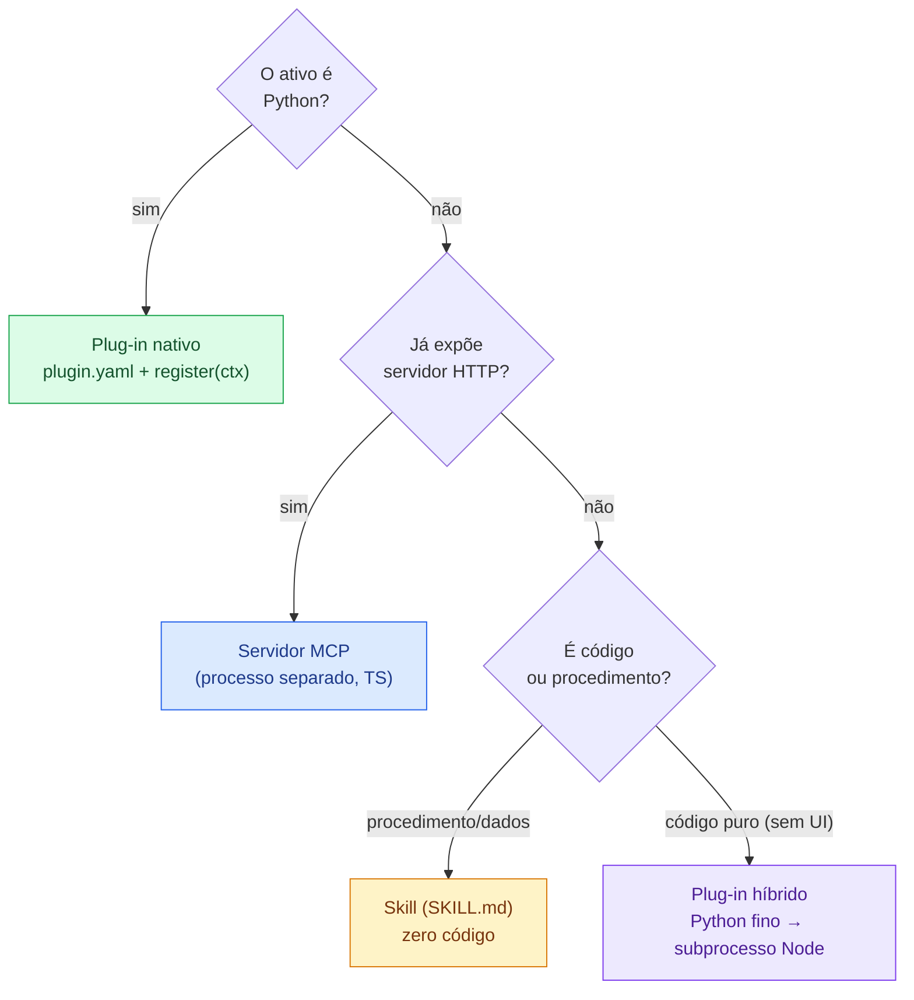

# Análise — o que deste repositório pode virar plug-in do Hermes Agent

> **Pergunta que este documento responde:** dos projetos que vivem neste
> repositório, quais podem ser transformados em extensões do
> [Hermes Agent](https://hermes-agent.nousresearch.com/) (Nous Research) — e
> em qual formato, com qual esforço, reaproveitando exatamente qual código?
>
> O [PRD — Genius Allspark](PRD-genius-allspark.md) (§3.4) já posiciona o
> Hermes como **o braço executor** do produto, acessado por um *Runtime
> Adapter*. Este documento olha para o outro sentido da seta: **o que nós
> entregamos ao Hermes**, não o que ele executa para nós.

---

## 1. Resumo executivo

> **Estado: o roadmap inteiro foi implementado.** Esta análise deixou de ser
> só um mapa — cada linha da tabela abaixo aponta para código com teste. O
> §8 registra o que a construção ensinou, incluindo onde a análise estava
> errada.

| # | Ativo deste repositório | Vira o quê no Hermes | Aderência | Esforço |
|---|---|---|---|---|
| 1 | [`geniusai-foresight`](../geniusai-foresight/) — kernel de simulação | **Plug-in nativo** (Python, `plugin.yaml` + `register`) com 6 ferramentas — ✅ **feito** | 🟢 Altíssima | P |
| 2 | [`so-ia/src/lib/org/*`](../so-ia/src/lib/org/) — compilador de organograma | **Servidor MCP** — ✅ [`@genius/mcp-organograma`](../packages/mcp-organograma/) | 🟢 Alta | M |
| 3 | [`packages/learning`](../packages/learning/) — memória indexada + LearningFlow | **Memory provider** — ✅ [`hermes_plugin/`](../packages/learning/hermes_plugin/) | 🟢 Alta | M |
| 4 | [`iffar-pixel-art/agent-manifests`](../iffar-pixel-art/) — 453 manifestos + runbooks | **Pacote de Skills** — ✅ [`hermes-skills/`](../iffar-pixel-art/hermes-skills/) (9 skills) | 🟢 Alta | P |
| 5 | [`packages/constructor`](../packages/constructor/) — API do Super Construtor | **Servidor MCP assimétrico** — ✅ [`@genius/mcp-construtor`](../packages/mcp-construtor/) | 🟡 Média-alta | M |
| 6 | [`iffar-3d-town/tools/*.py`](../iffar-3d-town/tools/) — extratores de PDF normativo | **Plug-in nativo próprio** — ✅ [`hermes_plugin/`](../iffar-3d-town/hermes_plugin/) | 🟢 Alta | P |
| 7 | [`geniusai-civilizations`](../geniusai-civilizations/) — World Engine determinístico | **Servidor MCP de ensaio** — ✅ [`src/mcp/`](../geniusai-civilizations/apps/backend/src/mcp/) | 🟡 Média | G |
| 8 | [`packages/canon`](../packages/canon/) — 13 schemas Zod | **Contrato**, não plug-in — ✅ [`schemas/canon.schema.json`](../schemas/canon.schema.json) | ⚪ N/A | P |
| 9 | [`packages/providers`](../packages/providers/) — hub de provedores LLM | **Não fazer**: o Hermes já resolve isso internamente | 🔴 Redundante | — |
| 10 | [`apps/canvas`](../apps/canvas/), UIs em geral | **Não fazer como plug-in**: são *surfaces*, rodam ao lado | 🔴 Fora de escopo | — |

**Leitura em uma frase:** os ativos deste repositório que valem como plug-in
do Hermes são os **motores determinísticos e os catálogos institucionais** —
`foresight` (ensaio), `org/*` (organograma), `learning` (memória) e os
manifestos do IFFar (skills). As **interfaces gráficas e o hub de provedores
não devem virar plug-in**, por motivos opostos: as primeiras não são
extensão de runtime, o segundo duplica o que o Hermes já faz.

---

## 2. O que o Hermes aceita como extensão

Antes de decidir o que vira plug-in, é preciso ser literal sobre o que
"plug-in" significa no Hermes. Ele tem **seis pontos de extensão distintos**,
e escolher o errado é o principal jeito de desperdiçar trabalho:

| Extensão | Manifesto | Instalação | Onde roda | Serve para |
|---|---|---|---|---|
| **Plugin** | `plugin.yaml` + `register(ctx)` em Python | `hermes plugins install <owner/repo>` | **No processo** do agente | Registrar ferramentas, hooks, comandos, providers |
| **Skill** | `SKILL.md` (padrão [agentskills.io](https://agentskills.io)) | `hermes skills install` | Contexto do agente | Procedimento reutilizável, sem código |
| **Memory provider** | Classe Python + `ctx.register_memory_provider` | Plug-in ou `config.yaml` | No processo | Backend de memória persistente (1 por instalação) |
| **Servidor MCP** | JSON-RPC 2.0 (stdio/HTTP) | Lista `mcp_servers` na config | **Processo separado** | Expor API externa como ferramentas — **qualquer linguagem** |
| **Tool/utility** | Livre | Standalone | Ao lado | Orquestrar/embrulhar o Hermes |
| **Surface** | Específico do protocolo | Config ou plug-in | Ao lado | Interface de usuário / canal de mensagem |

O contrato do plug-in nativo, resumido ao essencial:

```
~/.hermes/plugins/genius-foresight/
├── plugin.yaml      # name, version, description, provides_tools, provides_hooks
├── __init__.py      # def register(ctx): ...  ← único ponto de entrada
├── schemas.py       # descrição das ferramentas para o LLM (JSON-Schema)
└── tools.py         # handlers: (args: dict, **kwargs) -> str  (SEMPRE JSON)
```

```python
def register(ctx):
    ctx.register_tool(name="...", toolset="...", schema=..., handler=...)
    ctx.register_hook("pre_tool_call", ...)      # hooks de ciclo de vida
    ctx.register_skill("...", Path(__file__).parent / "skills" / "..." / "SKILL.md")
    ctx.register_memory_provider(...)            # single-select
    ctx.register_cli_command(...)                # hermes <meu-plugin> <subcmd>
```

Duas regras do handler que valem para **todos** os itens deste documento:
ele **sempre devolve uma string JSON**, inclusive no erro (nunca levanta
exceção), e **sempre aceita `**kwargs`** para compatibilidade futura.

### 2.1 A restrição que decide tudo: Python × TypeScript

O plug-in **nativo** do Hermes é Python. Este repositório é
majoritariamente TypeScript — com uma exceção decisiva:

| Projeto | Linguagem | Caminho natural para o Hermes |
|---|---|---|
| `geniusai-foresight` | **Python 3.11+, zero dependências** | Plug-in nativo, direto |
| `iffar-3d-town/tools/extrair_*.py` | **Python** | Ferramentas no plug-in nativo |
| `so-ia`, `packages/*`, `apps/canvas` | TypeScript | Servidor MCP **ou** plug-in Python fino que chama Node |
| `geniusai-civilizations` | TypeScript | Servidor MCP (o backend já é um servidor) |
| `iffar-pixel-art` | JS + JSON | Skills (`SKILL.md`) — os manifestos já são dados, não código |

Existem, portanto, **três estratégias de porte**, e a escolha certa por
projeto é o miolo desta análise:



---

## 3. Os candidatos, um a um

### 3.1 🟢 `geniusai-foresight` → plug-in nativo (o melhor candidato do repositório)

**Por que é o melhor:** é o único ativo que satisfaz *todas* as condições de
um plug-in nativo sem nenhuma adaptação estrutural — **Python 3.11+**,
**`dependencies = []`** no `pyproject.toml` (nada para conflitar com o
ambiente do Hermes), API já organizada como CLI com entrada e saída em JSON,
e comportamento **determinístico** (o `replay` compara a reconstrução com o
`result.json` original).

**O que já existe e é reaproveitado literalmente:**

| Arquivo | O que entrega |
|---|---|
| `foresight/cli.py` | 6 subcomandos: `simulate`, `report`, `demo`, `game`, `profile`, `validate`, `replay` |
| `foresight/game_theory.py` | Nash puro/misto, QRE logit, dominância estrita, Pareto |
| `foresight/simulation.py`, `orchestration.py` | Execução do DAG de tarefas com gates |
| `foresight/evidence.py` | Ledger de evidências com corte temporal (`snapshot(cutoff, strict=True)`) |
| `foresight/calibration.py`, `safety.py` | Gate `calibrate-and-red-team` → `go`/`no-go` |
| `agents/*.yaml` (8), `tasks/*.yaml` (8), `workflows/foresight-cycle.yaml` | O procedimento — vira **Skill**, não código |

**Ferramentas implementadas** (`toolset: foresight`):

| Ferramenta | Entrada | Devolve |
|---|---|---|
| `foresight_validate` | `study` ou `study_path` | Contratos válidos + hash do snapshot de evidências, sem simular |
| `foresight_profile` | `study` ou `study_path` | Células adaptativas: atores, coordenador, especialistas |
| `foresight_run` | estudo + `output_dir` | Executa as 8 etapas e publica — se o gate autorizar |
| `foresight_demo` | `output_dir` | Cenário demonstrativo embutido (5 atores, 600 runs) |
| `foresight_game` | `fixture` | Equilíbrios (Nash puro/misto, QRE, Pareto, dominância) |
| `foresight_replay` | estudo + `expected_path` | Verificação determinística de uma run anterior |

> **Correção sobre a proposta original**, descoberta na implementação: os
> comandos `simulate` e `report` da CLI **executam exatamente o mesmo caminho**
> (`run_study`), então expor os dois como ferramentas distintas só confundiria
> o modelo. Viraram um único `foresight_run`, e a sexta vaga foi para
> `foresight_demo` — que é o jeito de o agente demonstrar a ferramenta, e
> conferir a saúde da instalação, sem ter um estudo pronto.

```yaml
# plugin.yaml
name: genius-foresight
version: 0.1.0
description: Simulação prospectiva multiagente com Teoria dos Jogos e evidência auditável
author: Marcio Bisognin
license: MIT
homepage: https://github.com/marciobisognin/GeniusAI/tree/main/geniusai-foresight
provides_tools:
  - foresight_validate
  - foresight_simulate
  - foresight_report
  - foresight_game
  - foresight_profile
  - foresight_replay
provides_hooks: []
python_dependencies:
  - "geniusai-foresight>=0.1.0"     # já publicável: pyproject.toml pronto
tags: [simulation, game-theory, forecasting, audit]
```

```python
# __init__.py  (esboço — o handler nunca levanta exceção)
from pathlib import Path
from . import schemas, tools

def register(ctx):
    for name in ("validate", "simulate", "report", "game", "profile", "replay"):
        ctx.register_tool(
            name=f"foresight_{name}",
            toolset="foresight",
            schema=getattr(schemas, name.upper()),
            handler=getattr(tools, name),
        )
    ctx.register_skill(
        "foresight-cycle",
        Path(__file__).parent / "skills" / "foresight-cycle" / "SKILL.md",
    )
```

A `SKILL.md` que acompanha o plug-in é uma tradução quase direta do §23 do
[`PRD.md`](../geniusai-foresight/PRD.md), que **já está escrito como
instrução para assistentes** ("Hermes, Codex e Claude Code") — ler
`squad.yaml`, executar o DAG sem pular gates, publicar só com `go`, anexar o
rodapé canônico de licença.

**Riscos e cuidados**
- `cli.py` impõe limites de segurança que o handler deve preservar, não
  contornar: input ≤ 5 MiB, arquivo regular (não *symlink*), rejeição de
  constantes JSON não-finitas, ≤ 10 000 registros de evidência.
- As ferramentas escrevem em disco (`--output`). O diretório precisa vir do
  workspace do Hermes, não de um caminho fixo.
- O gate é o produto: `foresight_run` **não pode** publicar quando
  `calibrate-and-red-team` devolve `no_go`. Isso é regra de negócio, não
  detalhe de implementação.

**Esforço:** P — dias, não semanas. O código já existe, é puro e testado
(6 arquivos de teste); o trabalho é escrever manifesto, schemas e handlers.

### 3.1.1 O que a implementação ensinou

O plug-in está em
[`geniusai-foresight/hermes_plugin/`](../geniusai-foresight/hermes_plugin/),
com 23 testes próprios. Quatro decisões só apareceram ao construir:

1. **Estudo inline vai para arquivo temporário, de propósito.** O modelo
   entrega o estudo como objeto JSON, mas `load_study` só aceita caminho.
   Gravar num temporário e chamar a mesma função mantém **todas** as guardas
   do kernel (≤ 5 MiB, arquivo regular, constantes não-finitas, ≤ 10 000
   evidências) — em vez de reimplementar validação frouxa em memória.
2. **O gate bloqueado virou resultado, não exceção.** `run_study` levanta
   `ValueError` com o gate embutido na mensagem; o handler chama
   `execute_study` + `write_reports` diretamente para devolver
   `{"status": "blocked_by_gate", "gate": {...}}`. A diferença entre "estudo
   malformado" e "a ciência disse não" precisa ser legível por máquina.
3. **Nenhum hook registrado** (`provides_hooks: []`) — o que neutraliza o
   risco levantado no §6: o plug-in não depende de nenhum hook cuja invocação
   precise ser confirmada versão a versão.
4. **Um defeito real do kernel apareceu no caminho.** `demo_input_path()`
   procurava a fixture instalada só em `sys.prefix`; no esquema `posix_local`
   (Debian/Ubuntu) o pip grava em `sysconfig.get_path("data")`, e `demo`
   falhava em pacote instalado — inclusive pela CLI. Corrigido com teste de
   regressão.

---

### 3.2 🟢 `so-ia/src/lib/org/*` → plug-in híbrido ou servidor MCP

**Por que vale muito:** é a **Lei 1** do produto ("nada existe sem o
organograma") em código executável, e é exatamente o tipo de conhecimento
que um agente genérico não tem. Um Hermes com este plug-in consegue ler uma
portaria em PDF e responder *"esta demanda pertence a qual unidade?"* com
base normativa — algo que nenhuma ferramenta genérica faz.

**O que existe** (TypeScript puro — verificado: nenhum destes módulos importa
React, Next ou qualquer dependência de runtime; os `import` são só de
`@/lib/data/*` (dados e tipos) e entre si):

| Módulo | Função exportada | O que faz |
|---|---|---|
| `import.ts` | `parseOrgFile`, `parseOrgText`, `parseOrgPasted` | Lê organograma de arquivo/texto/colagem |
| `relevance.ts` | `organizationCovers(topic, nodes)` | **A Lei 1**: decide se um conteúdo faz sentido para o organograma carregado |
| `matching.ts` | `matchNode`, `assembleOrganization` | Reaproveitar agente do catálogo × gerar novo |
| `squads.ts`, `squad-registry.ts` | `buildSquads`, `findSquadTemplate` | Monta squads a partir das unidades |
| `workflow-builder.ts` | `buildOrgWorkflow` | Deriva o fluxo de trabalho da atribuição |
| `templates.ts` | `templateEmpresa`, `templateGoverno` | Organogramas-semente |
| `skills-registry.ts` | `ensureSkill`, `listSkills` | Registro de skills por unidade |

Catálogo institucional acoplado: **12 agentes** (`src/lib/data/agents.ts`) e
**7 squads** (`institutionalSquads`).

Fica de fora `pdf-extract.ts`: é `"use client"` e usa `pdfjs-dist` no
navegador, sem equivalente do lado do servidor. É exatamente a lacuna que os
extratores Python do §3.6 preenchem.

**Ferramentas propostas** (`toolset: organograma`):

| Ferramenta | Devolve |
|---|---|
| `org_import` | Organograma normalizado a partir de PDF/texto/YAML |
| `org_covers` | `true/false` + justificativa — **o guarda da Lei 1** |
| `org_match` | Agente do catálogo reaproveitado, ou proposta de agente novo |
| `org_build_squad` | Squad montado para uma unidade |
| `org_workflow` | Fluxo derivado da atribuição |

**Duas rotas de implementação — a escolha importa:**

| | Plug-in híbrido (Python fino → Node) | Servidor MCP (TypeScript) |
|---|---|---|
| Como funciona | `register(ctx)` em Python; handler faz `subprocess` de um binário Node que expõe os módulos `org/*` | Servidor MCP em TS importando `org/*` direto; declarado em `mcp_servers` |
| Prós | Aparece como plug-in de primeira classe; usa `ctx.get_config`, `ctx.state`, hooks | Zero ponte de linguagem; funciona também no Claude Code, Codex e qualquer cliente MCP |
| Contras | Exige Node no ambiente do Hermes; serializar tudo em JSON no *stdio* | Não acessa `PluginContext` (sem hooks, sem `register_skill`) |
| **Recomendado quando** | O objetivo é *só* o Hermes | O objetivo é reaproveitar em vários agentes — **este é o caso aqui** |

**Recomendação:** comece pelo **servidor MCP**. O mesmo servidor serve
Hermes, Claude Code e Codex, e o repositório já trata esses três como
clientes de primeira classe (o `AgentRunner` de `geniusai-civilizations`
suporta os três). Se depois surgir necessidade de hooks (p. ex. bloquear via
`pre_tool_call` qualquer ferramenta de uma área **ausente do organograma** —
a Lei 1 aplicada ao próprio runtime), aí sim vale o invólucro Python fino.

> **A ideia mais forte deste documento:** um hook `pre_tool_call` que consulta
> `organizationCovers()` transforma a Lei 1 em **política de execução do
> agente**, não só regra de UI. O Hermes literalmente se recusa a usar uma
> ferramenta de uma área que o organograma carregado não possui. Isso não
> existe em nenhum plug-in do ecossistema — é diferencial nosso.

**Esforço:** M — extrair `org/*` para um pacote publicável (hoje usa o alias
`@/lib/data/org-chart` do Next) e escrever o servidor MCP.

---

### 3.3 🟢 `packages/learning` → memory provider

**Por que encaixa:** o Hermes tem um ponto de extensão dedicado
(`ctx.register_memory_provider`, *single-select*) e um ecossistema ativo
(`mem0`, `Mnemosyne`, `hindsight`). Nosso `packages/learning` já é
exatamente isso, com uma diferença de propósito: os providers do ecossistema
guardam *conversas*; o nosso guarda **execuções aprovadas por um humano** e
promove padrão repetido a `Skill` formal.

**O que existe:**

| Arquivo | O que faz |
|---|---|
| `memory.ts` | Índice vetorial local (`vectra`), busca por significado |
| `embeddings.ts` | Embedding local por *hashing trick* — **sem nenhuma API externa** |
| `learningFlow.ts` | Generaliza execução aprovada em fluxo reutilizável |
| `skillPromotion.ts` | Propõe promoção a `Skill` quando o padrão se repete N vezes |

**O diferencial:** procedência. Cada `MemoryChunk` sabe de qual `Run` e de
qual `Approval` nasceu (`MemoryChunkSourceType` no `canon`). Um provider de
memória com **rastro de aprovação humana** é um argumento forte em domínio
público/institucional, onde "por que o agente sabia disso?" é auditoria, não
curiosidade.

**Obstáculo real:** a interface `MemoryProvider` é uma **classe Python
abstrata**, e o código é TypeScript. Diferente das ferramentas — onde
`subprocess` por chamada é aceitável —, a memória é consultada em caminho
quente, a cada turno. As opções honestas:

1. **Portar para Python** (o *hashing trick* e a busca são ~algumas centenas
   de linhas; a dependência `vectra` teria equivalente como `sqlite-vec` ou
   `faiss`). Mais trabalho, resultado mais limpo.
2. **Servidor HTTP local** + provider Python fino que faz requisições. Menos
   trabalho, custo de latência por consulta e mais uma peça para operar.

**Recomendação:** portar (opção 1), e tratar o `packages/learning` em TS como
a implementação de referência — os dois compartilham o schema `MemoryChunk`
do `canon`, então os índices continuam intercambiáveis.

**Esforço:** M.

---

### 3.4 🟢 `iffar-pixel-art` → pacote de Skills (o caminho mais barato de todos)

**Por que é barato:** os **453 manifestos** em `agent-manifests/*.json` já
são *dados estruturados de procedimento*, não código. Cada um tem `skills`
com `provenance` e `basis`, um `runbook` com `command`/`inputs`/`outputs`, e
`limitations` explícitas. Converter isso em `SKILL.md` é transformação de
formato — não há lógica a portar.

Exemplo real (`1_1_11--ouvidor-a.json`) e o que cada campo vira:

| Campo do manifesto | Vira, no `SKILL.md` |
|---|---|
| `displayName`, `unit.name` | Título e escopo da skill |
| `normativeSource` (portaria, página, artigos) | Seção "Base normativa" — **procedência verificável** |
| `skills[].label` / `.basis` | O que a skill sabe fazer, e com que fundamento |
| `runbook.command` / `inputs` / `outputs` | Procedimento executável |
| `limitations` | **Seção de limites** — "não produz ato administrativo sem aprovação humana" |

Aquele bloco de `limitations` é ouro num contexto de agente autônomo: são
**restrições em linguagem natural** que o modelo lê e respeita, exatamente o
que uma skill deve carregar.

**Duas entregas complementares:**
1. **Tap de skills** — `hermes skills tap add marciobisognin/GeniusAI` servindo
   as skills geradas dos manifestos (gerador: adaptar
   `scripts/generate-agent-catalog.mjs`, que já percorre os manifestos).
2. **Uma ferramenta** `iffar_route` (no plug-in do §3.2) que recebe uma
   demanda em texto e devolve a **rota normativa** — unidades, agentes,
   handoffs, se exige checkpoint humano — reaproveitando o motor de rota de
   `server/core.mjs`.

**Cuidado importante:** o contrato de execução do Pixel Art exige
**checkpoint humano** e verificação de artefatos com SHA-256 antes de
declarar entrega (`state: 'awaiting_human_approval'`, `integrity:
'unverified'`). Ao virar skill, isso precisa continuar sendo obrigação
escrita — uma skill que descreve o runbook mas omite o gate humano seria uma
degradação, não um porte.

**Esforço:** P para as skills (é geração automática); M para a ferramenta de
rota.

---

### 3.5 🟡 `packages/constructor` → servidor MCP

O Super Construtor já é **um servidor HTTP com SSE**, com rotas prontas:

```
POST /providers/:id/health-check      POST /agents/match     POST /squads/match
POST /companies/:id/export-pack       POST /companies/:id/import-pack
GET  /packs/available                 POST /packs/import
POST /execution/run                   GET  /execution/runs/:id/events   (SSE)
POST /approvals/:id/resolve           GET  /memory/search
GET  /health
```

Um servidor MCP que espelhe esse conjunto entrega ao Hermes a capacidade de
**montar e operar organizações de agentes** — inclusive resolver aprovações
pendentes. É a integração de maior alcance funcional do repositório.

**Por que 🟡 e não 🟢:** há um risco conceitual sério. O PRD (§3.4) é
explícito: o Hermes *"nunca decide política, orçamento ou aprovação — apenas
executa"*. Expor `POST /approvals/:id/resolve` como ferramenta do Hermes
**inverte essa regra** — o executor passaria a poder aprovar o próprio
trabalho. A superfície MCP deve, portanto, ser deliberadamente **assimétrica**:

| Expor ao Hermes | **Não** expor ao Hermes |
|---|---|
| `agents/match`, `squads/match` (consulta) | `approvals/:id/resolve` |
| `packs/available`, `export-pack` | `providers/:id` (escrita de credenciais) |
| `memory/search` | Qualquer rota que altere política ou orçamento |
| `execution/run` — **apenas** para agentes A3+ | `execution/run` para agentes A0–A2 |

Esse recorte não é burocracia: é a quarta lei do produto ("autonomia se
conquista, não se configura") sobrevivendo à integração.

**Esforço:** M.

---

### 3.6 🟢 `iffar-3d-town/tools/*.py` → ferramentas do plug-in de organograma

Dois scripts Python que resolvem um problema difícil e específico:
`extrair_organograma.py` e `extrair_competencias.py` extraem estrutura de
uma **portaria em PDF** usando detecção de tabelas vetoriais do `pdfplumber`
— com tratamento para linhas cortadas por quebra de página
(`recover_split_row`) e códigos que somem inteiros de `find_tables()`
(`recover_missing_code`, encontrados só comparando contagem por seção com
uma varredura bruta).

Isso é conhecimento de domínio caro, já depurado contra um documento real
(Portaria nº 876/2026-GRE). Sendo Python, entra **direto** como ferramenta
`org_extract_pdf` no plug-in do §3.2, sem nenhuma ponte.

**Cuidado:** adiciona a dependência `pdfplumber` ao plug-in — declarar em
`python_dependencies` do `plugin.yaml`.

**Esforço:** P.

---

### 3.7 🟡 `geniusai-civilizations` → ferramenta de ensaio (valor alto, custo alto)

O que interessa aqui **não é o jogo** — é o motor. `apps/backend/src/engine/`
tem um **World Engine determinístico**: PRNG com estado serializável,
`createWorld(seed)` determinístico, `tick(world, decisions)` puro (não muta a
entrada), trace por tick em JSONL, replay e save versionado com escrita
atômica. Mais de 90 testes cobrem determinismo, validação e economia.

Traduzido para a linguagem do PRD, isso é a **Lei 2: nenhuma missão sem
ensaio** — um sandbox onde consequências de decisões são observáveis antes
de valerem no mundo real. Uma ferramenta `rehearse_decision` que roda N
ticks de um cenário e devolve o trace é genuinamente útil para um agente
autônomo.

**Por que 🟡 apesar disso:** o motor está acoplado ao domínio "civilizações"
(cidades, exércitos, tecnologia, diplomacia). Generalizá-lo para ensaiar
decisões institucionais é **redesenho de produto**, não porte de plug-in. É
uma linha de trabalho legítima — só não é o caminho curto, e não deve ser
confundida com um.

**Esforço:** G. Recomendação: **não começar por aqui.**

---

## 4. O que *não* deve virar plug-in

Dizer não é parte da análise. Três casos, por três motivos diferentes:

| Ativo | Por que não |
|---|---|
| **`packages/providers`** | O Hermes já tem multi-provedor nativo e um ecossistema de roteamento (`hermes-web-search-plus`, model override em `pre_llm_call`). Portar nosso hub seria **duplicar a camada que o Hermes usa para chamar o modelo** — conflito de responsabilidade, não extensão. Ele continua essencial **dentro** do Allspark, onde o Hermes é apenas *um* dos runtimes. |
| **`apps/canvas`, UI do `so-ia`, `iffar-3d-town`, console do Pixel Art** | São *surfaces*: rodam **ao lado** do agente, não dentro dele. Se o objetivo for integrá-las, o caminho é o inverso — a UI consome o Hermes (via API/SSE), como o `nirvana-bridge.ts` já faz com a CLI `claude`. Empacotar React como plug-in Python não tem significado. |
| **`packages/canon`** | Não é capacidade, é **contrato**. Os 13 schemas Zod (Agent, Squad, Company, MindClone, Pack, ProviderConfig, LearningFlow, MemoryChunk, Task, Run, Approval, CanvasNode, CanvasEdge) devem virar **JSON Schema** compartilhado, consumido pelos plug-ins dos §3.2–3.5. É pré-requisito de todos eles, não um deles. |

---

## 5. Ordem recomendada

```mermaid
flowchart LR
    F["1 · genius-foresight<br/>plug-in nativo<br/>✅ implementado"]
    S["2 · skills IFFar<br/>453 manifestos → SKILL.md<br/>esforço P"]
    C["3 · canon → JSON Schema<br/>contrato compartilhado<br/>esforço P"]
    O["4 · MCP organograma<br/>org/* + extratores PDF<br/>esforço M"]
    L["5 · memory provider<br/>packages/learning<br/>esforço M"]
    K["6 · MCP construtor<br/>superfície assimétrica<br/>esforço M"]
    R["7 · ensaio<br/>World Engine<br/>esforço G"]

    F --> S --> C --> O --> L --> K --> R

    style F fill:#dcfce7,stroke:#16a34a,color:#14532d
    style S fill:#dcfce7,stroke:#16a34a,color:#14532d
    style C fill:#dcfce7,stroke:#16a34a,color:#14532d
    style O fill:#dbeafe,stroke:#2563eb,color:#1e3a8a
    style L fill:#dbeafe,stroke:#2563eb,color:#1e3a8a
    style K fill:#fef3c7,stroke:#d97706,color:#78350f
    style R fill:#fee2e2,stroke:#dc2626,color:#7f1d1d
```



O critério da ordem é **valor entregue por unidade de risco**: os três
primeiros não exigem nenhuma decisão arquitetural nova (o código já é Python,
os manifestos já são dados, os schemas já existem), e o último exige
redesenho de produto.

---

## 6. Como validar cada entrega

O Hermes traz validação embutida — usar, e não confiar em inspeção visual:

```bash
hermes plugins doctor .          # valida plugin.yaml, register(), tools e hooks
hermes plugins install <path>    # instala a partir do diretório local
hermes plugins enable <name>     # ativa (pergunta env vars e capabilities)
hermes plugins list              # confere o estado do que foi registrado
```

**Verificação que não pode ser pulada:** confirmar, com um teste de fumaça
real, que o hook do qual o plug-in depende **de fato dispara**. Houve um
relato ([issue #2817](https://github.com/NousResearch/hermes-agent/issues/2817),
fechada como *not planned*) de que `pre_llm_call`, `post_llm_call`,
`on_session_start` e `on_session_end` aceitavam registro sem nunca serem
invocados, enquanto `pre_tool_call`/`post_tool_call` funcionavam. A
documentação atual descreve os seis como funcionais, e há trabalho recente
em cima de `pre_llm_call` — mas o desenho do §3.2 (Lei 1 como política de
execução) depende de `pre_tool_call`, que é justamente o par sempre
implementado. Vale confirmar na versão do Hermes em uso antes de apostar em
qualquer um dos outros quatro.

---

## 8. O que a construção ensinou

O roadmap do §5 foi executado inteiro. Esta seção registra o que só apareceu
ao construir — inclusive **onde esta análise estava errada**.

### 8.1 Onde a análise errou

| A análise dizia | O que a implementação mostrou |
|---|---|
| Foresight com `foresight_simulate` **e** `foresight_report` | Os dois comandos da CLI executam o mesmo caminho (`run_study`). Expor ambos confundiria o modelo — viraram um `foresight_run`, e a vaga sobrando foi para `foresight_demo` |
| Extratores de PDF "dentro do plug-in do §3.2" | O §3.2 virou servidor MCP em **TypeScript**, e os extratores são **Python**. Viraram um plug-in nativo próprio, que entrega estrutura para o MCP decidir sobre ela |
| 453 manifestos → skills | 453 manifestos descrevem **8 competências distintas**. Uma skill por agente daria 453 arquivos quase idênticos e inúteis no contexto de um agente — agrupamos por competência: **9 skills** |
| `so-ia/src/lib/org/*` por plug-in híbrido *ou* MCP | MCP, sem hesitação — mas exigiu antes extrair o motor para [`@genius/org-compiler`](../packages/org-compiler/), com golden test provando equivalência byte a byte com o `so-ia` |

### 8.2 Quatro defeitos reais encontrados no caminho

Nenhum deles era o objetivo do trabalho; todos apareceram porque o porte
exercitou código que ninguém exercitava daquele jeito.

1. **`demo_input_path()` do Foresight** procurava a fixture instalada só em
   `sys.prefix`. No esquema `posix_local` (Debian/Ubuntu) o pip grava em
   `sysconfig.get_path("data")` — `demo` falhava em pacote instalado,
   **inclusive pela CLI**. Corrigido com teste de regressão.
2. **JSON Schema não-determinístico.** Campos como `createdAt` usam
   `.default(() => new Date().toISOString())`; o conversor executava a função e
   gravava o instante da geração como `"default"`. O schema mudava a cada
   geração e mentia sobre o padrão. Defaults dinâmicos não têm representação
   estática em JSON Schema — agora viram descrição.
3. **Portão de autonomia por lista de bloqueio.** A primeira versão de
   `requiresHumanApproval` tratava `A0/A1/A2` como bloqueados; autonomia vazia
   ou desconhecida **passava**. Virou lista de permissão (`A3/A4/A5`): valor
   inesperado cai do lado seguro.
4. **Assinatura de ensaio cega para o que está em andamento.** `signWorld`
   ignorava `researching` e propostas pendentes, então um mundo pesquisando e
   um mundo parado assinavam igual — uma assinatura que não distingue não serve
   para provar reprodutibilidade.

### 8.3 O que provou equivalência, em vez de presumir

Três portes atravessaram fronteira (linguagem, framework, runtime). Em todos,
a equivalência é verificada por teste, não por leitura:

| Porte | Como a equivalência é provada |
|---|---|
| `so-ia/src/lib/org/*` → `@genius/org-compiler` | Golden test: baseline gerada executando o **código original do so-ia** (com o alias `@/` resolvido) sobre 22 superfícies; o pacote precisa reproduzir byte a byte |
| `embeddings.ts` → `embeddings.py` | Fixture de 14 casos gerada pelo TypeScript; o teste Python exige o mesmo vetor com 12 casas decimais |
| `packages/canon` → `canon.schema.json` | Teste falha se o arquivo versionado se descolar dos schemas Zod |

### 8.4 O estado final

| Entrega | Onde | Testes |
|---|---|---|
| Plug-in nativo do Foresight | `geniusai-foresight/hermes_plugin/` | 23 |
| Plug-in de extração normativa | `iffar-3d-town/hermes_plugin/` | 12 |
| Memory provider com procedência | `packages/learning/hermes_plugin/` | 26 |
| Skills institucionais | `iffar-pixel-art/hermes-skills/` | 7 |
| Compilador de organograma extraído | `packages/org-compiler/` | 18 |
| MCP do organograma (Lei 1) | `packages/mcp-organograma/` | 24 |
| MCP do Super Construtor (assimétrico) | `packages/mcp-construtor/` | 23 |
| MCP da Sala de Ensaio (Lei 2) | `geniusai-civilizations/apps/backend/src/mcp/` | 13 |
| Canon em JSON Schema | `schemas/canon.schema.json` | 9 |

### 8.5 O que continua em aberto

- **Generalizar o motor de ensaio.** O §3.7 avisava, e continua valendo: o
  domínio simulado é o de civilizações, não decisões institucionais genéricas.
  O servidor MCP expõe o ensaio real que o motor suporta hoje; generalizá-lo é
  redesenho de produto.
- **O `so-ia` não passou a consumir o `@genius/org-compiler`.** O pacote é a
  fonte de verdade daqui para a frente e o golden test garante que os dois não
  divergiram, mas o app continua com sua cópia. Migrá-lo exige mexer na
  resolução de módulos do Next, e o `so-ia` não tem CI que pegue uma regressão.
- **Confirmar os hooks na versão do Hermes em uso** (§6). Nenhum plug-in
  entregue aqui depende de hook — foi decisão de projeto, não acaso.

---

## 7. Fontes

- [Hermes Agent — site oficial (Nous Research)](https://hermes-agent.nousresearch.com/)
- [Build a Hermes Plugin — guia do desenvolvedor](https://hermes-agent.nousresearch.com/docs/developer-guide/plugins)
- [Plugins — guia do usuário](https://hermes-agent.nousresearch.com/docs/user-guide/features/plugins)
- [Hooks — documentação no repositório](https://github.com/NousResearch/hermes-agent/blob/main/website/docs/user-guide/features/hooks.md)
- [awesome-hermes-agent — diretório da comunidade](https://github.com/0xNyk/awesome-hermes-agent)
- [Issue #2817 — hooks documentados mas não invocados](https://github.com/NousResearch/hermes-agent/issues/2817)
- [PRD — Genius Allspark](PRD-genius-allspark.md) §3.4 (Hermes como braço executor) e §3.7 (mapa da fusão)

---

<sub>Análise sobre o estado do repositório em `main`. Os pontos de extensão do
Hermes descritos no §2 refletem a documentação oficial consultada em agosto de
2026 — reconfirme o contrato na versão que você for usar antes de implementar.</sub>
