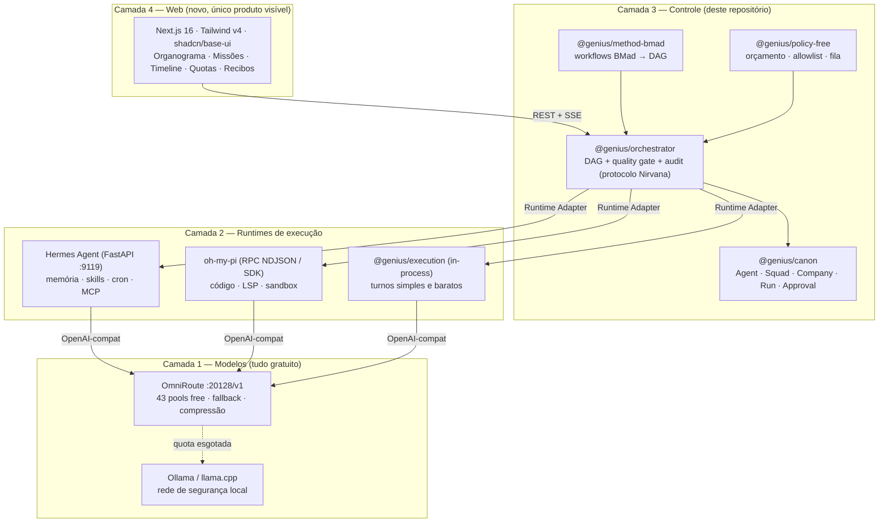

# Arquitetura — Hermes Web sobre provedores 100% gratuitos

> **Em uma frase:** cinco projetos não se fundem em um só código; eles se
> encaixam como **quatro camadas com contratos estreitos** — modelos
> (OmniRoute), runtime (Hermes + oh-my-pi), organização (Nirvana-OS como
> protocolo) e método (BMad) — e a web nova é a única superfície que o usuário
> vê.

| | |
|---|---|
| **Documento** | Proposta de arquitetura — resposta a "como combinar estes repositórios" |
| **Base** | Este repositório (`packages/canon`, `packages/providers`, `packages/execution`, `packages/constructor`, `apps/canvas`) |
| **Documentos-irmãos** | [PRD Genius Allspark](./PRD-genius-allspark.md) · [Construção](./PRD-genius-allspark-construcao.md) · [Execução](./PRD-genius-allspark-execucao.md) |
| **Restrição central** | Todo provedor de modelo usado em execução precisa ser **gratuito** (free tier permanente ou modelo local) |

Marcadores de confiança (herdados do PRD Allspark):

| Marca | Significado |
|---|---|
| ✅ | Verificado no código deste repositório ou na documentação primária do projeto externo |
| 🟡 | Proposta de arquitetura — decisão a validar |
| 🔵 | Hipótese que exige protótipo antes de virar compromisso |

---

## 1. O erro a evitar antes de qualquer linha de código

A tentação natural é clonar os cinco repositórios e "juntar". Isso falha por
quatro motivos verificáveis:

1. **Linguagens e runtimes incompatíveis.** Hermes é Python 3.11 + `uv` ✅;
   oh-my-pi é TypeScript + ~80k linhas de Rust sob Bun ✅; Nirvana-OS é
   Bun/TypeScript ✅; BMad é Node + Python ✅; OmniRoute é Node/Next.js ✅.
   Um monorepo único herdaria a soma de todas as toolchains.
2. **Licença do Nirvana-OS.** SUL v1.0 — *source-available*, não OSI ✅. Copiar
   código dele contamina o produto. Os **protocolos** (squad.yaml,
   business.yaml, DAG, quality gate, audit trail) são ideias reimplementáveis;
   o código, não. Os outros quatro são MIT ✅.
3. **Cada um já resolve uma camada diferente** — nenhum é substituto do outro
   (§2). Fundir gera três implementações de memória, duas de skills e quatro de
   roteamento de modelo.
4. **Este repositório já tem o modelo canônico.** `packages/canon/src/schemas.ts`
   já define `Agent`, `Squad`, `Company`, `MindClone`, `ProviderConfig`, `Run`,
   `RunStep`, `Approval` ✅. A integração é *importar para o canon*, não
   substituir o canon.

**Regra de arquitetura:** cada repositório externo entra por **um adaptador e um
contrato**, nunca por cópia de código. O que atravessa a fronteira são dados
validados por Zod, não objetos internos deles.

---

## 2. Quem faz o quê — divisão de responsabilidades

| Repositório | Camada | O que entra no sistema | O que **fica de fora** | Licença |
|---|---|---|---|---|
| **OmniRoute** | Modelos | Gateway OpenAI-compatível único (`:20128/v1`), 43 pools de free tier, 19 estratégias de roteamento, circuit breaker, compressão de tokens, dashboard de quota ✅ | Electron desktop, uso como produto final para o usuário | MIT |
| **Hermes Agent** | Runtime de agente | Loop de agente, memória persistente (FTS5), skills autônomas (padrão agentskills.io), cron, subagentes, MCP, backend FastAPI `:9119` ✅ | UI própria (Vite SPA), gateway de Telegram/Discord/WhatsApp no MVP | MIT |
| **oh-my-pi** | Runtime de código | Executor de tarefas de código: 31 ferramentas, bash embutido, LSP, DAP, edições por hash, isolamento de workspace (`pi-iso`), modo RPC NDJSON e SDK Node ✅ | TUI, modo colaborativo, catálogo próprio de 60+ provedores (substituído por OmniRoute) | MIT |
| **Nirvana-OS** | Organização | **Protocolos**: `squad.yaml` (agents/tasks/workflows/capabilities), `business.yaml` (org chart, governança, memória), DAG paralelo, quality gate judge→critique→revise, `audit.jsonl` ✅ | O código do engine, o CLI `nrv`, os packs pagos — reimplementar, não importar | SUL v1.0 ⚠️ |
| **BMad Method** | Método | Workflows de entrega (Analysis → Planning → Solutioning → Implementation), personas de papel, formato `workflow.yaml` + `instructions.md` + `template.md` + `checklist.md`, Party Mode ✅ | O instalador de IDE, os bundles de ChatGPT/Gemini | MIT |

A leitura em uma frase: **OmniRoute é como se pensa, Hermes é quem pensa,
oh-my-pi é quem faz, Nirvana-OS é quem organiza, BMad é como se trabalha, e a
web é onde se vê.**

---

## 3. A pilha em quatro camadas



O ponto crítico do desenho: **as três setas para a Camada 1 são o mesmo
protocolo** (OpenAI `/v1/chat/completions`). Hermes aceita "custom endpoint" ✅,
oh-my-pi aceita provedores customizados em `~/.omp/agent/models.yml` com
`api: openai-completions` ✅, e este repositório já tem
`OpenAICompatibleAdapter` ✅. É isso que torna a fusão viável sem tocar no
código deles.

---

## 4. Camada 1 — Gratuidade por construção (OmniRoute)

### 4.1 Por que OmniRoute e não um roteador próprio

Escrever um roteador de free tiers é fácil; **manter** 43 pools com quotas,
formatos e janelas de reset diferentes é o trabalho real. OmniRoute já entrega
quota-aware auto-fallback em quatro níveis, circuit breaker de três estágios,
lockout de modelo e um dashboard de saldo em `/dashboard/free-tiers` ✅.

### 4.2 Configuração no canon (sem código novo de provedor)

`packages/providers` já suporta o tipo `openai-compatible` ✅. Um único
`ProviderConfig` cobre todos os 43 pools:

```jsonc
{
  "id": "omniroute-free",
  "tipo": "openai-compatible",
  "nome": "OmniRoute (free tiers)",
  "baseUrl": "http://omniroute:20128/v1",
  "apiKeyRef": "OMNIROUTE_KEY",
  "model": "auto/cheap"
}
```

E a rede de segurança, que nunca depende de terceiros:

```jsonc
{ "id": "local", "tipo": "ollama", "nome": "Ollama local",
  "baseUrl": "http://ollama:11434", "model": "qwen3:8b" }
```

### 4.3 Mapa de papel → modelo gratuito 🟡

`ModelPolicy` do canon (`default` + `fallback`) já expressa isso ✅. A proposta
é padronizar cinco papéis, alinhados aos zero-config do OmniRoute e aos roles do
oh-my-pi:

| Papel | Uso | `default` | `fallback` |
|---|---|---|---|
| `plan` | decompor missão, arquitetura | `auto/smart` | `auto` |
| `build` | escrever código, documentos | `auto/coding` | `auto/cheap` |
| `chat` | conversa, resumo, classificação | `auto/fast` | `auto/cheap` |
| `judge` | quality gate, crítica | `auto/smart` | `auto` |
| `local` | degradação total, dados sensíveis | `ollama:qwen3:8b` | — |

### 4.4 As cinco travas que garantem "zero custo" 🟡

Free tier não é o mesmo que gratuito garantido — a garantia vem de política, não
de esperança. `@genius/policy-free` implementa:

1. **Allowlist de pools.** Só pools marcados como *free forever* entram na
   configuração do OmniRoute. Nenhuma chave de provedor pago existe no ambiente
   — o que não está no `.env` não pode ser cobrado.
2. **Guarda de orçamento por missão.** Cada `Run` carrega um teto de tokens; ao
   estourar, a missão pausa em `requer_aprovacao` (status já existente no canon
   ✅) em vez de continuar gastando.
3. **Fila de concorrência.** Free tiers limitam requisições por minuto, não só
   por mês. Uma fila global com *token bucket* por pool evita o 429 em cascata
   que o circuit breaker interpretaria como provedor morto.
4. **Compressão antes do envio.** O pipeline do OmniRoute (RTK, Caveman,
   LLMLingua-2) reduz 15–95% dos tokens ✅ — em free tier, compressão é
   literalmente aumento de capacidade.
5. **Degradação, nunca falha.** Esgotados os pools, o roteador cai para Ollama
   local. A missão fica mais lenta e mais burra, mas não morre nem cobra.

### 4.5 O que continua custando — honestidade obrigatória

Gratuito aqui significa **provedores de modelo**, não infraestrutura. Restam:

| Item | Custo | Mitigação |
|---|---|---|
| Máquina para Hermes + OmniRoute (processos longos, memória, cron) | Real | VPS pequena, Oracle Cloud Free Tier, ou máquina do próprio usuário |
| Front-end web | ~zero | Vercel/Cloudflare no plano gratuito |
| Banco e artefatos | ~zero no início | SQLite/Postgres na mesma máquina |
| GPU para Ollama | Opcional | Modelos 8B rodam em CPU, lentos porém funcionais |

⚠️ **ToS:** vários free tiers restringem uso comercial ou treinam com os dados
enviados. Antes de qualquer uso com dados de cliente, é preciso auditar pool a
pool e marcar cada um com `permiteDadosSensiveis: boolean` — quando falso, o
roteamento é forçado para `local`. 🟡

---

## 5. Camada 2 — Dois runtimes, um contrato

### 5.1 O contrato `RuntimeAdapter` 🟡

Este é o encaixe mais importante do sistema. Um novo pacote
`@genius/runtime` define:

```ts
export interface RuntimeAdapter {
  readonly id: "hermes" | "omp" | "local";
  /** Capacidades declaradas — o orquestrador escolhe pelo que a tarefa exige. */
  capabilities(): Set<"code" | "memory" | "cron" | "browser" | "mcp" | "sandbox">;
  /** Executa um passo e emite eventos já no formato de RunStep do canon. */
  run(job: JobEnvelope, emit: (step: RunStep) => void): Promise<JobResult>;
  cancel(runId: string): Promise<void>;
}
```

`JobEnvelope` é o único formato que atravessa a fronteira: `{ runId, agent,
persona, instrucoes, contexto[], artefatosEntrada[], modelPolicy, budget,
autonomia }`. Nenhum runtime vê o banco do produto; nenhum runtime decide
política.

`packages/execution` (`runAgentTurn`, `runSquadTurn` ✅) vira a implementação
`local` desse contrato — trabalho de refatoração pequeno e imediato.

### 5.2 Hermes como *kernel* de agente

O que Hermes traz que não vale reimplementar: memória persistente com busca
FTS5 + sumarização, criação autônoma de skills, cron com entrega, subagentes,
MCP ✅. Ele já tem `hermes_cli` com backend FastAPI na porta 9119 servindo a SPA
✅ — ou seja, **já existe uma superfície HTTP** para falar com ele.

Integração em duas etapas 🟡:

- **Etapa curta:** o adapter fala com o processo Hermes por
  `acp_adapter`/RPC ou pelo endpoint FastAPI, mapeando eventos → `RunStep`.
- **Etapa boa:** um pequeno plugin no diretório `plugins/` do Hermes ✅ que
  publica os eventos do agente como NDJSON em um socket, evitando *polling*.

O que **não** usamos no MVP: a UI Vite dele (a nossa web substitui) e o gateway
de mensageria (entra na fase 4, quando "receber missão pelo WhatsApp" virar
requisito).

### 5.3 oh-my-pi como executor de tarefas de código

Quando o passo do DAG for "escrever/alterar código", Hermes é o gerente errado:
oh-my-pi tem hashline edits (61% menos tokens ✅ — em free tier isso é decisivo),
LSP, DAP e isolamento copy-on-write do workspace por subagente ✅.

Integração: `omp --mode rpc` (NDJSON por stdio) ou o SDK
`@oh-my-pi/pi-coding-agent` com `createAgentSession` ✅, e
`~/.omp/agent/models.yml` apontando para OmniRoute:

```yaml
providers:
  omniroute:
    baseUrl: http://omniroute:20128/v1
    api: openai-completions
```

🔵 **Hipótese a prototipar:** expor oh-my-pi ao Hermes como servidor MCP, para
que o próprio agente Hermes possa delegar código sem passar pelo orquestrador.
Ganha-se autonomia; perde-se controle de orçamento. Testar antes de adotar.

---

## 6. Camada 3 — Organização (Nirvana-OS como protocolo)

### 6.1 O que se importa é a forma, não o código

Os conceitos do Nirvana-OS mapeiam quase um-para-um no canon já existente ✅:

| Nirvana-OS | Canon deste repositório | Observação |
|---|---|---|
| `business.yaml` → org chart, employees | `Company` + `Agent` (`area`, `autonomia`) | O organograma é a lei do produto (CLAUDE.md) |
| `squad.yaml` → agents/tasks/workflows/capabilities | `Squad` + `Task` + DAG do orquestrador | `capabilities` viram o índice de descoberta |
| mind-clone (persona DNA) | `MindClone` (identidade, conhecimento, raciocínio, comunicação, restrições) ✅ | Já existe, campo a campo |
| quality gate (judge → critique → revise) | passo `judge` do DAG + `Approval` ✅ | Usa o papel `judge` da §4.3 |
| `audit.jsonl` | `Run.steps` (`RunStep`) + tabela de eventos ✅ | "Prosa mais recibo" do PRD Allspark |
| papel do antagonista (>5 employees) | Agent com persona de crítico obrigatório | Regra de composição do squad 🟡 |

**Entregável concreto:** `@genius/importer-nirvana` — lê `squad.yaml` e
`business.yaml` de terceiros, valida contra Zod e grava no canon. Ler formato
público não é derivar do código licenciado; o orquestrador é escrito do zero.

### 6.2 O orquestrador `@genius/orchestrator` 🟡

Cinco fases, espelhando o harness do Nirvana mas com código próprio:

1. **Interpretar o brief** (papel `plan`) → Contrato de Missão.
2. **Consultar registros** — companies, squads, mind-clones, packs
   (`packages/constructor` já tem `packsDir`, `libraryImport`, `reuse` ✅).
3. **Despachar em paralelo** — DAG com passos independentes concorrentes,
   respeitando a fila de free tier da §4.4.
4. **Quality gate** — judge → critique → revise, com limite de rodadas ligado ao
   orçamento.
5. **Auditar** — todo evento vira `RunStep` persistido e transmitido por SSE.

⚠️ Regra do CLAUDE.md deste repositório, que vale aqui integralmente: **tudo
deriva do organograma carregado**. Um squad cuja área não existe no organograma
não pode ser despachado — a validação mora no orquestrador, não na UI.

---

## 7. Camada 3 — Método (BMad)

Nirvana diz *quem* trabalha; BMad diz *como* se trabalha. As fases (Analysis →
Planning → Solutioning → Implementation, com o loop Learn ✅) são exatamente o
ciclo que uma missão do Allspark precisa e hoje não tem.

**Entregável:** `@genius/method-bmad` — um compilador de workflow.

```
workflow.yaml + instructions.md + template.md + checklist.md   (BMad, MIT)
        ↓  compilador
DAG de passos do canon: { papel, agentId, entradas, saidas, criterioAceite }
        ↓
template.md  → formato do artefato de saída
checklist.md → itens binários do quality gate (§6.2, fase 4)
```

Isso resolve dois problemas de uma vez: o quality gate ganha critérios objetivos
(o checklist) em vez de "o juiz achou bom", e os artefatos ganham forma estável
(o template). O **Party Mode** do BMad ✅ vira a sala multiagente da web — vários
agentes do organograma discutindo o mesmo artefato.

Os packs BMad (BMM, BMB, BMGD ✅) entram como `Pack` do canon ✅, pelo mesmo
caminho de importação que já existe em `packages/constructor`.

---

## 8. Camada 4 — A web nova

Stack alinhada ao que o repositório já usa: **Next.js 16, Tailwind v4,
shadcn/ui sobre @base-ui/react (`render`, nunca `asChild`), Framer Motion** ✅.

| Tela | Fonte de dados | Papel |
|---|---|---|
| **Organograma** | `Company`/`Squad`/`Agent` do canon | A tela-raiz: nada existe fora dela |
| **Missão** | `Task` + Contrato de Missão | Brief em linguagem natural → plano aprovável |
| **Execução (DAG ao vivo)** | SSE de `RunStep` | Passos, paralelismo, gate, pausa por autonomia |
| **Recibo** | `Run` completo + artefatos | Prosa legível + registro estruturado |
| **Provedores & Quotas** | API do OmniRoute + `ProviderConfig` | Saldo dos free tiers, saúde, fila |
| **Skills & Memória** | Hermes (`~/.hermes/skills`) + `@genius/learning` ✅ | O que o sistema aprendeu |
| **Auditoria** | `RunStep` histórico | Toda a trilha, exportável |

Reaproveitamento: `apps/canvas` ✅ já é a superfície de execução visual — a web
nova o absorve como a tela "Execução", em vez de recomeçar do zero.

Transporte: **REST para comandos, SSE para eventos.** O `RunStep` do canon já foi
desenhado para sobreviver ao *replay* de SSE para quem conecta atrasado ✅ — a
decisão certa já está tomada no código.

---

## 9. Os cinco contratos que sustentam tudo

Se apenas cinco coisas forem levadas a sério, o sistema se mantém integrável:

| # | Contrato | Regra |
|---|---|---|
| 1 | **Model Gateway** | Todo runtime fala OpenAI-compatível com **uma** `baseUrl`. Nenhum runtime tem chave de provedor. |
| 2 | **Runtime Adapter** | `run(job, emit)` (§5.1). Nenhum runtime lê o banco nem decide política. |
| 3 | **Job Envelope** | Contexto entra explícito e validado por Zod; nada de estado implícito compartilhado. |
| 4 | **Event Stream** | Todo evento de todo runtime vira `RunStep` do canon antes de ser persistido ou transmitido. |
| 5 | **Registry/Pack** | Toda entidade (agente, squad, workflow BMad, mind-clone) entra por importador validado, nunca por escrita direta no banco. |

---

## 10. Plano de execução em fases

| Fase | Entregável | Critério de pronto | Pacotes tocados |
|---|---|---|---|
| **F0 — Plano de modelos gratuito** | OmniRoute em Docker + `ProviderConfig` `omniroute-free` + Ollama de segurança | `POST /providers/:id/health-check` ✅ verde e um turno real respondido sem chave paga no ambiente | `providers`, `constructor` |
| **F1 — Contrato de runtime** | `@genius/runtime` + adapter `local` extraído de `packages/execution` ✅ | Uma missão de uma etapa roda ponta a ponta emitindo `RunStep` | `runtime`, `execution` |
| **F2 — Hermes plugado** | Adapter `hermes` (FastAPI/RPC), memória e skills visíveis na web | Mesma missão de F1 roda no Hermes trocando só o `id` do adapter | `runtime-hermes` |
| **F3 — Organização e método** | `@genius/orchestrator` (DAG + gate + audit) · `importer-nirvana` · `method-bmad` | Um workflow BMad completo executa como DAG, com gate reprovando pelo checklist | `orchestrator`, `importer-nirvana`, `method-bmad` |
| **F4 — Código de verdade** | Adapter `omp` com sandbox e hashline edits | Missão "corrija este bug" produz diff verificado por LSP dentro do workspace isolado | `runtime-omp` |
| **F5 — Web** | Next.js com as sete telas da §8, SSE, aprovações | Um humano conduz missão do brief ao recibo sem tocar em terminal | `apps/web` |
| **F6 — Sempre-ligado** | Cron do Hermes + gateway de mensageria | Missão agendada entrega relatório sozinha | `runtime-hermes` |

Ordem deliberada: **o plano de modelos vem primeiro** porque a restrição de
gratuidade é a mais dura de todas — se ela não fechar, o resto do desenho muda.

---

## 11. Riscos e decisões abertas

| Risco | Severidade | Resposta |
|---|---|---|
| Free tier some, muda quota ou vira pago | Alta | A allowlist é configuração, não código; Ollama é a rede de segurança permanente |
| ToS de free tier proíbe uso comercial / treina com os dados | Alta ⚠️ | Auditoria pool a pool + flag `permiteDadosSensiveis` forçando roteamento local |
| Rate limit derruba paralelismo do DAG | Média | Fila com token bucket por pool; DAG degrada para execução serial |
| Licença SUL do Nirvana-OS | Média ⚠️ | Só protocolos, nunca código; parecer jurídico antes de qualquer uso comercial |
| Qualidade dos modelos free em tarefas longas | Média | Passos curtos, templates BMad, gate por checklist binário |
| Quatro toolchains (Python, Bun, Node, Rust) na mesma máquina | Média | Um container por runtime; a web nunca depende deles para renderizar |
| Escopo — a soma dos cinco projetos é enorme | **Alta** | F0–F2 entregam valor sozinhos; F3+ só depois de uma missão real rodando |

**Decisões que precisam de você:**

1. **Hermes como kernel ou como um runtime entre outros?** A proposta acima é a
   segunda (mais desacoplada, mais trabalho de adapter). A primeira é mais rápida
   e mais acoplada.
2. **Web dentro deste repositório (`apps/web`) ou repositório novo?** A proposta
   é aqui, reusando `canon` e `apps/canvas`.
3. **Nirvana-OS reimplementado (recomendado) ou consumido via CLI `nrv`?**
   Consumir é mais rápido, mas prende o produto a uma licença não-OSI.

---

## 12. Matriz de licenças

| Projeto | Licença | Uso proposto | Risco |
|---|---|---|---|
| Hermes Agent | MIT | Processo separado + plugin | Baixo |
| oh-my-pi | MIT | Processo separado / SDK | Baixo |
| OmniRoute | MIT | Serviço em container | Baixo |
| BMad Method | MIT | Formatos e packs importados | Baixo |
| Nirvana-OS | SUL v1.0 (source-available) | **Somente protocolos**, código próprio | Médio ⚠️ |
