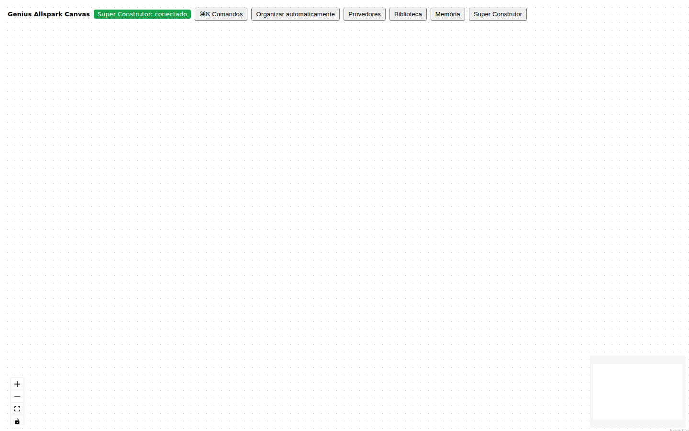
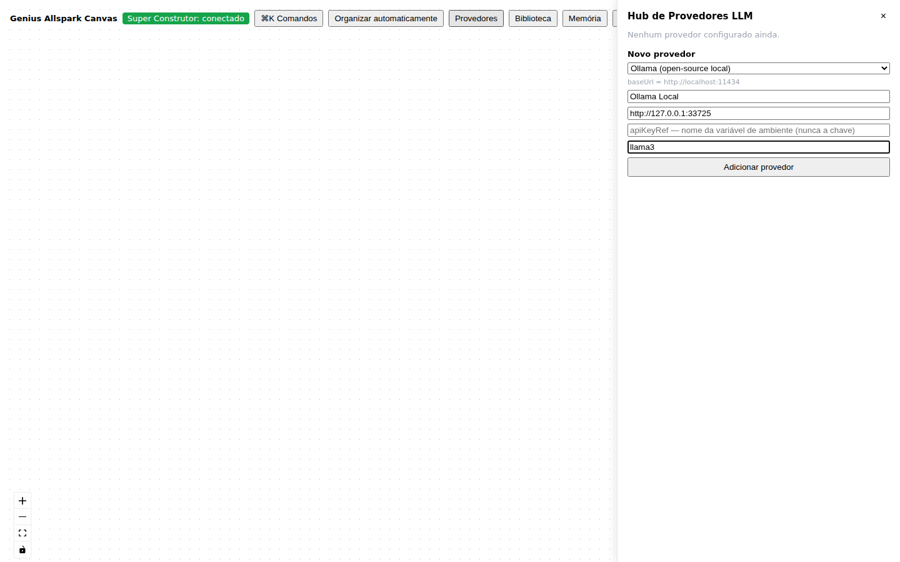
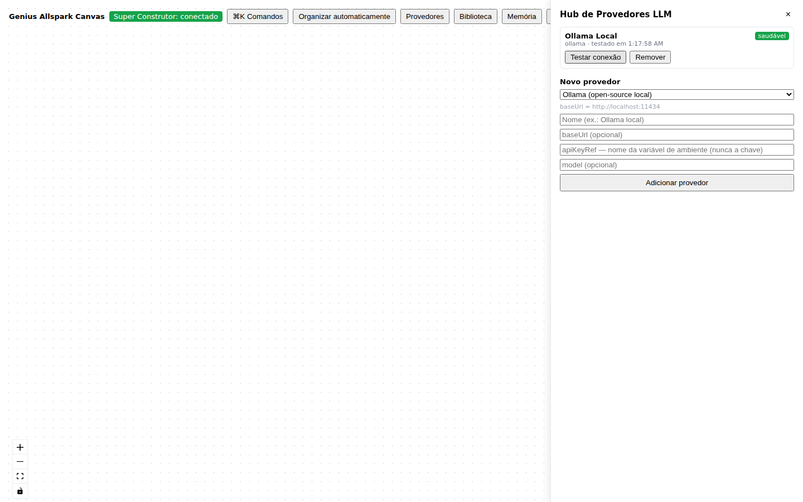
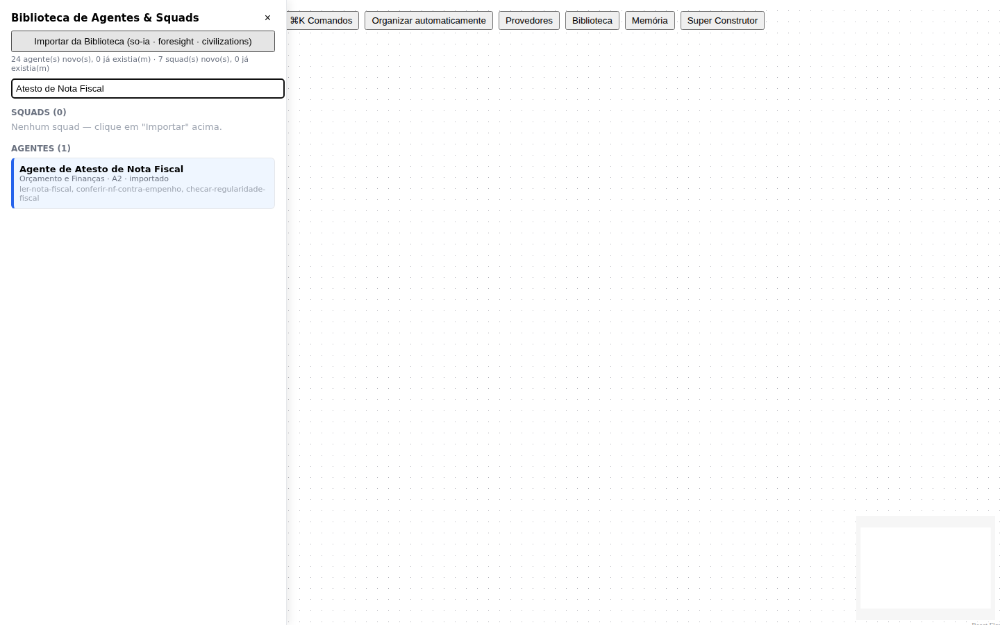
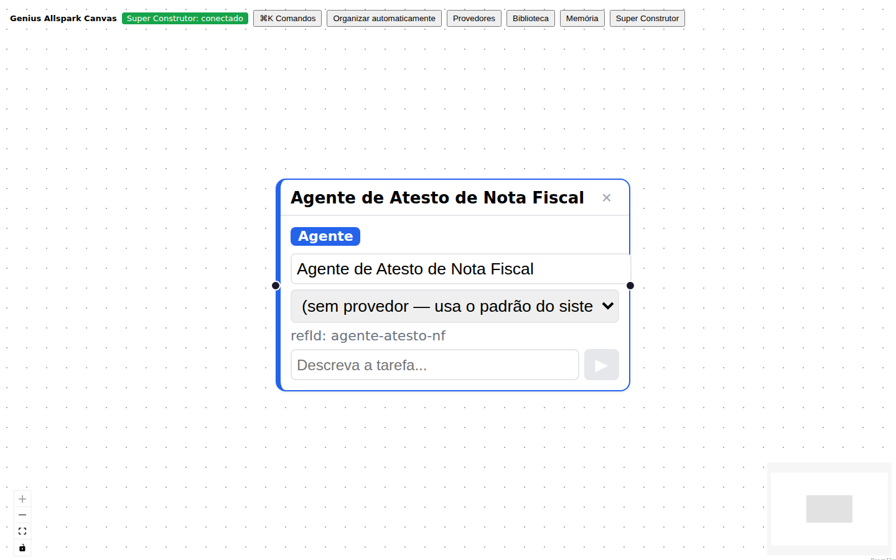
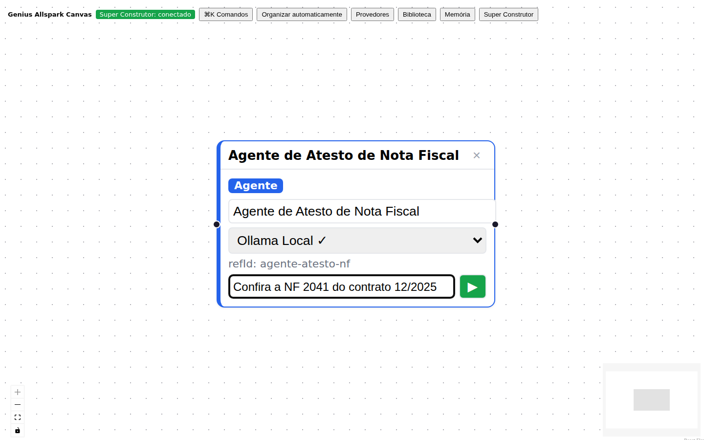
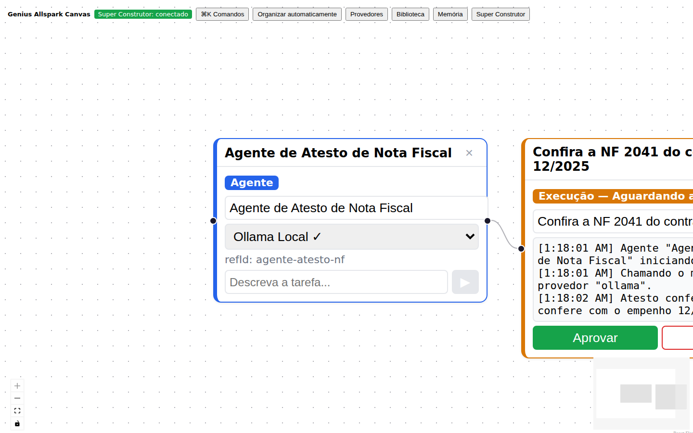
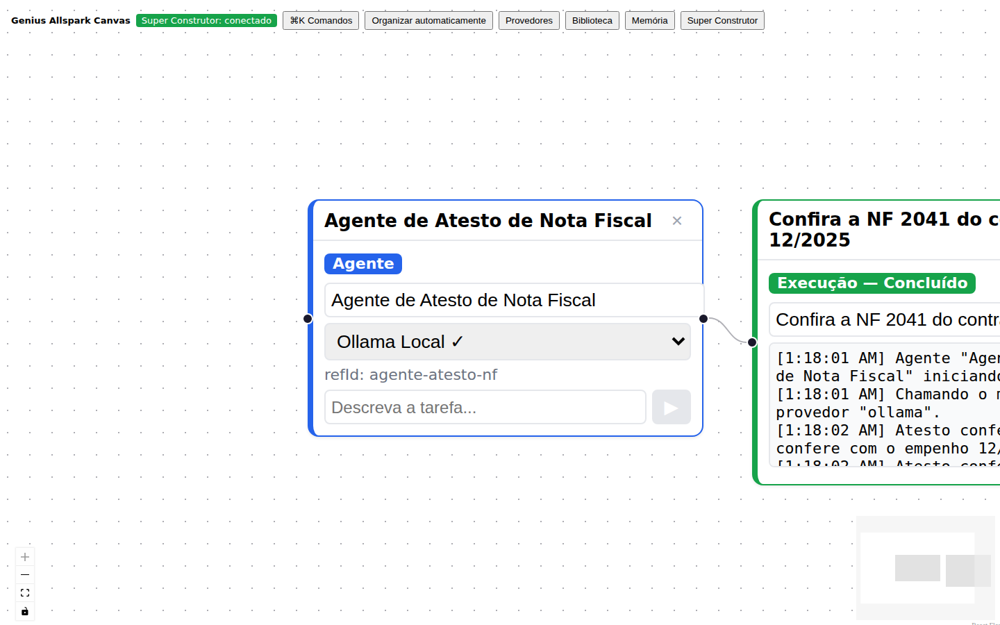

# Guia de Início Rápido — Genius Allspark Canvas

Este guia é para quem só quer **ver o sistema rodando**, sem ler o
[Guia de Construção](PRD-genius-allspark-construcao.md) inteiro primeiro.
Em poucos minutos você tem o Canvas aberto no navegador, um agente real
executando uma tarefa e o resultado aparecendo ao vivo na tela.

## O que é, em uma frase

Um **canvas infinito** onde você arrasta agentes de IA prontos (do so-ia,
do Foresight, ou criados na hora), conecta a um provedor de LLM (Ollama
local, ChatGPT, Claude...) e roda tarefas reais — com aprovação humana
quando o agente não tem autonomia total, e memória que aprende a cada
aprovação.

## Vídeo — 9 segundos, do zero até o resultado


O GIF acima toca sozinho (é assim que o GitHub e a maioria dos
visualizadores de Markdown embutem imagens animadas). Para a versão em
vídeo completa, com controles de play/pause e melhor qualidade, veja
[`assets/inicio-rapido/demo-inicio-rapido.webm`](assets/inicio-rapido/demo-inicio-rapido.webm).

Gravado com um agente real (`Agente de Atesto de Nota Fiscal`, importado
do so-ia) e um provedor Ollama real — não é uma simulação encenada.

## Instalação e execução

Você precisa de **Node.js 22+** instalado. Três jeitos de rodar, do mais
simples ao mais manual:

### Opção 1 — `npx` direto do GitHub (mais rápido, sem clonar)

```bash
npx github:marciobisognin/GeniusAI
```

Na primeira vez isso baixa o repositório, instala as dependências e
compila (leva um minuto ou dois); nas vezes seguintes é quase instantâneo.
Ao final, abre `http://localhost:5173` sozinho (ou mostra o link, se não
houver navegador gráfico disponível).

### Opção 2 — `npx .` depois de clonar

```bash
git clone https://github.com/marciobisognin/GeniusAI.git
cd GeniusAI
npx .
```

Mesmo resultado da Opção 1, mas com o código já na sua máquina — melhor se
você quer também mexer nele depois.

Em ambas as opções, `Ctrl+C` no terminal encerra os dois processos (Super
Construtor + Canvas) de forma limpa.

### Opção 3 — manual, passo a passo (mais controle)

```bash
git clone https://github.com/marciobisognin/GeniusAI.git
cd GeniusAI
npm install
npm run build

# terminal 1 — Super Construtor (banco + API)
node packages/constructor/dist/start.js

# terminal 2 — Canvas (interface)
npm run dev -w apps/canvas
```

Abra `http://localhost:5173`.

## Passo a passo visual

### 1. Canvas vazio

Ao abrir, o badge no canto superior esquerdo mostra "Super Construtor:
conectado" — é o sinal de que a interface achou o servidor.



### 2. Cadastrar um provedor LLM

Clique em **Provedores** e preencha nome, tipo (`ollama` já vem
selecionado) e `baseUrl` (para Ollama local, normalmente
`http://localhost:11434`).



Depois de "Adicionar provedor", clique em **"Testar conexão"** — isso
chama o provedor de verdade (no servidor, nunca no navegador) e marca
"saudável" se responder.



### 3. Importar a Biblioteca e arrastar um agente

Clique em **Biblioteca** → **"Importar da Biblioteca"** — isso lê os
catálogos reais do `so-ia`, do `geniusai-foresight` e do
`geniusai-civilizations` e traz os agentes/squads prontos.



Arraste um agente da lista para o canvas.



### 4. Escolher o provedor e descrever a tarefa

No próprio nó, escolha o provedor no seletor e digite a tarefa em
linguagem natural.



### 5. Clicar em ▶ e ver rodar ao vivo

Um `ExecutionNode` novo aparece, ligado ao agente, mostrando cada passo em
tempo real — inclusive se pausar pedindo aprovação humana (autonomia
A0–A2).



### 6. Aprovar e ver concluir



A partir daqui, essa aprovação já virou aprendizado: rode uma tarefa
parecida de novo e o log vai mostrar "Memória: N trecho(s)..." — veja a
seção ["Como o sistema aprende sozinho"](../README.md#como-o-sistema-aprende-sozinho-etapa-6) no README principal.

## Problemas comuns

| Sintoma | Causa provável | Solução |
|---|---|---|
| "Super Construtor: offline" no canto superior | O servidor (`packages/constructor`) não está rodando ou está noutra porta | Confirme que o terminal do Super Construtor está aberto sem erros; se mudou a porta, exporte `VITE_CONSTRUCTOR_URL` antes de `npm run dev -w apps/canvas` |
| Porta 4001 ou 5173 já em uso | Já existe um Genius Allspark (ou outra coisa) rodando | Feche o processo anterior, ou rode com `PORT=4002 CANVAS_PORT=5174 npx .` |
| "Testar conexão" falha para um provedor Ollama | O Ollama não está rodando localmente | Instale/inicie o Ollama (`ollama serve`) antes de testar |
| `npx github:...` falhou baixando | Sem acesso à internet, ou repositório privado sem permissão | Use a Opção 2 (clonar primeiro) |

## E depois?

- O [Guia de Construção](PRD-genius-allspark-construcao.md) explica cada
  peça do sistema em detalhe, etapa por etapa.
- O [README principal](../README.md) tem a tabela de pacotes e as seções
  "Como executar uma tarefa de verdade" e "Como o sistema aprende
  sozinho".
