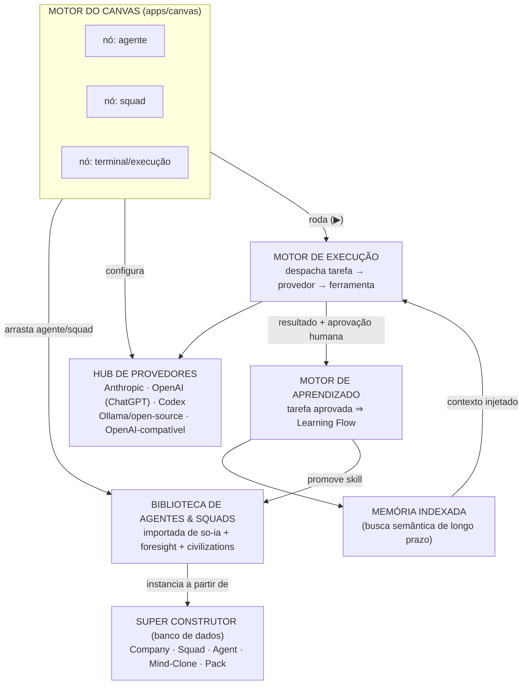

# Guia de Construção — Genius Allspark Canvas

> **Etapas de criação, prontas para construção imediata com IA.** Cada etapa
> tem o que já existe no seu repositório para reaproveitar, os passos
> técnicos exatos e um prompt pronto para dar a um agente de código agora.

Este documento substitui, na prática, o roadmap anterior
(`PRD-genius-allspark-execucao.md`) como guia de construção: aquele falava em
fases e leis; este fala em **componentes concretos, arquivos, pacotes e
prompts**. Os conceitos de produto do [PRD original](PRD-genius-allspark.md)
(autonomia A0–A5, recibo, calibração) continuam válidos e aparecem aqui
encaixados nos lugares certos — mas a estrutura agora é a que você descreveu.

## O que você descreveu, traduzido

| O que você pediu | Nome técnico neste plano | O que já existe no repo para reaproveitar |
|---|---|---|
| Canvas infinito baseado no OmniRift | **Motor do Canvas** | Nada ainda em código — OmniRift é referência de padrão (nós, terminais, worktrees, custo por sessão) |
| Configurar provedores: ChatGPT, Codex, LLMs open source | **Hub de Provedores** | `geniusai-civilizations/apps/backend/src/agent/AgentRunner.ts` — interface já pluga Claude Code/Codex/opencode (`CliAgentRunner.ts`) e Ollama (`OllamaRunner.ts`) por configuração. **É literalmente esta abstração, faltando virar produto** |
| Carregar agentes/squads já existentes no seu repositório | **Biblioteca de Agentes & Squads** | `so-ia/src/lib/data/agents.ts` (agentes com `modelPolicy`, `skills`, `connectors`), `so-ia/src/lib/org/squad-registry.ts` (squads institucionais), `geniusai-foresight/agents/*.yaml` (8 agentes declarativos) |
| Super construtor de squads, empresas, agentes e mind-clones (Nirvana-OS) + seus packs | **Super Construtor** + **Packs** | `so-ia/src/lib/org/matching.ts` e `workflow-builder.ts` já fazem "reaproveita ou cria" para squads — falta Company, Mind-Clone e um banco de dados real (hoje é `localStorage`) |
| Hermes: tarefa aprovada vira aprendizado; memória de longo prazo indexada | **Motor de Aprendizado** + **Memória Indexada** | Nada ainda — Hermes é externo; construímos o conceito direto nesta base |

## Convenções deste guia

- **Monorepo único**: `packages/*` (lógica compartilhada, sem UI) e
  `apps/canvas` (o app novo — o Canvas Infinito). Usa o workspace npm já
  preparado na Fase 0 do roadmap anterior.
- **Nomenclatura de pacotes**: continua `@genius/*` para não quebrar a
  continuidade com o que já foi decidido.
- **Banco local real, não `localStorage`**: SQLite via `better-sqlite3`,
  servido por um processo local leve (Fastify) que o app do canvas chama por
  HTTP/WebSocket — assim o Super Construtor é de verdade um banco de dados.
- **Memória indexada sem infraestrutura externa**: índice vetorial local em
  arquivo (`vectra`, puro JS/TS) — funciona no laptop do zero, sem serviço
  gerenciado. Trocar por pgvector/Chroma é upgrade de escala, não pré-requisito.
- **Cada etapa é independente o suficiente** para dar seu "Prompt pronto"
  direto a uma sessão de IA (Claude Code ou equivalente) e sair com código
  funcionando — na ordem, porque cada etapa consome o pacote da anterior.

---

# Etapa 0 — Fundação do monorepo

**Objetivo:** ter o esqueleto onde as próximas etapas plugam, sem construir
nada de produto ainda.

### Passos
1. `npm init -w packages/canon -w packages/providers -w packages/agent-library -w packages/constructor -w packages/learning -w apps/canvas` a partir da raiz.
2. `packages/canon`: schemas Zod para as entidades que todo o resto usa —
   `Agent`, `Squad`, `Company`, `MindClone`, `Pack`, `ProviderConfig`,
   `LearningFlow`, `MemoryChunk`, `Task`, `Run`, `Approval`.
3. `packages/canon`: catálogo de eventos (`agent.loaded`, `run.started`,
   `run.completed`, `approval.granted`, `learning.recorded`,
   `memory.indexed`) com envelope comum (`id`, `ts`, `correlationId`).
4. SQLite: schema inicial (espelho 1:1 do canon) + migrações versionadas;
   servidor Fastify mínimo (`apps/canvas-server` ou dentro de `packages/constructor`)
   expondo CRUD básico.
5. CI: job novo no workflow existente cobrindo os pacotes novos (build + testes),
   sem tocar nos jobs do so-ia/civilizations/foresight.

### Prompt pronto
> Crie o workspace npm com os pacotes `packages/canon`, `packages/providers`,
> `packages/agent-library`, `packages/constructor`, `packages/learning` e o
> app `apps/canvas` (Vite + React + TypeScript), todos em TypeScript strict.
> Em `packages/canon/src/schemas.ts`, defina com Zod as entidades: `Agent`,
> `Squad`, `Company`, `MindClone`, `Pack`, `ProviderConfig`, `LearningFlow`,
> `MemoryChunk`, `Task`, `Run`, `Approval` — inferindo os campos mínimos de
> cada uma a partir do que descrevo nas etapas seguintes deste documento
> (`docs/PRD-genius-allspark-construcao.md`, Etapas 1 a 6). Adicione testes de
> parse/serialize para cada schema. Em `packages/constructor/src/db.ts`, monte
> um schema SQLite (via `better-sqlite3`) espelhando o canon, com migrações em
> `packages/constructor/migrations/`, e um servidor Fastify mínimo em
> `packages/constructor/src/server.ts` com rotas REST CRUD para cada entidade.
> Atualize `.github/workflows/ci.yml` (ou crie um workflow paralelo) para
> instalar, buildar e testar os pacotes novos sem alterar os jobs existentes.

### Critério de aceite
`npm run build` e `npm test` verdes na raiz para os pacotes novos; o servidor
Fastify sobe e responde `GET /agents` com `[]` num banco vazio.

---

# Etapa 1 — Motor do Canvas Infinito

**Objetivo:** um canvas infinito de verdade — pan/zoom, nós, arestas,
minimapa — onde tudo o resto vai aparecer.

### Passos
1. `apps/canvas`: React + Vite + `@xyflow/react` (React Flow) como motor de
   nós/arestas com pan/zoom infinito e virtualização nativa.
   (Upgrade futuro para Pixi/WebGL só se o canvas passar de ~2.000 nós
   simultâneos — não é pré-requisito para começar.)
2. Tipos de nó iniciais: `AgentNode`, `SquadNode`, `NoteNode`,
   `ExecutionNode` (terminal/log de uma execução em andamento).
3. Minimapa, grade de fundo, auto-layout (Dagre) para organizar squads
   importados sem sobreposição.
4. Persistência: posição e conteúdo de cada nó salvos via
   `packages/constructor` (não em `localStorage`) — o canvas é uma visão do
   banco, não o dono do dado.
5. Paleta de comandos (⌘K): criar nó, buscar agente/squad, focar num nó.

### Prompt pronto
> Em `apps/canvas`, monte um canvas infinito com `@xyflow/react`: pan/zoom
> contínuo, minimapa, grade de 8pt, auto-layout com `dagre` para squads
> importados. Crie os componentes de nó `AgentNode`, `SquadNode`, `NoteNode`
> e `ExecutionNode` (este último mostrando status ao vivo: aguardando /
> executando / concluído / erro, com um log rolável). A posição e o conteúdo
> de cada nó devem ser persistidos chamando a API REST de
> `packages/constructor` (Etapa 0) — nada fica só no cliente. Adicione uma
> paleta de comandos acionada por `⌘K`/`Ctrl+K` para criar um nó, buscar um
> agente/squad existente pelo nome e focar a câmera nele.

### Critério de aceite
Abrir o app, criar 3 nós manualmente, recarregar a página e ver os 3 nós na
mesma posição (prova de que a persistência é real, não client-side).

---

# Etapa 2 — Hub de Provedores LLM

**Objetivo:** configurar de fato ChatGPT, Codex, modelos open-source e
outros, por agente ou por padrão — generalizando o que o `civilizations` já
tem.

### Passos
1. `packages/providers`: interface `LLMProviderAdapter` — generalização de
   `AgentRunner` do `civilizations` (`decide`/`healthy`, mas com nome de
   método neutro `complete`/`stream`, para não ficar amarrado ao domínio de
   civilizações).
2. Adapters concretos:
   - `AnthropicAdapter` (API Claude).
   - `OpenAIChatAdapter` (ChatGPT/GPT via API).
   - `OpenAICodexAdapter` — reaproveita o padrão de `CliAgentRunner.ts`
     (spawn de processo, stdin/stdout, parse de JSON) para CLIs de código.
   - `OllamaAdapter` — **porta quase direta** de `OllamaRunner.ts` do
     civilizations (mesmo contrato de host/model/numPredict).
   - `OpenAICompatibleAdapter` — genérico (`baseUrl` + `apiKey`), cobre
     OpenRouter, vLLM, LM Studio, Groq e qualquer LLM open-source servido
     por endpoint compatível com a API da OpenAI.
3. Tela de configuração (no canvas, painel lateral): cadastrar provedores,
   testar conexão (`healthy()`), guardar chave no keychain do SO (não em
   arquivo — reaproveitar a diretriz já definida no roadmap anterior).
4. Política de modelo por agente: cada `AgentNode` escolhe um provedor
   padrão + fallback (reaproveita o campo `modelPolicy` que já existe em
   `so-ia/src/lib/data/agents.ts`).

### Prompt pronto
> Em `packages/providers/src/adapter.ts`, defina a interface
> `LLMProviderAdapter` com `healthy(): Promise<boolean>` e
> `complete(input: CompletionInput): Promise<CompletionOutput>` (streaming
> opcional via callback). Implemente `AnthropicAdapter`, `OpenAIChatAdapter`,
> `OpenAICodexAdapter` (baseado no padrão de spawn de processo de
> `geniusai-civilizations/apps/backend/src/agent/CliAgentRunner.ts`),
> `OllamaAdapter` (porte direto de
> `geniusai-civilizations/apps/backend/src/agent/OllamaRunner.ts` para esta
> interface) e `OpenAICompatibleAdapter` (baseUrl + apiKey genéricos). Em
> `apps/canvas`, crie um painel "Provedores" (rota ou sheet lateral) para
> cadastrar cada provedor, chamar `healthy()` com um botão "testar conexão" e
> exibir o resultado. As chaves de API devem ir para o keychain do sistema
> operacional via Tauri (ou, se o app ainda não é Tauri nesta etapa, num
> `.env` local explicitamente fora do controle de versão — documente a
> dívida). Cada `AgentNode` do canvas ganha um seletor de provedor padrão +
> fallback, pré-preenchido pelo campo `modelPolicy` quando o agente vier da
> Biblioteca (Etapa 3).

### Critério de aceite
Cadastrar um provedor Ollama local e um OpenAI-compatível (ex.: OpenRouter),
clicar "testar conexão" nos dois e ver sucesso/falha reais — não simulado.

---

# Etapa 3 — Biblioteca de Agentes & Squads

**Objetivo:** carregar no canvas os agentes e squads que **já existem** nos
seus três projetos, sem reescrever nenhum.

### Passos
1. `packages/agent-library`: **importadores** por formato —
   - `fromSoIaAgents()`: lê `so-ia/src/lib/data/agents.ts` e
     `so-ia/src/lib/org/squad-registry.ts`.
   - `fromForesightYaml()`: lê `geniusai-foresight/agents/*.yaml`
     (8 agentes: `causal-forecaster`, `country-profiler`,
     `evidence-auditor`, `game-theory-modeler`, `intake-orchestrator`,
     `red-team-calibrator`, `report-narrator`, `simulation-engineer`).
   - `fromCivilizationsProfiles()`: lê os perfis gerados por
     `CivilizationAgentFactory.ts`.
   Cada importador normaliza para o schema `Agent`/`Squad` do
   `packages/canon` — nenhum formato de origem é modificado.
2. Persistir o resultado da importação no banco do Super Construtor
   (Etapa 4), marcando `origem: "importado"` e a fonte exata.
3. Painel "Biblioteca" no canvas: lista pesquisável de agentes/squads
   disponíveis, com preview (skills, provedor sugerido, autonomia) e
   **arrastar para o canvas** instancia um `AgentNode`/`SquadNode` real,
   ligado ao registro do banco (não uma cópia solta).
4. Botão "importar da biblioteca" roda os três importadores e mostra um
   diff (o que é novo, o que já existe) antes de gravar.

### Prompt pronto
> Em `packages/agent-library/src/importers/`, crie três importadores:
> `fromSoIaAgents.ts` (lê e converte `so-ia/src/lib/data/agents.ts` e
> `so-ia/src/lib/org/squad-registry.ts` para os schemas `Agent`/`Squad` de
> `packages/canon`), `fromForesightYaml.ts` (lê todos os arquivos
> `geniusai-foresight/agents/*.yaml` e converte cada um para `Agent`) e
> `fromCivilizationsProfiles.ts` (converte a saída de
> `geniusai-civilizations/apps/backend/src/agent/CivilizationAgentFactory.ts`).
> Cada importador é puro (recebe o conteúdo do arquivo/diretório, devolve uma
> lista de entidades validadas pelo canon) — não modifique os arquivos de
> origem. Grave o resultado no banco de `packages/constructor` com
> `origem: "importado"` e o caminho de origem. Em `apps/canvas`, crie um
> painel "Biblioteca" (sheet lateral) listando os agentes/squads disponíveis
> com busca por nome/skill, e implemente arrastar-e-soltar do painel para o
> canvas, criando um `AgentNode`/`SquadNode` vinculado ao `id` real do banco.

### Critério de aceite
Rodar o importador uma vez e ver os agentes do `so-ia` (ex.: "Agente de
Qualificação de Leads") e os 8 agentes YAML do `foresight` aparecerem no
painel Biblioteca; arrastar um para o canvas cria o nó com os dados corretos.

---

# Etapa 4 — Super Construtor (Companies · Squads · Agents · Mind-Clones · Packs)

**Objetivo:** o construtor de verdade — inspirado nos conceitos do
Nirvana-OS (reimplementados de forma independente; a licença dele é
source-available, não OSI — conceitos são livres, código não é copiado),
gravado em banco, não montado à mão em JSON.

### Passos
1. `packages/constructor`: entidades `Company` (contém `Squad`s),
   `Squad` (contém `Agent`s, tem líder — já existe o conceito em
   `squad-registry.ts`, agora com dono real em banco), `Agent`,
   `MindClone`.
2. **Mind-Clone**: perfil cognitivo estruturado de uma pessoa real,
   nas mesmas camadas já definidas no PRD de produto — Identidade,
   Conhecimento, Raciocínio Operacional, Comunicação, Restrições, Evolução.
   Wizard de criação: perguntas guiadas + upload de documentos da pessoa
   (relatórios, e-mails, decisões passadas) → um `AgentDNA` estruturado que
   se torna a base de um `Agent`.
3. **Reaproveitar ou criar**, para as quatro entidades — o mesmo padrão que
   `so-ia/src/lib/org/matching.ts` e `workflow-builder.ts` já implementam
   para squads/workflows, generalizado: antes de criar, o construtor procura
   equivalente na Biblioteca (Etapa 3); só cria novo quando nada serve.
4. **Packs**: bundle portátil (`.json` ou `.zip` com manifesto) contendo
   `{ agents, squads, workflows, skills }` — formato de exportação/importação.
   Pasta `packs/` na raiz do repositório: qualquer arquivo lá é auto-detectado
   e oferecido para importação no painel Biblioteca.
5. UI do Super Construtor: tela dedicada (fora do canvas, ou um zoom mais
   profundo dele) para montar Company → Squad → Agent/Mind-Clone com
   formulários guiados, não só drag-and-drop.

### Prompt pronto
> Em `packages/constructor`, adicione as entidades `Company` e `MindClone` ao
> schema (SQLite + canon), com `Company` referenciando N `Squad`s e cada
> `Squad` referenciando N `Agent`s (reaproveite a estrutura de
> `so-ia/src/lib/org/squad-registry.ts` como referência de forma, sem copiar
> o arquivo). Implemente `MindClone` com as camadas Identidade, Conhecimento,
> Raciocínio Operacional, Comunicação, Restrições e Evolução, cada uma um
> campo de texto estruturado. Crie a função `findOrCreate(kind, spec)` em
> `packages/constructor/src/reuse.ts` que primeiro busca na Biblioteca
> (`packages/agent-library`) um agente/squad compatível por sobreposição de
> skills/responsabilidades (portando a lógica de
> `so-ia/src/lib/org/matching.ts`) e só cria um novo registro quando nada
> serve. Defina o formato `Pack` (manifesto JSON: `{ nome, versao, agents,
> squads, workflows, skills }`) com `export()`/`import()`; crie a pasta
> `packs/` na raiz do repositório com um `README.md` explicando o formato, e
> um watcher simples que lista os arquivos ali para importação manual. Em
> `apps/canvas`, crie a tela "Super Construtor" com formulários para montar
> Company → Squad → Agent/Mind-Clone passo a passo, incluindo o wizard de
> criação de Mind-Clone (perguntas guiadas por camada + upload de documentos
> de referência).

### Critério de aceite
Criar uma Company nova pelo formulário, adicionar um Squad, e ver o sistema
sugerir reaproveitar um agente existente da Biblioteca antes de deixar criar
um novo do zero. Exportar essa Company como Pack e reimportá-la em uma
Company vazia produz o mesmo resultado.

---

# Etapa 5 — Motor de Execução

**Objetivo:** o botão "▶" no canvas roda de verdade — agente ou squad,
usando o provedor configurado, com resultado visível ao vivo no
`ExecutionNode`.

### Passos
1. `packages/constructor` (ou novo `packages/execution`): dado um
   `AgentNode`/`SquadNode` + uma tarefa em linguagem natural, monta o prompt
   (persona do Agent/Mind-Clone + contexto da tarefa), chama o
   `LLMProviderAdapter` configurado (Etapa 2), executa ferramentas quando o
   agente pede.
2. Streaming de eventos para o `ExecutionNode`: cada passo do agente aparece
   ao vivo (reaproveita o padrão de streaming de `AgentRunner.decide` do
   civilizations).
3. Execução de squad: decompõe a tarefa entre membros, líder consolida —
   mesma lógica conceitual de `runTurn.ts` do civilizations, adaptada de
   "turno de civilização" para "tarefa de squad".
4. Aprovação humana antes de qualquer ação externa real (grava em
   `packages/canon` `Approval`) — sem isso a Etapa 6 não tem gatilho.

### Prompt pronto
> Crie `packages/execution` com a função `runTask(nodeId, taskDescription)`:
> resolve o `Agent` (ou `Squad`) do banco, monta o prompt combinando a
> persona/DNA do agente com a descrição da tarefa, chama o
> `LLMProviderAdapter` já configurado para aquele nó, e emite eventos de
> progresso (`task.step`, `task.tool_call`, `task.completed`,
> `task.failed`) que o `ExecutionNode` do canvas consome via
> WebSocket/SSE para mostrar o log ao vivo. Para `Squad`, decomponha a tarefa
> entre os agentes membros e consolide pelo líder antes de emitir
> `task.completed`. Toda ação classificada como externa (envio, publicação,
> gravação fora do sandbox) deve pausar em `task.awaiting_approval` e só
> continuar após um registro de `Approval` no banco — construa a tela mínima
> de aprovação (aprovar/rejeitar com comentário) no canvas.

### Critério de aceite
Arrastar um agente da Biblioteca, clicar "▶", digitar uma tarefa simples e
ver o `ExecutionNode` mostrar passos reais até concluir ou pedir aprovação.

---

# Etapa 6 — Motor de Aprendizado + Memória Indexada

**Objetivo:** a peça que faltava em todos os projetos anteriores — toda
tarefa executada **e aprovada** vira aprendizado reutilizável, e existe uma
memória de longo prazo pesquisável por significado, não só por palavra-chave.

### Passos
1. `packages/learning`: ao registrar uma `Approval` positiva (Etapa 5), o
   motor gera um `LearningFlow` — resumo generalizado dos passos que deram
   certo (via LLM: "generalize esta execução específica em um procedimento
   reutilizável"), com tags e o agente/skill de origem.
2. **Promoção de skill**: quando um `LearningFlow` se repete com sucesso
   N vezes para a mesma skill, o sistema propõe transformar isso numa nova
   `Skill` formal na Biblioteca (mesmo conceito de "origem: gerada" que já
   existe em `so-ia/src/lib/org/skills-registry.ts`, agora alimentado por
   uso real, não por matching de palavra-chave).
3. **Memória indexada de longo prazo**: todo `LearningFlow`, documento de
   Mind-Clone e resultado aprovado é fatiado (`chunk`), embedado e gravado
   num índice vetorial local (`vectra`) — pesquisável por significado.
4. **Injeção de contexto**: antes de rodar uma tarefa nova (Etapa 5), o
   motor busca na memória indexada os `LearningFlow`s e trechos mais
   relevantes e injeta como contexto — o sistema literalmente fica melhor a
   cada aprovação.
5. Painel "Memória" no canvas: buscar por significado, ver a procedência de
   cada resultado (qual execução, qual aprovação, quando).

### Prompt pronto
> Em `packages/learning`, implemente `recordApprovedRun(runId)`: busca a
> execução aprovada (Etapa 5), pede a um `LLMProviderAdapter` para
> generalizar os passos num `LearningFlow` (schema: `taskPattern`,
> `stepsGeneralized`, `agentOrSkillOrigin`, `tags`, `sourceRunId`) e grava no
> banco. Implemente `maybePromoteSkill(agentId, skillTag)`: conta
> `LearningFlow`s bem-sucedidos com a mesma tag; acima de um limiar
> configurável, cria uma proposta de nova `Skill` (mesmo conceito de
> `so-ia/src/lib/org/skills-registry.ts`, porém alimentada por uso real).
> Implemente um índice vetorial local com `vectra` em
> `packages/learning/src/memory.ts`: `indexChunk(text, metadata)` e
> `search(query, k)`. Toda vez que um `LearningFlow` for gravado, indexe-o;
> toda vez que `runTask` (Etapa 5) iniciar, chame `search` com a descrição da
> tarefa e injete os top-k resultados no prompt como contexto de memória. Em
> `apps/canvas`, crie o painel "Memória": campo de busca semântica e lista de
> resultados mostrando de qual execução/aprovação cada trecho veio.

### Critério de aceite
Rodar a mesma tarefa duas vezes: na segunda vez, o log de execução mostra
contexto de memória injetado vindo da primeira execução aprovada, e a
qualidade/velocidade da resposta melhora de forma observável.

---

# Etapa 7 — Integração ponta a ponta

**Objetivo:** provar que as seis etapas formam um sistema, não seis
protótipos soltos.

### Roteiro de aceitação
1. Abrir o canvas vazio.
2. Configurar um provedor (Ollama local **e** um provedor cloud) no Hub.
3. Importar a Biblioteca — ver agentes do so-ia e do foresight disponíveis.
4. Pelo Super Construtor, montar uma Company nova com um Squad reaproveitando
   um agente da Biblioteca e criando um Mind-Clone novo.
5. Arrastar o Squad para o canvas, rodar uma tarefa real.
6. Aprovar o resultado.
7. Ver o Learning Flow gerado e indexado na Memória.
8. Rodar uma segunda tarefa parecida e confirmar que o contexto de memória
   da primeira aparece na segunda.
9. Exportar a Company como Pack; importar em ambiente limpo; confirmar
   equivalência.

**Este roteiro é o critério de aceite do sistema inteiro** — se os nove
passos rodam sem intervenção manual no banco, o Genius Allspark Canvas
existe de fato.

---

# Como usar este guia agora

1. Rode a Etapa 0 primeiro — sem ela nada compila.
2. Dê o "Prompt pronto" de cada etapa, em ordem, a uma sessão de IA com
   acesso a este repositório (Claude Code ou equivalente). Cada prompt já
   cita os arquivos reais a importar/portar — não precisa reexplicar o
   contexto.
3. Depois de cada etapa, rode o critério de aceite antes de avançar para a
   próxima — as etapas dependem umas das outras de propósito.
4. Ao final da Etapa 7, o sistema descrito nesta conversa existe e roda
   localmente.
