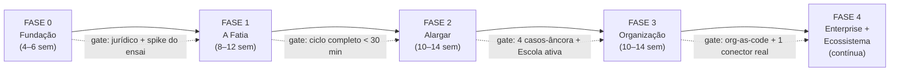

# PRD de Execução — Genius Allspark

> **Plano mestre de construção: todas as fases, todos os épicos e cada tarefa
> necessária para erguer os sistemas, as ferramentas, o design e o ambiente
> gráfico do Allspark.**

| | |
|---|---|
| **Produto** | Genius Allspark — Sistema Operacional de Organizações Agênticas |
| **Documento** | PRD de Execução (backlog técnico por fases) — v1.0 |
| **Documento-pai** | [PRD — Genius Allspark v1.0](PRD-genius-allspark.md) (visão, Quatro Leis, arquitetura) |
| **Escopo** | Fases 0–4 completas: fundação, fatia vertical, alargamento, organização, enterprise/ecossistema |

---

## Como ler este documento

- **Fase → Épico → Tarefa.** Cada fase tem um objetivo e um gate go/no-go.
  Cada épico entrega algo demonstrável. Cada tarefa tem ID, entregável,
  dependências e critério de aceite.
- **IDs**: `F1-E3-T02` = Fase 1, Épico 3, Tarefa 2. Dependências citam IDs.
- **Tamanhos** (ordem de grandeza, para priorização — não compromisso):
  **P** ≤ 3 dias · **M** ≤ 2 semanas · **G** ≤ 6 semanas.
- **Trilhas** — toda tarefa pertence a uma:

| Trilha | Sigla | Cobre |
|---|---|---|
| Sistemas | SIS | Backend, pacotes, motores, runtimes, dados |
| Ferramentas | FER | CLIs, adapters, conectores, infra de dev |
| Design | DES | Design system, tokens, componentes, acessibilidade |
| Ambiente gráfico | AG | Superfícies visuais (Organograma Vivo, Forja, Sala de Ensaio…) |
| Qualidade | QA | Testes, evals, CI, segurança |

## Definition of Done global (vale para toda tarefa)

1. Código com testes (unitário no mínimo; e2e quando toca fluxo de usuário).
2. Schemas Zod para todo dado que cruza fronteira de módulo.
3. Eventos emitidos com `mission_id`/`run_id`/`agent_id` quando aplicável.
4. Estados exibidos apenas no vocabulário unificado (rascunho → planejado →
   ensaiado → contratado → em execução → bloqueado → requer aprovação → em
   revisão → aprovado → concluído/com ressalvas → cancelado/falhou).
5. Texto de UI passa pelo Tradutor de Eventos — nenhum jargão técnico cru.
6. WCAG 2.2 AA nos componentes novos; cor nunca é o único canal de estado.
7. Decisão arquitetural relevante → ADR curto em `docs/adr/`.

## Mapa geral

---

# FASE 0 — Fundação (4–6 semanas)

> **Objetivo:** decidir o indecidível (jurídico, protocolo, hipótese do
> ensaio), montar o esqueleto do monorepo e do design system, e extrair dos
> projetos existentes os motores que viram pacotes compartilhados.
> **Nada de feature visível ao usuário final nesta fase.**

## F0-E1 — Governança do programa

| ID | Trilha | Tarefa | Tam. | Depende | Critério de aceite |
|---|---|---|---|---|---|
| F0-E1-T01 | FER | Criar `docs/adr/` com template de ADR (contexto → decisão → consequências) e ADR-0001 registrando a adoção deste plano | P | — | Template usado por todos os ADRs seguintes |
| F0-E1-T02 | SIS | **Decisão jurídica Nirvana-OS**: parecer sobre a licença source-available; decidir reimplementar × licenciar | M | — | ADR-0002 assinado; se "reimplementar", lista dos conceitos permitidos (ideias não são protegidas; código sim) |
| F0-E1-T03 | FER | Converter a raiz do repositório em workspace npm (`workspaces: ["so-ia", "geniusai-civilizations", "packages/*"]`) sem quebrar os projetos atuais | P | — | `npm install` na raiz resolve tudo; CIs existentes seguem verdes |
| F0-E1-T04 | QA | Matriz de CI por projeto/pacote: jobs disparam apenas quando o caminho correspondente muda (paths filter) | M | T03 | PR docs-only não roda suíte de app; PR em `packages/canon` roda canon + dependentes |

## F0-E2 — Pacotes canônicos (extrair, não reescrever)

| ID | Trilha | Tarefa | Tam. | Depende | Critério de aceite |
|---|---|---|---|---|---|
| F0-E2-T01 | SIS | `@genius/canon`: schemas Zod + tipos das entidades canônicas (Workspace, Organization, OrgNode, Squad, AgentProfile, Skill, Mission, RehearsalRun, Run, StepRun, Artifact, Approval, Policy, MemoryRecord, LicenseGrant, CalibrationRecord, CostLedger, AuditEvent) | M | F0-E1-T03 | 100% das entidades com schema + parse/serialize testados; publicável no workspace |
| F0-E2-T02 | SIS | `@genius/canon`: catálogo de **eventos** versionados (`mission.*`, `rehearsal.*`, `contract.signed`, `run.*`, `tool.*`, `quality_gate.*`, `license.*`, `calibration.recorded`, `budget.*`, `security.*`) com envelope comum (id, ts, versão, correlação) | M | T01 | Todo evento valida contra schema; teste de round-trip |
| F0-E2-T03 | SIS | `@genius/org-compiler`: extrair do `so-ia` os motores `matching.ts`, `squads.ts` + `squad-registry.ts`, `relevance.ts`, `workflow-builder.ts`, `skills-registry.ts` para o pacote, tipados pelo canon | G | T01 | so-ia importa do pacote e o app se comporta identicamente (golden tests com organogramas de fixture) |
| F0-E2-T04 | SIS | `@genius/org-compiler`: importadores (`import.ts`, `pdf-extract.ts`) movidos para o pacote com suíte de fixtures (.json/.csv/.txt/.md/.pdf) | M | T03 | Cada formato tem ≥3 fixtures com resultado esperado versionado |
| F0-E2-T05 | QA | Golden tests do compilador: N organogramas reais (IFFar, empresa 50p, empresa 300p) → saída compilada versionada como snapshot | M | T03 | Mudança de comportamento do compilador quebra o teste e exige atualização consciente do snapshot |
| F0-E2-T06 | SIS | `@genius/receipt`: schema do Recibo Operacional (quem, o quê, fontes/citações, decisões, custos, aprovações, diffs) + renderizadores JSON e HTML | M | T01 | Recibo de exemplo do caso atesto renderiza e valida |

## F0-E3 — Contrato Control Plane ↔ Runtime

| ID | Trilha | Tarefa | Tam. | Depende | Critério de aceite |
|---|---|---|---|---|---|
| F0-E3-T01 | SIS | Especificar o **Runtime Protocol v0** (ADR-0003): dispatch de tarefa, streaming de eventos, aprovação bloqueante, cancelamento, heartbeat, checkpoint, idempotência | M | F0-E2-T02 | Spec versionada + JSON Schemas dos frames |
| F0-E3-T02 | FER | `@genius/runtime-adapter`: interface TS do protocolo + **MockRuntime** determinístico para testes e demos | M | T01 | Missão fake roda ponta a ponta contra o mock em teste de integração |
| F0-E3-T03 | FER | **HermesAdapter esqueleto**: mapeamento sessão/ferramenta/custo do Hermes para o protocolo; decisões de gap documentadas | M | T01 | Chamada real de uma ferramenta simples do Hermes trafega pelo adapter com eventos corretos |

## F0-E4 — Spike da Sala de Ensaio (critério de falsificação)

> A hipótese mais ousada do produto (Lei 2) é testada **antes** de virar
> compromisso. Prazo fechado: 4 semanas de spike, em paralelo aos épicos acima.

| ID | Trilha | Tarefa | Tam. | Depende | Critério de aceite |
|---|---|---|---|---|---|
| F0-E4-T01 | SIS | Harness de ensaio: rodar a missão de atesto (dados sintéticos) em dry-run N=30 variações via células do `geniusai-foresight` | G | F0-E3-T02 | Distribuições de custo/duração/pontos de falha geradas |
| F0-E4-T02 | SIS | **Baseline ingênuo** para comparação: estimativa por média histórica simples + heurística de passos | P | — | Implementado e documentado |
| F0-E4-T03 | QA | Protocolo de avaliação: 20 execuções reais medidas contra as previsões do ensaio × baseline (erro absoluto de custo/duração; recall de pontos de falha) | M | T01, T02 | Relatório go/no-go: ensaio precisa bater o baseline com margem definida no protocolo **antes** de rodar |
| F0-E4-T04 | SIS | Plano B pronto: modo "dry-run estrutural" (sem simulação estocástica) especificado caso o gate falhe | P | — | ADR-0004 com os dois caminhos |

## F0-E5 — Design system fundacional

| ID | Trilha | Tarefa | Tam. | Depende | Critério de aceite |
|---|---|---|---|---|---|
| F0-E5-T01 | DES | **Tokens**: paleta semântica (azul execução, verde validado, âmbar atenção, vermelho falha, roxo memória, cinza inativo) em claro/escuro, tipografia, grid 8pt, raios, sombras — como pacote `@genius/tokens` (CSS vars + Tailwind preset) | M | — | so-ia consome os tokens sem regressão visual perceptível |
| F0-E5-T02 | DES | **Vocabulário de estados**: os 12 estados unificados com nome, cor, ícone e microcopy — componente `<StateBadge>` único | P | T01 | Nenhuma tela cria badge de estado próprio |
| F0-E5-T03 | DES | Biblioteca base: consolidar os componentes shadcn/@base-ui do so-ia em `@genius/ui` (usar `render`, não `asChild`), com Storybook (ou Ladle) e testes de acessibilidade automatizados (axe) | G | T01 | ≥20 componentes documentados; axe sem violações AA |
| F0-E5-T04 | AG | **Protótipo navegável do Organograma Vivo** (código, não Figma): árvore com pulso de atividade, zoom semântico simulado em 4 níveis, dados fake | G | T01 | Teste com 5 usuários: todos entendem "onde está o trabalho" sem explicação |
| F0-E5-T05 | DES | **Dicionário v0 do Tradutor de Eventos**: mapeamento evento técnico → frase humana (pt-BR) para os ~40 eventos do canon, com placeholders tipados | M | F0-E2-T02 | Pacote `@genius/translator`; teste garante 100% dos eventos cobertos (falha de build se surgir evento sem tradução) |
| F0-E5-T06 | DES | Direção de motion: durações/curvas padrão (Framer Motion), redução de movimento respeitada | P | T01 | Variantes exportadas de `@genius/ui`; `prefers-reduced-motion` testado |

## F0-E6 — Dados e eventos locais

| ID | Trilha | Tarefa | Tam. | Depende | Critério de aceite |
|---|---|---|---|---|---|
| F0-E6-T01 | SIS | Schema SQLite v1 (espelho do canon) + migrações versionadas (ex.: drizzle/kysely) | M | F0-E2-T01 | Migração sobe/desce limpa; testes de persistência |
| F0-E6-T02 | SIS | **Event store append-only** local: gravação imutável, leitura por correlação, base do replay | M | T01, F0-E2-T02 | Reproduzir uma sequência de eventos reconstrói o estado (teste determinístico) |

### 🚦 Gate da Fase 0 (go/no-go)
1. ADR jurídico do Nirvana decidido. 2. `@genius/canon` + `org-compiler`
extraídos com golden tests verdes e so-ia consumindo-os. 3. Runtime Protocol
v0 com mock funcionando. 4. Veredito do spike do ensaio (Lei 2 plena **ou**
plano B declarado). 5. Tokens + protótipo do Organograma Vivo validados com
usuários.

---

# FASE 1 — A Fatia (8–12 semanas)

> **Objetivo:** *uma* missão real percorrendo as Quatro Leis de ponta a ponta,
> num app desktop local: importar organograma → compilar → pedir atesto de NF
> em linguagem natural → ensaiar → contratar → executar no Hermes → aprovar
> (A2) → receber prosa + Recibo. **Gate:** pessoa não técnica completa o ciclo
> em < 30 min sem ajuda.

## F1-E1 — Shell desktop

| ID | Trilha | Tarefa | Tam. | Depende | Critério de aceite |
|---|---|---|---|---|---|
| F1-E1-T01 | SIS | App Tauri 2 embarcando a UI React (evolução do so-ia); janela, menu, atalhos, auto-update desativável | G | F0-E5 | Instalável em Windows/macOS/Linux; abre em < 3s |
| F1-E1-T02 | SIS | Persistência local: SQLite do F0-E6 no lado Rust/Tauri, com camada de acesso tipada exposta à UI; migração do `localStorage` existente | M | F0-E6-T01 | Dados sobrevivem a reinício; import de estado legado do so-ia funciona |
| F1-E1-T03 | SIS | Cofre de segredos: chaves de provedores no keychain do SO, nunca em arquivo | M | T01 | Nenhuma credencial em texto plano em disco (teste de varredura) |
| F1-E1-T04 | AG | Paleta de comandos (⌘K): navegar para qualquer objeto (organograma, missão, agente, aprovação) | M | T01 | Qualquer tela alcançável só por teclado |

## F1-E2 — A Forja (onboarding e compilação)

| ID | Trilha | Tarefa | Tam. | Depende | Critério de aceite |
|---|---|---|---|---|---|
| F1-E2-T01 | AG | Portar o onboarding do so-ia (tipo → organograma → montagem) para o shell, consumindo `@genius/org-compiler` | M | F1-E1-T02, F0-E2-T03 | Fluxo idêntico ao atual, dados no SQLite |
| F1-E2-T02 | SIS | **Forja de agentes via LLM** com fallback determinístico: quando o catálogo não cobre a função, gerar identidade/descrição/skills via modelo, validado por schema; se o LLM falhar, cai no matching por palavras-chave atual | G | F0-E2-T03 | Eval: 20 funções de fixture → agente gerado passa validação e revisão humana em ≥80% |
| F1-E2-T03 | AG | Compilação assistível: console animado existente + **relatório de compilação** (o que foi reaproveitado × forjado, por quê) persistido como artefato | M | T01 | Relatório acessível depois do onboarding |
| F1-E2-T04 | QA | e2e Playwright: importar organograma fixture (.pdf e .csv) → sistema compilado → Lei 1 verificada (área ausente ⇒ ferramenta ausente) | M | T01 | Roda no CI a cada PR que toca Forja/compiler |

## F1-E3 — Organograma Vivo v1 (zoom 1–2)

| ID | Trilha | Tarefa | Tam. | Depende | Critério de aceite |
|---|---|---|---|---|---|
| F1-E3-T01 | AG | Render de produção da árvore (virtualizada ≥ 500 caixas) com estado vivo por caixa (pulso = executando; âmbar = aguarda aprovação; vermelho = bloqueado) alimentado pelo event store | G | F0-E5-T04, F0-E6-T02 | 60fps com 500 caixas; estados corretos em teste de integração |
| F1-E3-T02 | AG | Zoom semântico níveis Estratégia e Operação: afastado = áreas com calor de atividade; aproximado = missões/aprovações por caixa | M | T01 | Transição contínua sem troca de tela |
| F1-E3-T03 | AG | Painel da caixa (função): agente, habilitação por skill, tarefa atual, últimas execuções, custo | M | T01 | Abre em < 200ms; dados reais do SQLite |
| F1-E3-T04 | DES | Acessibilidade do canvas: navegação por teclado entre caixas, leitor de tela com resumo por área, alternativa em lista | M | T01 | Auditoria axe + teste manual com leitor de tela |

## F1-E4 — Missão em linguagem natural

| ID | Trilha | Tarefa | Tam. | Depende | Critério de aceite |
|---|---|---|---|---|---|
| F1-E4-T01 | SIS | Intake: caixa de missão (no Organograma Vivo e na paleta) → **Planner** LLM produz plano estruturado (objetivo, critérios de aceite, tarefas, agente/skill, riscos) validado pelo canon | G | F0-E2-T01 | 10 pedidos de fixture → plano válido em 100% (com retry de schema) |
| F1-E4-T02 | SIS | Roteamento pela Lei 1: planner só enxerga agentes/skills existentes no organograma compilado; pedido fora de cobertura → resposta honesta "sua organização não tem essa área" com sugestão | M | T01 | Teste: organograma sem financeiro rejeita missão de NF |
| F1-E4-T03 | AG | Tela do plano: revisão e edição do plano antes do ensaio | M | T01 | Usuário altera critério de aceite e o plano re-valida |

## F1-E5 — Sala de Ensaio v1

> Implementa o caminho vencedor do gate F0-E4 (ensaio pleno **ou** dry-run
> estrutural — as tarefas valem para ambos; muda a profundidade).

| ID | Trilha | Tarefa | Tam. | Depende | Critério de aceite |
|---|---|---|---|---|---|
| F1-E5-T01 | SIS | Ambiente sintético do caso atesto: NF/empenho/contrato fake gerados por seed; ferramentas em modo dry-run interceptadas pelo adapter | M | F0-E3-T02 | Nenhuma ação externa real possível em ensaio (teste de guarda) |
| F1-E5-T02 | SIS | Motor de ensaio: N variações (fonte indisponível, dado faltante, retry) → distribuição de custo/duração + pontos de falha prováveis | G | T01, F0-E4 | Saída validada pelo schema `RehearsalRun` |
| F1-E5-T03 | AG | **Replay assistível** do ensaio no Organograma Vivo: assistir a missão simulada caixa a caixa, com timeline | M | F1-E3-T01, T02 | Play/pause/scrub funcionam; eventos traduzidos |
| F1-E5-T04 | SIS | Registro de calibração: previsto (ensaio) × realizado (execução) gravado como `CalibrationRecord`; erro médio por janela móvel | M | T02 | Dashboard interno mostra o erro; alimenta F1-E6 |

## F1-E6 — Contrato de Missão

| ID | Trilha | Tarefa | Tam. | Depende | Critério de aceite |
|---|---|---|---|---|---|
| F1-E6-T01 | AG | Tela do Contrato: entregáveis, ações externas previstas, aprovações exigidas, custo/duração **com intervalo** e a frase de calibração ("nos últimos N contratos erramos em média X%") | M | F1-E5-T02, T04 | Sem número seco em lugar nenhum; contrato exportável |
| F1-E6-T02 | SIS | Assinatura do contrato = baseline: execução monitorada contra o intervalo; desvio projetado gera alerta **antes** do estouro | M | T01 | Teste: custo simulado estourando dispara alerta antecipado |

## F1-E7 — Execução real (Hermes)

| ID | Trilha | Tarefa | Tam. | Depende | Critério de aceite |
|---|---|---|---|---|---|
| F1-E7-T01 | FER | HermesAdapter v1 completo: sessão por tarefa, ferramentas do caso atesto, custos e tokens reais, cancelamento, checkpoint/retomada | G | F0-E3-T03 | Missão de atesto executa de verdade; interromper + retomar funciona |
| F1-E7-T02 | SIS | Guarda de autonomia no Control Plane: toda chamada de ferramenta valida `LicenseGrant` da skill; ação sensível sem A≥3 bloqueia e vira aprovação pendente | M | T01 | Invariante testada: nenhuma ação acima da habilitação, nem sob prompt injection simulada |
| F1-E7-T03 | AG | Execução ao vivo no Organograma Vivo: mesmos componentes do replay (F1-E5-T03) com eventos reais | M | F1-E5-T03, T01 | Usuário acompanha a caixa executando em tempo real |
| F1-E7-T04 | DES | Tradutor de Eventos v1 em produção: todo evento visível passa pelo dicionário; evento técnico original a um clique | P | F0-E5-T05 | Teste de cobertura do dicionário no CI |

## F1-E8 — Aprovação A2 + Recibo Operacional

| ID | Trilha | Tarefa | Tam. | Depende | Critério de aceite |
|---|---|---|---|---|---|
| F1-E8-T01 | AG | Portar a Caixa de Aprovações do so-ia: detalhe com citações verificáveis (cada valor aponta a fonte/página), ações aprovar/corrigir/rejeitar/delegar/só-desta-vez | M | F1-E1-T02 | Caso atesto exige e registra a aprovação humana |
| F1-E8-T02 | SIS | Geração do Recibo Operacional via `@genius/receipt` ao concluir missão: prosa (LLM, com template) + recibo estruturado; export JSON/HTML/PDF | M | F0-E2-T06 | Recibo do atesto contém 100% dos campos; citações clicáveis |
| F1-E8-T03 | SIS | Trilha de auditoria append-only ligada ao event store; tela de auditoria portada do so-ia lendo dados reais | M | F0-E6-T02 | Nenhum registro editável; export CSV/JSON |
| F1-E8-T04 | SIS | Ledger de habilitação v0: cada execução alimenta o histórico por skill (aprovada sem edição / com edição / rejeitada) — sem promoção ainda | P | F1-E7-T02 | Histórico visível no painel da caixa (F1-E3-T03) |

## F1-E9 — Qualidade da Fatia

| ID | Trilha | Tarefa | Tam. | Depende | Critério de aceite |
|---|---|---|---|---|---|
| F1-E9-T01 | QA | e2e Playwright do ciclo completo (organograma → recibo) com MockRuntime | G | F1-E8 | Roda no CI; < 10 min |
| F1-E9-T02 | QA | Eval do agente de atesto: 15 cenários (NF correta, divergência de valor, empenho vencido…) com gabarito; regressão obrigatória a mudança de prompt/modelo | M | F1-E7-T01 | Gate no CI: eval abaixo do limiar bloqueia merge |
| F1-E9-T03 | QA | Teste de segurança da fatia: prompt injection no documento da NF, tentativa de escrita fora do escopo, vazamento de segredo | M | F1-E7-T02 | Suíte vermelha documentada; zero ações acima da habilitação |
| F1-E9-T04 | QA | **Teste de gate com usuários**: 5 pessoas não técnicas, ciclo completo, sem ajuda | P | tudo | ≥4/5 completam em < 30 min → gate F1 aprovado |

### 🚦 Gate da Fase 1
Ciclo completo real (Hermes) e testado (mock) · invariante de autonomia
verificada · recibo completo e exportável · teste com usuários aprovado.

---

# FASE 2 — Alargar (10–14 semanas)

> **Objetivo:** de uma missão para um repertório: 4 casos-âncora, squads
> operantes, workflows visuais, Escola de Agentes com promoção/rebaixamento,
> memória por escopo, automações com kill switch e o zoom de execução.

## F2-E1 — Novos casos-âncora

| ID | Trilha | Tarefa | Tam. | Depende | Critério de aceite |
|---|---|---|---|---|---|
| F2-E1-T01 | SIS | Caso **Vigência Contratual**: agente + fontes + ensaio + recibo (monitoramento de prazos com alerta) | M | F1 | Ciclo completo com eval própria |
| F2-E1-T02 | SIS | Caso **Pesquisa de Preços**: instrução completa com citações (painel de preços, cesta, relatório) | G | F1 | Ciclo completo com eval própria |
| F2-E1-T03 | SIS | Caso privado **Dev**: missão de código com worktree Git isolada, execução em branch, diff para revisão (padrões OmniRift) | G | F2-E7-T01 | PR gerado por agente revisado e aprovado no Review |
| F2-E1-T04 | QA | Cada caso novo entra no e2e e no catálogo de evals | M | T01–T03 | CI cobre os 4 casos |

## F2-E2 — Squads operantes

| ID | Trilha | Tarefa | Tam. | Depende | Critério de aceite |
|---|---|---|---|---|---|
| F2-E2-T01 | SIS | Execução por squad: missão decomposta entre membros; líder consolida; handoffs registrados como eventos | G | F1-E4 | Missão de pesquisa de preços roda com 3 agentes em paralelo |
| F2-E2-T02 | AG | Squad Builder visual: arrastar agentes, papéis, líder, alertas de composição (papel duplicado, sem revisor, permissão excessiva, loop de delegação) | M | F1-E3 | Alertas disparam em fixtures defeituosas |
| F2-E2-T03 | SIS | Quality gates por squad: critérios de aceite verificados por agente revisor antes de subir ao humano | M | T01 | Falha no gate devolve ao responsável automaticamente |

## F2-E3 — Workflow Studio

| ID | Trilha | Tarefa | Tam. | Depende | Critério de aceite |
|---|---|---|---|---|---|
| F2-E3-T01 | SIS | Representação declarativa de workflow (YAML no canon): nós (agente, squad, decisão, aprovação, ferramenta, temporizador, condição, repetição), retries, timeout, fallback, compensação | M | F0-E2-T01 | Schema + validador + 5 workflows de exemplo |
| F2-E3-T02 | AG | Editor visual DAG (React Flow) bidirecional com o YAML (editar em qualquer lado) | G | T01 | Round-trip sem perda; diff de versões legível |
| F2-E3-T03 | SIS | Execução de workflow: motor no Control Plane despachando por dependência, paralelismo configurável, checkpoints | G | T01, F1-E7-T01 | Workflow de pesquisa de preços roda com paralelismo real |
| F2-E3-T04 | AG | Simulação de workflow na Sala de Ensaio (mesmo motor da F1-E5, alvo = workflow) | M | T03, F1-E5-T02 | Ensaio de workflow gera contrato calibrado |

## F2-E4 — Escola de Agentes

| ID | Trilha | Tarefa | Tam. | Depende | Critério de aceite |
|---|---|---|---|---|---|
| F2-E4-T01 | SIS | Motor de promoção: regras por skill (N execuções, taxa de aprovação, zero incidente) geram **proposta** de promoção com histórico anexado; decisão sempre humana; teto A2 para atos vinculados é inviolável | M | F1-E8-T04 | Proposta correta em fixtures; ato vinculado nunca gera proposta > A2 |
| F2-E4-T02 | SIS | Rebaixamento automático: incidente, violação de política ou queda de métrica ⇒ skill cai de nível na hora, evento + notificação | M | T01 | Teste: incidente simulado rebaixa em < 1s |
| F2-E4-T03 | AG | UI da Escola: carteira de habilitação por agente/skill, linha do tempo de promoções, propostas pendentes com "aceitar/negar/nunca mais propor" | M | T01 | "Nunca mais propor" respeitado (caso Marta do PRD-pai) |
| F2-E4-T04 | QA | Evals como currículo: revalidação automática da habilitação quando prompt/modelo/memória da skill muda | M | F1-E9-T02 | Mudança sem regressão passa; com regressão, skill volta a A2 e notifica |

## F2-E5 — Memória por escopo

| ID | Trilha | Tarefa | Tam. | Depende | Critério de aceite |
|---|---|---|---|---|---|
| F2-E5-T01 | SIS | Tipos de memória do canon (sessão, episódica, semântica, procedural, organizacional, projeto, pessoal) com procedência obrigatória (origem, data, escopo, confiança, validade) | M | F0-E2-T01 | Gravação sem procedência é rejeitada |
| F2-E5-T02 | SIS | **Escopo pelo organograma**: memória de área não cruza para outra sem handoff explícito (Lei 1 aplicada à memória) | M | T01 | Teste de vazamento entre áreas falha o acesso |
| F2-E5-T03 | SIS | Promoção controlada: conversa → memória permanente só com aprovação; contradições sinalizadas | M | T01 | Fluxo de promoção com revisão funciona |
| F2-E5-T04 | AG | UI de memória: consultar, filtrar por escopo, excluir (direito do usuário), ver procedência | M | T01 | Exclusão remove de verdade (teste) |

## F2-E6 — Automações

| ID | Trilha | Tarefa | Tam. | Depende | Critério de aceite |
|---|---|---|---|---|---|
| F2-E6-T01 | SIS | Agendador: recorrente (cron), por evento, condicional; orçamento por execução, janela de operação, prevenção de duplicata | M | F2-E3-T03 | Automação de vigência roda diária com teto |
| F2-E6-T02 | SIS | **Kill switch** global e por automação; modo de teste (dry-run forçado) | P | T01 | Kill switch para tudo em < 1s |
| F2-E6-T03 | AG | UI de automações: lista, próxima execução, histórico, logs traduzidos, pausar/testar | M | T01 | Toda automação auditável |

## F2-E7 — Zoom de execução (nível 3)

| ID | Trilha | Tarefa | Tam. | Depende | Critério de aceite |
|---|---|---|---|---|---|
| F2-E7-T01 | AG | Mergulho na caixa: sessões, terminal (xterm) somente leitura por padrão, arquivos alterados, contexto e custo da sessão (padrões OmniRift) | G | F1-E3 | Zoom 3 acessível por gesto de zoom, sem troca de tela |
| F2-E7-T02 | SIS | Worktrees Git isoladas por missão de código, com limpeza automática | M | T01 | Duas missões no mesmo repo não colidem |
| F2-E7-T03 | AG | Review de código no zoom 3: diff viewer (Monaco), comentar, aprovar/pedir correção — integrado à Caixa de Aprovações | M | T01 | Caso F2-E1-T03 revisado inteiramente no app |

## F2-E8 — Custos e observabilidade

| ID | Trilha | Tarefa | Tam. | Depende | Critério de aceite |
|---|---|---|---|---|---|
| F2-E8-T01 | SIS | CostLedger completo: custo por missão/agente/modelo/squad/área; tetos (global, missão, agente) com bloqueio e fallback econômico | M | F1-E7-T01 | Teto estourando bloqueia e notifica antes (baseline do contrato) |
| F2-E8-T02 | AG | Painel de observabilidade no Centro de Comando: custo, taxa de sucesso, retrabalho, calibração — **cada card com ação** | M | T01 | Nenhum gráfico sem ação associada |

### 🚦 Gate da Fase 2
4 casos-âncora completos · squad executa em paralelo · workflow declarativo
rodando · Escola promovendo/rebaixando com evals · kill switch testado.

---

# FASE 3 — Organização (10–14 semanas)

> **Objetivo:** a organização vira código e o sistema sai da ilha: políticas
> declarativas, canais de entrada/saída, conectores reais (governo e CRM),
> time-travel completo e metas por área.

## F3-E1 — Organograma como código

| ID | Trilha | Tarefa | Tam. | Depende | Critério de aceite |
|---|---|---|---|---|---|
| F3-E1-T01 | SIS | Formato `organograma.yaml` canônico + export/import sem perda do estado atual | M | F0-E2-T03 | Round-trip UI ↔ YAML idêntico |
| F3-E1-T02 | SIS | **Recompilação com diff**: mudança no organograma → plano de mudança ("área X criada: 3 agentes e 1 squad serão forjados; 2 fontes conectadas; 1 squad será arquivado") aplicado só após aprovação | G | T01 | Diff correto nas fixtures; nada muda sem aprovação |
| F3-E1-T03 | FER | Integração Git opcional: organograma versionado em repositório; mudança via PR dispara o diff de recompilação | M | T02 | Reorganização revisada como PR real |
| F3-E1-T04 | AG | UI do diff de capacidade: antes/depois lado a lado no Organograma Vivo | M | T02 | Usuário entende a mudança sem ler YAML |

## F3-E2 — Políticas como código

| ID | Trilha | Tarefa | Tam. | Depende | Critério de aceite |
|---|---|---|---|---|---|
| F3-E2-T01 | SIS | Schema de política (ação, papéis, autonomia exigida, gates, custo máximo, retenção) + motor de avaliação no Control Plane | G | F0-E2-T01 | Toda ação sensível consulta o motor; decisão registrada |
| F3-E2-T02 | SIS | "Aprovar só desta vez" × "criar regra permanente" da Caixa de Aprovações grava política real | M | T01, F1-E8-T01 | Regra criada na UI vira YAML versionado |
| F3-E2-T03 | QA | Testes de política: suíte que simula ações contra o conjunto de políticas e detecta contradições | M | T01 | Política contraditória falha o CI |

## F3-E3 — Canais

| ID | Trilha | Tarefa | Tam. | Depende | Critério de aceite |
|---|---|---|---|---|---|
| F3-E3-T01 | SIS | Núcleo de canais: identidade, política, memória e auditoria únicos independentes do canal de entrada | M | F3-E2-T01 | Mesma missão por canais diferentes gera o mesmo recibo |
| F3-E3-T02 | FER | Canal e-mail: receber pedido, entregar recibo/entregável, responder aprovação | M | T01 | Ciclo de vigência contratual 100% por e-mail |
| F3-E3-T03 | FER | Canal mensageria (WhatsApp/Telegram/Slack — escolher 1 por ADR): notificações e aprovações rápidas | M | T01 | Aprovação A2 respondida do celular |

## F3-E4 — Conectores MCP reais

| ID | Trilha | Tarefa | Tam. | Depende | Critério de aceite |
|---|---|---|---|---|---|
| F3-E4-T01 | FER | Framework de conectores: MCP servers com manifesto de permissões, sandbox, allowlist de rede, assinatura | M | F3-E2-T01 | Conector não assinado não carrega |
| F3-E4-T02 | FER | Conector **PNCP** (consulta pública): fonte real para pesquisa de preços | M | T01 | Caso F2-E1-T02 com dados reais e citações vivas |
| F3-E4-T03 | FER | Conector **Compras.gov.br** (consulta) | M | T01 | Painel de preços real no relatório |
| F3-E4-T04 | FER | 1º conector privado (CRM — escolher por ADR): leitura de funil para o caso comercial | M | T01 | Caso privado com dados reais |
| F3-E4-T05 | QA | Suíte de segurança de conectores: escopo mínimo, credencial filtrada dos prompts, replay de gravações para testes | M | T01 | Nenhuma credencial chega a um prompt (teste) |

## F3-E5 — Time-travel completo

| ID | Trilha | Tarefa | Tam. | Depende | Critério de aceite |
|---|---|---|---|---|---|
| F3-E5-T01 | SIS | Snapshots periódicos + reconstrução por eventos em qualquer timestamp (tecnologia de replay do civilizations aplicada ao event store) | G | F0-E6-T02 | Estado de "ontem 14h" reconstruído em < 2s |
| F3-E5-T02 | AG | Slider temporal no Organograma Vivo: arrastar para ver a organização em qualquer instante; comparação entre dois instantes | M | T01, F1-E3 | Auditor responde "o que rodava às 14h?" sem consultar logs |

## F3-E6 — Indicadores e metas

| ID | Trilha | Tarefa | Tam. | Depende | Critério de aceite |
|---|---|---|---|---|---|
| F3-E6-T01 | SIS | Metas por área (canon) ligadas a missões e automações; progresso derivado, nunca digitado | M | F2-E8-T01 | KPI sem fonte de dados não existe (Lei 1) |
| F3-E6-T02 | AG | Zoom estratégico completo: metas, custo e calor por área no nível mais afastado | M | T01, F1-E3-T02 | Gestor lê a organização em 10s |

### 🚦 Gate da Fase 3
Reorganização via diff aprovado · política criada da UI e aplicada · 1 ciclo
completo por e-mail · 2 conectores públicos reais com citações vivas ·
time-travel funcional.

---

# FASE 4 — Enterprise e Ecossistema (contínua)

> **Objetivo:** de instalação local para plataforma de equipe e, só então,
> ecossistema. Cada épico tem seu próprio go/no-go de demanda (não construir
> marketplace sem usuários pedindo).

## F4-E1 — Colaboração multiusuário

| ID | Trilha | Tarefa | Tam. | Depende | Critério de aceite |
|---|---|---|---|---|---|
| F4-E1-T01 | SIS | Backend PostgreSQL + sync (o mesmo canon; SQLite continua no modo local) | G | F3 | Migração local→equipe sem perda |
| F4-E1-T02 | SIS | Presença e colaboração: quem está vendo/aprovando o quê; lock otimista em edições | M | T01 | Dois usuários no mesmo organograma sem conflito destrutivo |
| F4-E1-T03 | AG | Alçadas visuais: aprovações roteadas por papel humano do organograma (a hierarquia real decide quem aprova) | M | T01, F3-E2-T01 | Aprovação sobe a cadeia em ausência (escalonamento) |

## F4-E2 — Identidade e segurança enterprise

| ID | Trilha | Tarefa | Tam. | Depende | Critério de aceite |
|---|---|---|---|---|---|
| F4-E2-T01 | SIS | SSO (OIDC/SAML) + RBAC avançado (papéis do organograma ⇒ permissões) | G | F4-E1-T01 | Login corporativo; permissão deriva do organograma |
| F4-E2-T02 | SIS | Gestão central de segredos (vault corporativo) e rotação | M | T01 | Nenhum segredo local no modo equipe |
| F4-E2-T03 | QA | Auditoria ampliada: retenção configurável, export para SIEM, relatório de conformidade (LGPD/OWASP LLM) | M | T01 | Relatório gerado por botão |

## F4-E3 — Execução distribuída

| ID | Trilha | Tarefa | Tam. | Depende | Critério de aceite |
|---|---|---|---|---|---|
| F4-E3-T01 | SIS | Workers remotos: fila persistente, heartbeat, reatribuição em falha, sandbox por contêiner | G | F0-E3-T01 | Worker morto ⇒ tarefa reatribuída sem perda |
| F4-E3-T02 | SIS | Runtimes adicionais via adapter (provar a substituibilidade com um 2º runtime) | M | T01 | Mesma missão roda em Hermes e no 2º runtime |
| F4-E3-T03 | SIS | OpenTelemetry ponta a ponta: traces por missão cruzando controle/worker/modelo | M | T01 | Trace de uma missão abre no Jaeger/equivalente |

## F4-E4 — SDK e Marketplace (go/no-go próprio)

| ID | Trilha | Tarefa | Tam. | Depende | Critério de aceite |
|---|---|---|---|---|---|
| F4-E4-T01 | FER | SDK público: criar agentes, skills (SKILL.md), conectores e domain packs contra o canon | G | F3-E4-T01 | Parceiro externo publica um agente sem tocar no core |
| F4-E4-T02 | SIS | Marketplace: publicação assinada, permissões declaradas, certificação de skills (eval mínima obrigatória), versionamento | G | T01 | Skill sem eval não é certificável |
| F4-E4-T03 | SIS | Domain packs verticais (licitações, jurídico, comercial…) empacotando agentes+workflows+políticas+fontes | M | T01 | Pack de licitações instala em 1 clique num organograma compatível |

---

# Planejamento transversal

## Equipe mínima sugerida 🟡

| Papel | F0–F1 | F2–F3 | F4 |
|---|---|---|---|
| Eng. produto full-stack (TS) | 2 | 3 | 4 |
| Eng. plataforma/runtime (TS/Rust) | 1 | 2 | 2–3 |
| Eng. IA/evals | 1 | 1–2 | 2 |
| Designer de produto (sistema + superfícies) | 1 | 1 | 1–2 |
| PM/domain expert (setor público) | 1 (parcial) | 1 | 1 |

## Cadência

- **Semanal**: revisão de evals e calibração (o sistema se mede — o time também).
- **Por fase**: gate go/no-go formal com demo gravada + relatório contra os critérios.
- **Contínuo**: ADR para toda decisão que amarra o futuro; CHANGELOG por pacote.

## Riscos de execução (além dos riscos de produto do PRD-pai)

| Risco | Sinal precoce | Resposta |
|---|---|---|
| Extração dos motores do so-ia quebra comportamento | Golden tests divergindo | Congelar snapshot, migrar por motor, nunca big-bang |
| Spike do ensaio consome mais que 4 semanas | Sem relatório na semana 4 | Cortar para plano B (dry-run estrutural) sem debate |
| Editor DAG vira buraco de tempo | F2-E3-T02 estourando | Lançar YAML-first com visualização somente leitura; edição visual depois |
| Conectores gov instáveis | Falhas intermitentes no PNCP | Camada de cache/replay desde o primeiro dia (F3-E4-T05) |
| Design system atrasa as superfícies | Telas esperando componente | Regra: superfície pode usar composição provisória de `@genius/ui`, nunca componente fora do pacote |

## Rastreabilidade com as Quatro Leis

| Lei | Onde este plano a constrói |
|---|---|
| 1 — Nada sem organograma | F0-E2 (compiler) · F1-E2/E4-T02 · F2-E5-T02 · F3-E1 · F3-E6-T01 |
| 2 — Nenhuma missão sem ensaio | F0-E4 (falsificação) · F1-E5/E6 · F2-E3-T04 |
| 3 — Nenhum resultado sem recibo | F0-E2-T06 · F1-E8 · F3-E4 (citações vivas) · F4-E2-T03 |
| 4 — Autonomia se conquista | F1-E7-T02/E8-T04 · F2-E4 (Escola) · F3-E2 (políticas) · F4-E1-T03 |

---

# Encerramento

Este plano transforma o PRD do Genius Allspark em trabalho executável: **5
fases, 33 épicos e 116 tarefas identificadas**, cada uma com entregável e
critério de aceite, amarradas às Quatro Leis por rastreabilidade explícita. A
ordem não é negociável no essencial — extrair antes de reescrever, falsificar
o ensaio antes de prometê-lo, uma fatia inteira antes de alargar — porque é
ela que protege o produto do destino comum dos sistemas ambiciosos: nascerem
largos e rasos. O Allspark nasce estreito e fundo, e alarga com provas.
