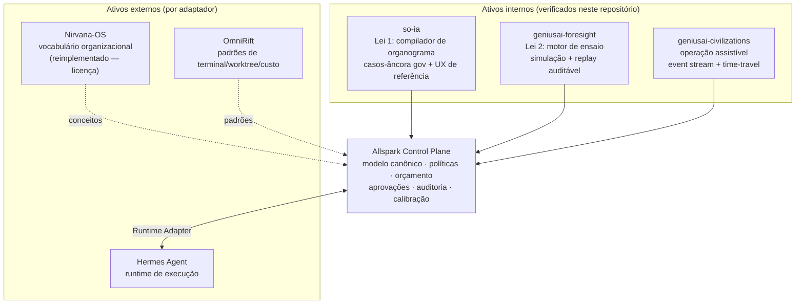
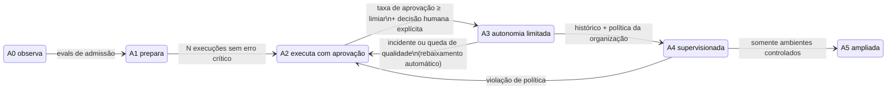
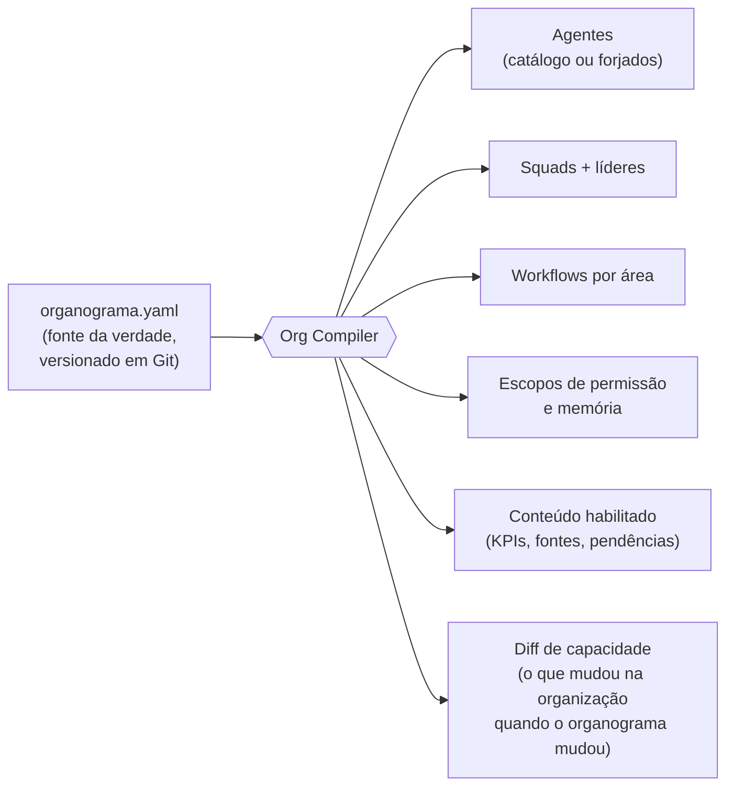
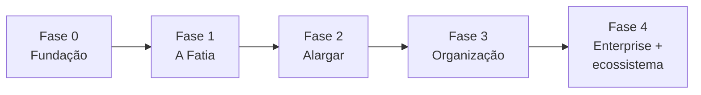

# PRD — Genius Allspark

> **A organização digital que nasce do organograma, ensaia antes de agir e
> entrega tudo com recibo.**

| | |
|---|---|
| **Produto** | Genius Allspark — Sistema Operacional de Organizações Agênticas |
| **Versão** | 1.0 |
| **Status** | Proposta de produto e arquitetura — substitui e evolui o rascunho "GeniusOS Unified" |
| **Escopo** | Fusão de `so-ia`, `geniusai-foresight`, `geniusai-civilizations` (deste repositório) com Hermes Agent, OmniRift e Nirvana-OS (externos) |
| **Documentos-irmãos** | [PRD SO-IA v2](../so-ia/docs/PRD-so-ia-v2.md) · [PRD Foresight](../geniusai-foresight/PRD.md) · [PRD Civilizations](../geniusai-civilizations/docs/PRD-watchable-ai-civilizations.md) |

---

## Como ler este documento

Cada seção começa com **"Em uma frase"** — se você só ler essas frases, terá
entendido o produto. O restante é aprofundamento.

Marcadores de confiança, herdados do PRD SO-IA v2:

| Marca | Significado |
|---|---|
| ✅ | Verificado no código deste repositório ou em fonte primária |
| 🟡 | Proposta de produto — decisão a validar |
| 🔵 | Hipótese ousada — o "fora da caixa"; exige protótipo antes de virar compromisso |

---

# 1. Por que um novo PRD — análise crítica do "GeniusOS Unified"

> **Em uma frase:** o rascunho anterior acerta na arquitetura federada, mas
> propõe um produto sem alma — uma lista de 200 funcionalidades sem tese
> central, sem fatia inicial e, crucialmente, sem ter conseguido analisar o
> projeto que contém a ideia mais diferenciada de todo o ecossistema.

## 1.1 O que o rascunho anterior acerta (e este PRD preserva)

1. **Arquitetura federada, não monorepo colado** — cada projeto contribui com
   uma capacidade, integrada por adaptadores a um modelo canônico. ✅
2. **Separação plano de controle × plano de execução** — políticas, orçamento
   e aprovação nunca pertencem ao runtime. ✅
3. **"Prosa mais recibo"** — toda entrega tem explicação legível + registro
   estruturado. É o melhor conceito do rascunho e aqui vira lei do produto. ✅
4. **Contrato de Missão** antes de executar. ✅
5. **Alerta de licença do Nirvana-OS** (source-available, não OSI) — a
   recomendação de reimplementar conceitos em vez de copiar código está
   correta e é mantida. ✅

## 1.2 As dez lacunas que este PRD corrige

| # | Lacuna do rascunho | Correção neste PRD |
|---|---|---|
| 1 | **Não analisou o `so-ia`** — tratou como "camada a auditar" | O `so-ia` está neste repositório, foi analisado arquivo a arquivo (§3.1) e fornece a tese central do produto |
| 2 | **Ignorou `geniusai-foresight` e `geniusai-civilizations`** | Ambos viram órgãos vitais: o motor de ensaio (§5.3) e a operação assistível (§5.1) |
| 3 | **Sem tese** — o produto é definido por acúmulo de features | Quatro leis (§2) das quais tudo deriva; o que não deriva delas fica fora |
| 4 | **Sem fatia inicial** — MVP de 5 fases que já começa enorme | Fatia vertical finíssima: *uma* missão de ponta a ponta, com ensaio e recibo (§10) |
| 5 | **Canvas infinito genérico** — herda o problema do OmniRift e tenta remendar com filtros | O canvas **é o organograma** — um espaço semântico que não desorganiza porque tem a topologia da própria organização (§5.1) |
| 6 | **Autonomia configurada por dropdown** — qualquer agente pode "nascer" nível 4 | Autonomia é **conquistada**, como carteira de habilitação: promoção por histórico auditado, nunca por configuração (§5.7) 🔵 |
| 7 | **Estimativas de missão chutadas** — custo e risco no contrato sem base | Estimativas vêm de **ensaio simulado**; o sistema mede a própria calibração (Brier score de missões) (§5.4) 🔵 |
| 8 | **Dois vocabulários de autonomia** (0–5 do rascunho vs A0–A5 do so-ia) | Unificado no A0–A5 do so-ia, que já tem regra jurídica embutida (ato vinculado trava em A2) ✅ |
| 9 | **UX em três produtos disfarçados** (Guiado/Studio/Operations como mundos separados) | Um único objeto — o Organograma Vivo — com **zoom semântico**: profundidade, não modos (§8.1) |
| 10 | **Nada sobre a qualidade do código existente** | Auditoria honesta do estado atual e plano de elevação de engenharia para o repositório inteiro (§9) |

---

# 2. A ideia central — as Quatro Leis do Allspark

> **Em uma frase:** Allspark é a centelha que transforma um organograma em uma
> organização digital viva — que só existe a partir da estrutura real, só age
> depois de ensaiar, só entrega com recibo, e só ganha autonomia que
> conquistou.

O nome vem do arquivo que originou esta análise — e a metáfora é exata: o
Allspark é aquilo que dá vida a máquinas. Aqui, **o organograma é a centelha**.

### Lei 1 — Nada existe sem o organograma ✅

Já é a regra de produto do `so-ia` (`src/lib/org/relevance.ts`): se uma área
não existe no organograma, nenhuma ferramenta, KPI, pendência ou workflow
daquela área existe no sistema. Este PRD a eleva de regra de conteúdo para
**princípio de compilação**: o organograma é código-fonte, e o sistema inteiro
é o binário compilado dele (§7.1).

### Lei 2 — Nenhuma missão sem ensaio 🔵

Antes de gastar dinheiro real, tocar sistemas reais ou publicar qualquer
coisa, a missão roda em **ensaio**: uma simulação da própria organização
digital executando o plano, com dados sintéticos ou point-in-time, produzindo
estimativas de custo, duração, riscos e pontos de falha — assistível como um
replay. É o motor do `geniusai-foresight` aplicado não a países e mercados,
mas à *própria organização do usuário*.

### Lei 3 — Nenhum resultado sem recibo ✅

Herdada do rascunho anterior ("prosa mais recibo") e do `so-ia` (auditoria
append-only, citações verificáveis). Toda entrega é um par inseparável:
narrativa legível + **Recibo Operacional** estruturado (agentes, ferramentas,
fontes, decisões, arquivos, custos, aprovações, validações).

### Lei 4 — Autonomia se conquista, não se configura 🔵

Nenhum agente "nasce" autônomo. Todo agente entra em A0–A1 (observa, prepara)
e é **promovido por histórico**: N execuções supervisionadas com taxa de
aprovação acima do limiar, sem violação de política, promovem a habilitação
*daquela skill específica* — nunca do agente inteiro de uma vez. Rebaixamento
é automático em caso de incidente. Atos administrativos vinculados têm teto
legal em A2, herdado do PRD SO-IA v2.

**Teste de pertencimento:** toda funcionalidade proposta para o Allspark deve
responder de qual lei deriva. Se não deriva de nenhuma, não entra. 🟡

---

# 3. O que já existe — inventário real dos ativos

> **Em uma frase:** diferente do rascunho anterior, este PRD sabe exatamente o
> que há em cada projeto — três ativos internos verificados no código e três
> externos com papéis (e riscos de licença) definidos.

## 3.1 `so-ia` — a semente do produto ✅

Next.js 16 + TypeScript + Tailwind v4 + shadcn/ui (@base-ui) + Framer Motion.
É a camada de apresentação do conceito central, já funcional:

| Motor existente | Arquivo | O que prova |
|---|---|---|
| Compilação organograma → agentes | `src/lib/org/matching.ts` | Cada função vira agente (reaproveitado do catálogo ou sintetizado) |
| Squads por área | `src/lib/org/squads.ts` + `squad-registry.ts` | Reaproveita do repositório ou cria via Squad de Fundação |
| Cobertura do organograma | `src/lib/org/relevance.ts` | A Lei 1 já implementada como filtro de todo o conteúdo |
| Gerador de workflows | `src/lib/org/workflow-builder.ts` | Workflow derivado de função real + gate humano |
| Importação de organograma | `src/lib/org/import.ts` + `pdf-extract.ts` | .json/.csv/.txt/.md/.pdf → estrutura canônica |
| Registro de skills | `src/lib/org/skills-registry.ts` | Skills no formato aberto SKILL.md, com origem rastreada |

Limitações honestas (ver §9): estado em `localStorage`, matching
determinístico por palavras-chave (sem LLM real), cenários com conteúdo
ilustrativo fixo, sem backend, sem testes automatizados.

**Papel no Allspark:** experiência de referência, modelo de domínio da Lei 1 e
os casos-âncora do setor público brasileiro (atesto de NF, vigência
contratual, pesquisa de preços — IFFar/CLC).

## 3.2 `geniusai-foresight` — o motor de ensaio ✅

Python 3.11+, squad científico de simulação prospectiva: células adaptativas
de agentes por ator, evidências point-in-time, Teoria dos Jogos, cenários
estocásticos e **replay auditável**.

**Papel no Allspark:** hoje ele simula países e mercados; no Allspark ele
ganha um segundo alvo — **a organização digital do próprio usuário**. É o
motor da Lei 2: cada ensaio de missão é uma simulação prospectiva onde os
atores são os agentes do organograma. 🔵

## 3.3 `geniusai-civilizations` — a operação assistível ✅

Monorepo TypeScript (backend Node + WebSocket, frontend React/Vite): mundos
governados por agentes autônomos que o usuário **assiste** — com engine
determinístico, PRNG serializável, replay e exportação de partidas.

**Papel no Allspark:** a tecnologia de "assistir uma sociedade de agentes
trabalhar" — event streaming, replay determinístico, time-travel — vira a
espinha dorsal do Organograma Vivo (§5.1) e da Sala de Ensaio (§5.3).

## 3.4 Hermes Agent (externo) — o braço executor

Runtime agêntico completo: loop, múltiplos provedores, ferramentas, memória,
skills, subagentes, cron, canais, mecanismos de segurança.

**Papel:** primeiro runtime oficial do plano de execução, acessado por
Runtime Adapter versionado. Nunca decide política, orçamento ou aprovação —
apenas executa. 🟡

## 3.5 OmniRift (externo) — referência de superfície

Desktop Tauri/Rust/React: terminais PTY, worktrees, custos, Monaco, MCP.

**Papel:** referência de padrões (PTY, worktrees isoladas, tracking de custo
por sessão) — **não** o canvas infinito, que este PRD substitui pelo canvas
semântico do organograma (§5.1). 🟡

## 3.6 Nirvana-OS (externo) — vocabulário organizacional, com cautela

Conceitos valiosos (empresas, squads, capacidades tipadas, DAGs, quality
gates, governança) sob licença source-available **não-OSI** que restringe
SaaS/PaaS.

**Papel:** referência conceitual **reimplementada de forma independente** no
plano de controle — ou acordo comercial explícito antes de qualquer linha de
código incorporada. Decisão jurídica é gate da Fase 0 (§10). ✅

## 3.7 O mapa da fusão

---

# 4. O produto em uma história

> **Em uma frase:** a melhor especificação de UX é uma narrativa que qualquer
> pessoa — técnica ou não — consegue acompanhar.

**Segunda-feira, 8h50.** Marta coordena a área de Licitações e Contratos de um
Instituto Federal. No Allspark, ela não vê "um chat com IA": vê o organograma
do Instituto — o dela, importado de um PDF no primeiro dia — onde cada
caixinha respira. A caixa "Fiscal de Contrato" pulsa em âmbar: há um atesto de
nota fiscal aguardando.

Ela escreve: *"Preparar o atesto da NF 2041 do contrato 12/2025."*

O Allspark não executa. Primeiro, **ensaia**: em oito segundos, uma simulação
da missão roda na Sala de Ensaio — o agente de atesto confere a NF contra o
empenho sintético, o agente de vigência valida o contrato, o quality gate
exige duas citações verificáveis. O ensaio termina e vira um **Contrato de
Missão**: custo estimado R$ 0,42 (±15%, e o sistema mostra que seus últimos 50
ensaios erraram o custo real em média 8%), duração ~3 min, 1 ponto de
aprovação humana obrigatório — porque atesto é ato vinculado, e a habilitação
do agente está travada em A2 por lei, não por configuração.

Marta aprova o contrato. A execução real roda — e ela pode assistir, caixa a
caixa, no organograma, ou ir tomar café. Às 9h04 chega a entrega: o parecer de
atesto em prosa clara **mais o recibo** — cada valor citando página do
empenho, cada decisão assinada pelo agente que a tomou, custo real R$ 0,39.
Marta revisa, ajusta uma vírgula, aprova. O ato é dela; o trabalho braçal, não.

No fim do mês, o painel dela mostra: o agente de atesto completou 47 execuções
supervisionadas com 96% de aprovação sem edição. O sistema **propõe** promover
a skill `conferir-nf-contra-empenho` de A2 para A3 em contratos abaixo de
R$ 10 mil — decisão dela, com o histórico completo anexado. Ela nega: atesto
segue A2. O sistema registra e nunca mais propõe para atos vinculados. 🔵

O mesmo produto, com outro organograma, é uma software house tocando release
com squads de código, ou uma indústria acompanhando funil comercial. **O que
muda é a centelha — o organograma. O resto se recompila.**

---

# 5. Superfícies do produto

> **Em uma frase:** sete superfícies, todas visões do mesmo objeto — a
> organização compilada — em profundidades diferentes.

## 5.1 O Organograma Vivo 🔵

O anti-canvas-infinito. Em vez de um plano vazio onde nós se acumulam até
virar caos (a limitação reconhecida do OmniRift), o espaço de trabalho **é o
organograma** — a topologia da organização real:

- Cada **caixa** é uma função com seu agente; cada **área** é um território
  com seu squad; as **arestas** são as linhas de reporte reais.
- Atividade é visível *in loco*: a caixa que está executando pulsa; a que
  aguarda aprovação fica âmbar; a bloqueada, vermelha. O mapa de calor da
  organização é o próprio organograma.
- **Zoom semântico** (§8.1): afastar mostra estratégia (áreas, metas,
  indicadores); aproximar mostra operação (missões, workflows); mergulhar numa
  caixa abre a execução (sessões, terminais, arquivos, logs — padrões
  OmniRift); o último nível é a evidência (recibos, fontes, auditoria).
- **Time-travel**: o slider temporal (tecnologia de replay do
  `geniusai-civilizations`) permite rever a organização em qualquer instante —
  "o que estava acontecendo às 14h de ontem?" é uma pergunta que a interface
  responde arrastando um controle.

Auto-organização deixa de ser um remendo (filtros, minimapas, grupos) e passa
a ser estrutural: nada flutua solto porque **todo trabalho pertence a uma
caixa do organograma** — Lei 1 aplicada ao espaço.

## 5.2 A Forja (onboarding) ✅→🟡

O onboarding do `so-ia` já é o correto e vira a "ignição" do Allspark:

1. Tipo de organização (empresa/órgão público) + nome.
2. Organograma: digitado, colado ou importado (.json/.csv/.txt/.md/.pdf).
3. **Compilação assistível**: função por função, o sistema busca no catálogo,
   reaproveita ou forja um agente novo; área por área, reaproveita ou cria
   squads via Squad de Fundação — com a animação de montagem existente.
4. Novo passo final 🟡: **primeira missão de demonstração ensaiada** — antes
   de qualquer configuração avançada, o usuário vê uma missão real da área
   dele ser ensaiada, contratada, executada e entregue com recibo. Valor antes
   de configuração; nenhum conceito técnico (DAG, MCP, embedding) exigido.

## 5.3 A Sala de Ensaio 🔵

A superfície que não existe em nenhum produto conhecido da categoria.

| Aspecto | Como funciona |
|---|---|
| **O que ensaia** | O plano da missão, executado pelos *mesmos* agentes e workflows, em ambiente sintético: dados fictícios ou point-in-time, ferramentas em modo dry-run, ações externas interceptadas |
| **Motor** | `geniusai-foresight`: células de agentes + cenários estocásticos — o ensaio roda N variações (fontes indisponíveis, dados incompletos, retries) e devolve distribuições, não números secos |
| **Saída** | Estimativa de custo/duração com intervalo, pontos de falha prováveis, ações externas que serão pedidas, aprovações que serão exigidas |
| **Assistibilidade** | O ensaio é um replay navegável (engine do `civilizations`): dá para assistir a missão simulada acontecer no Organograma Vivo antes de ela existir |
| **Aprendizado** | Divergência ensaio × execução real alimenta a calibração (§5.4) e as evals dos agentes (§5.7) |

Custo do ensaio é controlado: modelos econômicos, cache agressivo, dry-run de
ferramentas. Missões triviais (abaixo de limiar de risco/custo) podem pular o
ensaio por política explícita — a Lei 2 admite exceção declarada, nunca
implícita. 🟡

## 5.4 O Contrato de Missão Calibrado 🔵

O rascunho anterior propunha um Contrato de Missão com estimativas; este PRD o
torna **honesto**:

- Estimativas vêm do ensaio (distribuição, não chute).
- Cada contrato exibe a **calibração histórica do próprio sistema**: "nos
  últimos 50 contratos, o custo real ficou em média 8% acima do estimado" —
  um Brier/erro médio de previsão que o sistema calcula sobre si mesmo.
- Contrato aceito é baseline: a execução real é acompanhada contra ele, e
  desvios relevantes (custo estourando o intervalo, etapa travada além do
  previsto) geram alerta *antes* do estouro, não depois.

É a diferença entre um sistema que promete e um sistema que **sabe o quanto
costuma errar ao prometer** — e melhora porque mede.

## 5.5 Centro de Comando ✅→🟡

Evolução direta do existente no `so-ia`: KPIs derivados do estado real (nunca
números fixos), feed de atividade filtrado pelo organograma. Regra mantida do
rascunho anterior: **nenhuma informação sem ação** — cada card oferece
revisar, aprovar, corrigir, pausar, delegar ou abrir o recibo.

## 5.6 Caixa de Aprovações e o Recibo Operacional ✅

Herdados do `so-ia` (human-in-the-loop com citações verificáveis, trilha
append-only) e generalizados: todo tipo de revisão (conteúdo, código, dado,
decisão, custo, ação externa, publicação, exclusão, transação) passa pela
mesma caixa, com as ações do rascunho anterior — aprovar, corrigir, editar,
rejeitar, delegar, **aprovar só desta vez** ou **criar regra permanente** (a
aprovação que vira política é como o sistema aprende governança com o uso).

O **Recibo Operacional** é o artefato-assinatura do produto: um documento
estruturado, exportável e verificável — quem fez, com quê, baseado em quê,
custou quanto, quem aprovou, o que mudou. Para o setor público, é a ponte
direta para processo administrativo (PRD SO-IA v2 §9). ✅

## 5.7 A Escola de Agentes 🔵

Onde a Lei 4 vive. Todo agente tem, por skill:

- **Promoção**: proposta pelo sistema com o histórico completo anexado;
  decidida por humano com alçada; sempre por skill, nunca por agente inteiro.
- **Rebaixamento**: automático e imediato em incidente, violação de política
  ou degradação de métrica — sem necessidade de humano para reduzir risco.
- **Teto legal**: atos administrativos vinculados nunca passam de A2 (herdado
  do PRD SO-IA v2 §8). ✅
- **Evals como currículo**: cada skill carrega cenários de avaliação; mudanças
  de prompt, modelo ou memória exigem regressão automatizada antes de manter a
  habilitação — o agente "revalida a carteira" a cada mudança relevante.

## 5.8 Memória com procedência ✅→🟡

Mantida a taxonomia do rascunho anterior (sessão, episódica, semântica,
procedural, organizacional, projeto, pessoal) com as regras que já eram boas —
escopos nunca misturados implicitamente, fonte obrigatória, expiração,
contradições sinalizadas, promoção controlada, direito de consulta e exclusão.
Acréscimo da Lei 1: **memória também é filtrada pelo organograma** — memória
de uma área não vaza para agentes de outra sem handoff explícito. 🟡

---

# 6. Problema, personas e proposta de valor

> **Em uma frase:** os cinco problemas do rascunho anterior (fragmentação,
> falta de governança, baixa observabilidade, memória desorganizada,
> complexidade operacional) continuam válidos — o Allspark os ataca com uma
> resposta cada um.

| Problema (mantido do rascunho ✅) | Resposta do Allspark |
|---|---|
| Fragmentação de ferramentas | Tudo é visão do mesmo objeto compilado do organograma |
| Falta de governança | Leis 3 e 4: recibo obrigatório + autonomia conquistada com teto legal |
| Baixa observabilidade | Organograma Vivo + time-travel + tradutor de eventos (§8.3) |
| Memória desorganizada | Escopos com procedência, filtrados pelo organograma |
| Complexidade operacional | Zoom semântico: um produto, profundidades diferentes — não dois produtos |

Personas mantidas do PRD SO-IA v2 (que já traz as duais público/privado:
pregoeira, fiscal de contrato, diretor de administração; CEO, gestor
operacional, analista) somadas às do rascunho (desenvolvedor, administrador de
IA, auditor). O caso-âncora continua sendo o setor público brasileiro
(IFFar/CLC) — mercado com dor aguda, critério objetivo (legalidade) e
concorrência quase nula em soluções auditáveis. ✅

---

# 7. Arquitetura técnica

> **Em uma frase:** um monólito modular como plano de controle, workers de
> execução separados, e uma peça nova que nenhum dos seis projetos tem — o
> Compilador de Organização.

## 7.1 O Compilador de Organização 🔵

A peça central e inédita. O organograma é tratado como **código-fonte**
(`organograma.yaml` versionável em Git — "organização como código"):

- **Determinístico e auditável**: mesmo organograma → mesmo sistema. Mudou o
  organograma, o sistema **recompila** e apresenta o diff: "a área X foi
  criada; estes 3 agentes e este squad serão forjados; estas 2 fontes serão
  conectadas". Reorganização empresarial vira um *pull request* revisável. 🔵
- Os motores do `so-ia` (`matching.ts`, `squads.ts`, `relevance.ts`,
  `workflow-builder.ts`) são a versão embrionária do compilador — o caminho é
  extraí-los para um pacote compartilhado com schemas Zod e testes (§9).

## 7.2 Planos da plataforma 🟡

Mantida a estrutura de planos do rascunho, com dois acréscimos (em negrito):

| Plano | Conteúdo |
|---|---|
| Experiência | Desktop (Tauri) · Web · CLI · API · Canais |
| Controle | Organizações · Missões · Políticas · Orçamentos · Aprovações · Quality gates · **Org Compiler** · **Calibração** |
| **Ensaio** 🔵 | Motor foresight · ambientes sintéticos · dry-run de ferramentas · replay |
| Execução | Hermes Workers · outros runtimes · sandboxes · modelos · ferramentas |
| Conhecimento | Memória · skills · documentos · procedência |
| Confiança | Identidade · RBAC · segredos · auditoria · políticas · isolamento |
| Dados/Observabilidade | Eventos · artefatos · custos · métricas · traces |

## 7.3 Decisões mantidas do rascunho ✅

Estão corretas e são adotadas sem alteração de mérito:

- **Monólito modular** no controle + workers separados; microsserviços só com
  justificativa de carga/isolamento.
- **Stack**: Tauri 2 + React + TypeScript no desktop; TypeScript hexagonal no
  controle; SQLite local / PostgreSQL colaborativo; OpenTelemetry com
  correlação por `mission_id`/`run_id`/`agent_id`.
- **Modelo canônico** (Workspace, Organization, Squad, AgentProfile, Mission,
  Run, Artifact, Policy, MemoryRecord, CostLedger, AuditEvent…) com três
  acréscimos: `RehearsalRun` (ensaio), `CalibrationRecord` (previsto ×
  realizado) e `LicenseGrant` (habilitação A0–A5 por skill). 🟡
- **Eventos** versionados, imutáveis, idempotentes, reproduzíveis — com os
  novos `rehearsal.started/completed`, `contract.signed`,
  `license.promoted/demoted`, `calibration.recorded`. 🟡
- **Política como código** declarativa (YAML revisável, versionável, testável).
- Contextos delimitados (bounded contexts) por domínio.

## 7.4 Segurança e governança ✅

Integralmente herdadas do rascunho (RBAC→ABAC, menor privilégio, cofre de
segredos, sandboxes descartáveis, filtragem de credenciais, defesa contra
prompt injection, kill switch, tetos de orçamento, assinatura de plugins) e do
PRD SO-IA v2 (OWASP LLM Top-10 2025, trilha append-only, requisitos legais do
setor público). A Lei 4 acrescenta o mecanismo que faltava: **o caminho
padrão é o de menor autonomia**, e todo aumento tem dono, histórico e reversão
automática.

---

# 8. UX/UI e design

> **Em uma frase:** um único objeto (a organização compilada) explorado por
> zoom semântico, num visual sereno que comunica confiança — e um tradutor que
> converte todo evento técnico em frase humana.

## 8.1 Zoom semântico em vez de modos 🔵

Os "três modos" do rascunho (Guiado/Studio/Operations) viram **profundidades
do mesmo espaço** — perfis apenas definem a profundidade inicial e o que exige
alçada:

| Zoom | Quem vive aqui | O que se vê |
|---|---|---|
| Estratégia | Gestores | Áreas, metas, indicadores, custo por área, calor de atividade |
| Operação | Analistas, especialistas | Missões, workflows, squads, aprovações, ensaios |
| Execução | Desenvolvedores, admins | Sessões, terminais, worktrees, ferramentas, logs, contexto |
| Evidência | Auditores | Recibos, fontes, decisões, trilha append-only, time-travel |

Sem dados separados, sem "trocar de produto": arrastar o zoom é a navegação.
Uma paleta de comandos (⌘K) alcança qualquer objeto pelo teclado. ✅

## 8.2 Direção estética 🟡

Mantida a direção do rascunho, que está certa: serenidade e confiança, não
neon nem gamificação. Base neutra clara/escura; azul = execução normal,
verde = validado, âmbar = atenção/aprovação, vermelho = falha/bloqueio,
roxo = memória/inteligência; grid de 8pt; WCAG 2.2 AA; cor nunca é o único
canal de estado. Vocabulário único de estados (rascunho → planejado →
ensaiado 🔵 → contratado 🔵 → em execução → bloqueado → requer aprovação → em
revisão → aprovado → concluído/com ressalvas → cancelado/falhou) imposto a
todo runtime via adapter — nenhuma integração exibe terminologia própria.

## 8.3 O Tradutor de Eventos 🟡

Elevado de exemplo do rascunho a componente nomeado da plataforma: toda
mensagem técnica passa por uma camada de tradução com dicionário versionado.
`tool_call failed` nunca chega ao usuário; chega *"O agente de pesquisa não
conseguiu acessar a fonte; vou tentar o conector alternativo. Nenhuma ação sua
é necessária."* — com o evento técnico a um clique, no zoom de execução. A
didática não é um tom de voz: é uma camada da arquitetura, testável e
traduzível.

## 8.4 Anatomia do card de agente ✅

Mantida a do rascunho (avatar, função, squad, estado, tarefa, modelo,
consumo, risco, progresso) com dois acréscimos: **habilitação por skill**
(A0–A5, com histórico de promoções) e **calibração** (quão bem os ensaios
deste agente previram a realidade). 🔵

---

# 9. Qualidade de engenharia — elevação do repositório inteiro

> **Em uma frase:** o produto promete auditabilidade e calibração; o
> repositório que o constrói precisa exibir o mesmo padrão — hoje não exibe, e
> este é o plano honesto para chegar lá.

## 9.1 Auditoria do estado atual ✅

| Dimensão | Hoje | Alvo |
|---|---|---|
| Testes | `so-ia` sem testes automatizados; `civilizations` e `foresight` parciais | Unit + integração nos motores (`org/*.ts`), e2e Playwright nos fluxos-âncora, evals de agentes com regressão |
| Validação de dados | Tipos TS sem validação em runtime | Schemas Zod para organograma, agente, skill, workflow, missão — compartilhados entre import, compiler e API |
| Estado | `localStorage` no cliente | SQLite local (Fase 1) → PostgreSQL colaborativo (Fase 4), com migrações versionadas |
| "IA" real | Matching determinístico por palavras-chave | Matching e forja de agentes via LLM com fallback determinístico e evals |
| Estrutura | Três projetos irmãos sem código compartilhado | Workspace com pacotes: `@genius/canon` (modelo canônico + schemas), `@genius/org-compiler`, `@genius/receipt`, `@genius/rehearsal-client` |
| CI | `ci.yml` + CI do foresight | Matriz por projeto + gate de evals + análise estática + dependency scanning |
| Decisões | Registradas em PRDs | ADRs curtos por decisão arquitetural, versionados em `docs/adr/` |

## 9.2 Princípio 🟡

**Extrair, não reescrever.** Os motores do `so-ia` funcionam e têm a semântica
certa; o trabalho é extraí-los para pacotes tipados com schema e teste, e
fazer o app consumi-los — o mesmo pacote que o futuro backend usará. Cada fase
do roadmap inclui sua parcela de elevação de engenharia; não existe "fase de
qualidade" separada que nunca chega.

---

# 10. Roadmap — fatia vertical primeiro

> **Em uma frase:** em vez de cinco fases largas, uma fatia finíssima que
> percorre as quatro leis de ponta a ponta — e só depois alargar.

### Fase 0 — Fundação (gates go/no-go)
Decisão jurídica Nirvana (reimplementar × licenciar); modelo canônico +
schemas Zod no pacote `@genius/canon`; extração do Org Compiler v0 a partir
dos motores do `so-ia`; contrato Control Plane ↔ Runtime Adapter (Hermes);
ADRs; spike da Sala de Ensaio 🔵 — **se o ensaio não produzir estimativas
melhores que baseline ingênuo em 4 semanas de protótipo, a Lei 2 rebaixa para
"modo dry-run simples" e o produto continua de pé** (critério de falsificação
explícito).

### Fase 1 — A Fatia (o MVP de verdade)
**Uma missão, quatro leis, de ponta a ponta**: importar organograma → compilar
(Lei 1) → pedir o atesto de NF em linguagem natural → ensaiar (Lei 2) →
contratar → executar no Hermes → aprovar (A2) → entregar prosa + Recibo
Operacional (Lei 3) → registrar histórico de habilitação (Lei 4). Desktop
local, SQLite, um runtime, um caso-âncora. Critério de aceite: uma pessoa não
técnica completa o ciclo sem ajuda em menos de 30 minutos.

### Fase 2 — Alargar
Mais casos-âncora (vigência, pesquisa de preços; um caso privado de código com
worktrees/PTY — padrões OmniRift); squads operantes; workflows DAG com
gates; Escola de Agentes com promoção/rebaixamento; memória por escopo;
automações com kill switch.

### Fase 3 — Organização
Organograma-como-código com diff de recompilação; políticas como código;
indicadores e metas por área; canais (e-mail, mensageria); conectores MCP
governamentais (PNCP, Compras.gov.br) e de CRM; time-travel completo.

### Fase 4 — Enterprise e ecossistema
Colaboração multiusuário (PostgreSQL), SSO, RBAC avançado, workers remotos,
observabilidade distribuída; depois — e só depois — SDK, marketplace de
squads/skills com assinatura e certificação.

---

# 11. Métricas

> **Em uma frase:** além das métricas clássicas de produto e operação
> (mantidas do rascunho ✅), o Allspark se mede pelas quatro leis.

| Lei | Métrica-assinatura 🔵 |
|---|---|
| 1 | % do conteúdo do sistema derivado do organograma (alvo: 100%); tempo da Forja até o sistema compilado |
| 2 | Erro de calibração (custo/duração previstos × reais, por janela móvel); % de missões não-triviais ensaiadas |
| 3 | % de entregas com recibo completo (alvo: 100%); % de afirmações com citação verificável |
| 4 | Promoções propostas × aceitas; rebaixamentos automáticos; zero ações acima da habilitação (invariante, não meta) |

Hipóteses de negócio mantidas do rascunho como metas a validar 🟡: −30% tempo
de preparação, −25% retrabalho, ≥90% rastreabilidade, 100% das ações críticas
sob aprovação ou política explícita.

---

# 12. Riscos

| Risco | Mitigação |
|---|---|
| Ensaio caro ou impreciso 🔵 | Gate de falsificação na Fase 0; modelos econômicos + dry-run; degradação honesta para "simulação estrutural" |
| Ensaio dá falsa confiança | Contrato sempre exibe o erro histórico de calibração; intervalo, nunca número seco |
| Licença Nirvana | Reimplementação independente decidida na Fase 0; auditoria jurídica antes de qualquer código de terceiros |
| Canvas semântico não escala p/ organizações grandes | Virtualização + agregação por área; zoom estratégico é o default acima de N caixas |
| Autonomia conquistada vira burocracia | Limiar de trivialidade por política; promoção em lote por área com uma decisão |
| Fusão acoplada demais | Modelo canônico + adapters; nenhum runtime impõe seu modelo (mantido ✅) |
| Custos imprevisíveis | Ledger, tetos, fallback, alerta *antes* do estouro via baseline do contrato |
| Memória vaza entre áreas | Escopo por organograma + handoff explícito |
| Repositório não sustenta a ambição | §9: elevação de engenharia embutida em cada fase, não adiada |

---

# 13. Critérios de aceite do MVP (Fase 1)

O MVP está pronto quando um usuário consegue, localmente e sem ajuda:

1. importar um organograma real (arquivo ou texto) e assistir à compilação;
2. confirmar que **nada** de área ausente aparece no sistema (Lei 1 testável);
3. pedir uma missão em linguagem natural;
4. assistir ao ensaio e ler o Contrato de Missão com estimativa calibrada;
5. aprovar o contrato e acompanhar a execução real no Organograma Vivo;
6. ser chamado a aprovar a ação sensível (A2) com citações verificáveis;
7. receber a entrega em prosa + Recibo Operacional exportável;
8. consultar a trilha de auditoria e o custo real × previsto;
9. interromper, retomar e excluir dados quando quiser;
10. ver o histórico da skill executada contar para a habilitação futura.

---

# 14. Definição final

O **Genius Allspark** é um sistema operacional de organizações agênticas,
local-first e auditável, em que o organograma real é a centelha que compila
agentes, squads, workflows, permissões e conteúdo; em que nenhuma missão
relevante executa sem antes ser ensaiada em simulação calibrada; em que toda
entrega chega como prosa clara acompanhada de um recibo verificável; e em que
autonomia é uma habilitação conquistada por histórico — nunca uma
configuração.

Seu diferencial não é ter muitos agentes, nem mesmo orquestrá-los bem. É ser o
único sistema da categoria que **conhece a organização porque nasceu dela,
prevê porque ensaia, presta contas porque emite recibo de tudo — e sabe o
quanto costuma errar, porque se mede**.

A continuação natural deste PRD: ADRs da Fase 0, C4 do Control Plane + Org
Compiler, épicos e histórias da Fatia (Fase 1) e o protótipo de falsificação
da Sala de Ensaio.
