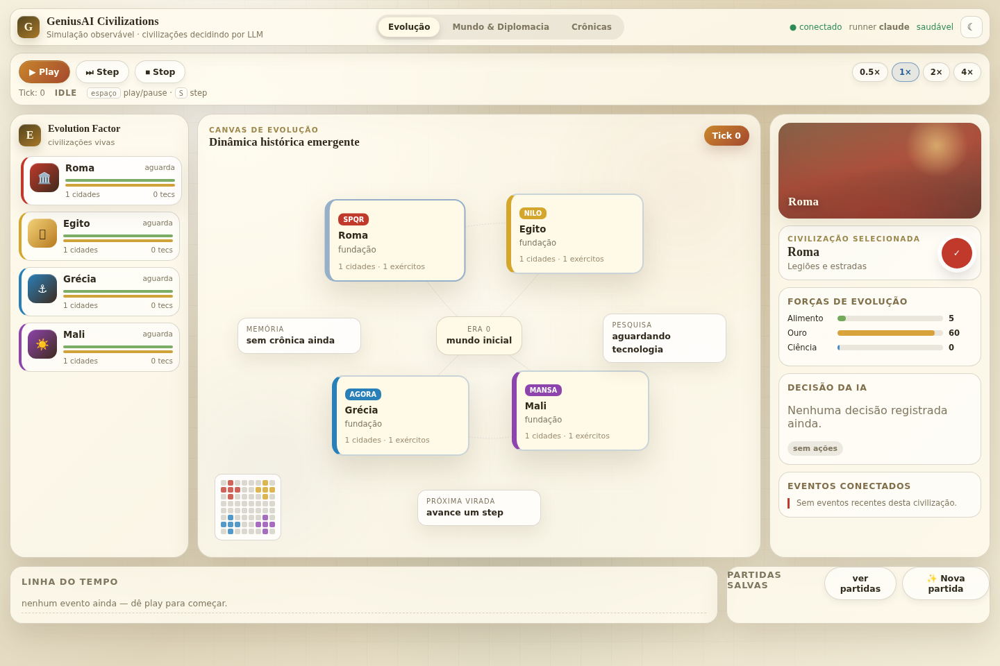
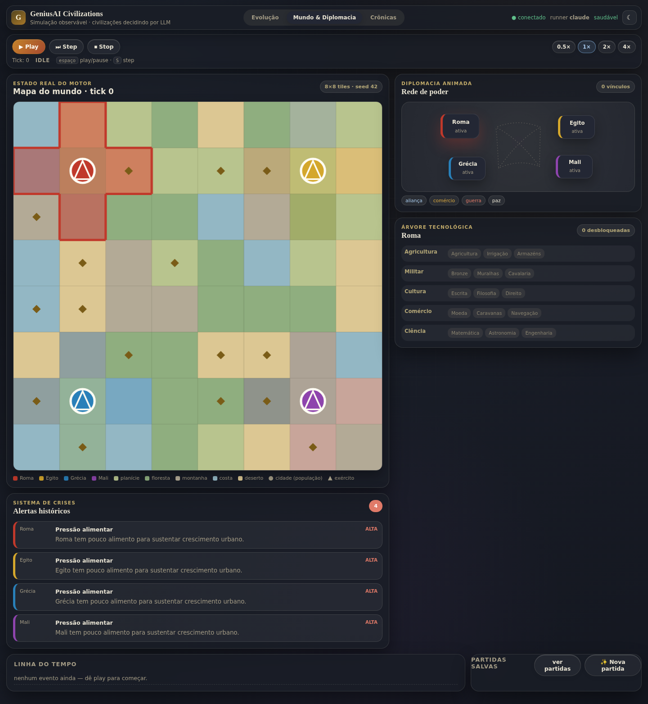
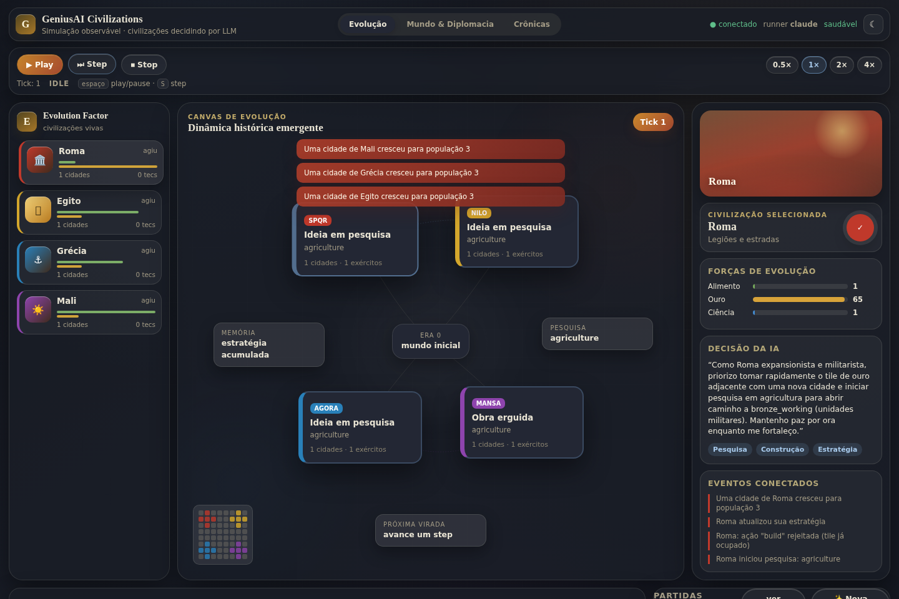

# GeniusAI Civilizations — Watchable AI

Simulação onde civilizações (Roma, Egito, Grécia, Mali) são governadas por **agentes autônomos** acionados por um **CLI de agente** (Claude Code / Codex / opencode) em modo headless, ou pelo **Ollama** direto. O usuário **assiste** — não comanda. Tudo roda localmente e a UI é servida em `localhost`.

> Especificação completa: [`docs/PRD-watchable-ai-civilizations.md`](docs/PRD-watchable-ai-civilizations.md).

## Estado atual: Fase 6 concluída (MVP completo + redesign da UI)

**Fase 0 — scaffold e execução por runner:**
- Monorepo TypeScript (npm workspaces): `apps/backend` (Node + WebSocket) e `apps/frontend` (React/Vite).
- Interface `AgentRunner` com implementações plugáveis:
  - `ClaudeCodeRunner` → `claude -p --output-format json`
  - `CodexRunner` → `codex exec`
  - `OpencodeRunner` → `opencode run`
  - `OllamaRunner` → HTTP `localhost:11434/api/chat` (com `format` = JSON schema)
- Seleção por env `RUNNER`; **health check** (HTTP `/health`, WebSocket e CLI).

**Fase 1 — World Engine determinístico (`apps/backend/src/engine/`), sem LLM:**
- Estado do mundo (mapa de tiles, civilizações, cidades, exércitos, tecnologia, diplomacia).
- PRNG determinístico (`Rng`) com estado serializável → simulação reproduzível (replay).
- `createWorld(seed)` determinístico e `tick(world, decisions)` puro (não muta a entrada).
- Ações validadas pelo motor: `build`, `research`, `move_army`, `attack`, `set_diplomacy`, `trade`, `set_strategy` — ações inválidas viram evento `action_rejected` (feedback p/ o agente).
- Economia (rendimentos, crescimento, pesquisa) e combate determinístico.
- **25 testes** cobrindo determinismo, validação, combate, comércio e economia.

**Fase 2 — Camada de agentes (`apps/backend/src/agent/`), liga o LLM ao motor:**
- `actions.ts` — schema de ações em JSON (para `format`/prompt) + validação `zod` (`coerceActions`): ações inválidas são descartadas com erro, sem derrubar o turno.
- `prompt.ts` — `buildSystemPrompt` (regras + persona) e `buildTurnPrompt` (snapshot compacto do mundo + resultados do último turno).
- `runTurn.ts` — `runCivilizationTurn(world, civId, runner)`: monta prompts → chama o runner → valida → devolve ações. **Fallback:** se o runner falha (exceção/saída não-JSON/timeout), re-pergunta 1×; se falhar de novo, "passa o turno".
- `memory.ts` — memória por civilização em `./data/memory/<civ>.md` (`readMemory`/`writeMemory`/`hydrateMemory`/`persistMemory`).
- **16 testes** com runners falsos (sem LLM) cobrindo validação, fallback e integração com o motor.

Rodar os testes: `npm run test --workspace apps/backend` (41 no total).

Demo de um turno real com LLM:
```bash
RUNNER=claude npm run turn:demo --workspace apps/backend -- rome
# ou:  RUNNER=ollama MODEL=qwen2.5:14b npm run turn:demo --workspace apps/backend -- egypt
```

**Fase 3 — Orquestrador (`apps/backend/src/orchestrator/`):**
- `GameLoop` — coordena os turnos: a cada tick, todas as civilizações vivas decidem sobre o mesmo snapshot (sequencial), o motor aplica via `tick()`, e o progresso é emitido por eventos (`turn_start`/`turn_token`/`turn_end`/`tick_end`/`loop_state`) — base do streaming para a UI.
- Controles: `play` / `pause` / `stop` / `step` (1 tick) / `setSpeed`; timeout por turno; auto-stop quando resta ≤1 civilização.
- `trace.ts` — persistência em `./data/`: trace por tick (`traces/<id>.jsonl`), save do mundo (`saves/<id>.json`), memórias (`memory/<civ>.md`).
- **5 testes** (runner falso) cobrindo tick/eventos, persistência, skip de civ morta, play→stop e auto-stop.

Rodar os testes: `npm run test --workspace apps/backend` (46 no total).

Demo do orquestrador (N ticks reais com LLM):
```bash
RUNNER=claude TICKS=1 npm run loop:demo --workspace apps/backend
```

**Fase 4 — UI de observação em localhost:**
- Backend: o WebSocket agora expõe **um `GameLoop` compartilhado** por servidor. Ao conectar, o cliente recebe `hello`/`health`/`world_init`; depois disso, todo `LoopEvent` do loop é retransmitido (broadcast) em tempo real. O cliente controla a reprodução via comandos `{type:"command", action:"play"|"pause"|"stop"|"step"|"set_speed"}` — **não** existe comando para agir por uma civilização.
- Frontend: `WorldMap` (mapa em Canvas — terreno, território, cidades, exércitos), `CivPanel` ×4 (stats + raciocínio **em streaming** + ações do turno + erros de validação), `EventTimeline` (eventos narrados) e `Controls` (play/pause/step/velocidade).
- Log de progresso também no terminal do backend (`[loop] tick N · civ: ...`) — "watchable" vale para o terminal, não só o browser.

Rodar (2 terminais):
```bash
RUNNER=claude npm run dev:backend    # :8787
npm run dev:frontend                 # http://localhost:5173
```

**Verificado com um navegador real** (Playwright/Chromium) contra o backend com o runner `claude` de verdade: conexão WebSocket, clique em "Step", e o tick avançou na UI (1→2) refletindo as decisões reais dos 4 agentes — incluindo uma proposta de comércio de Mali no tick 1 se concretizando (`trade_executed`) no tick 2.

~~**Limitação conhecida:** o histórico de raciocínio dos painéis vive só na memória do cliente...~~ — **resolvido na Fase 5** (mensagem `history` abaixo).

**Fase 5 — Persistência/replay, save/load e narrador (`apps/backend/src/orchestrator/`):**
- **Retomada automática:** `createGameLoop()` tenta `loadWorld(gameId)` antes de criar um mundo novo — reiniciar o backend continua a mesma partida de onde parou (tick, mapa, civilizações), sem qualquer ação do usuário.
- **Reconexão com histórico:** ao conectar, o cliente recebe `world_init` (estado atual) **e** `history` (`{timeline, civs}`, lido do trace em disco) — resolve a limitação da Fase 4: reabrir a UI (ou reconectar) repõe a timeline inteira e o último raciocínio de cada civilização, não só o estado presente.
- **Save/load pela UI:** comandos WS `list_saves` (lista partidas salvas com tick/seed/data), `new_game` (opcional `seed`) e `load_game` (`gameId`) — trocam o `GameLoop` ativo em tempo real, sem reiniciar o servidor; `load_game` para um `gameId` inexistente devolve `{type:"error"}` em vez de criar um mundo silenciosamente. Componente `SavesPanel` no frontend.
- **Narrador de eventos** (`narrator.ts`, opcional via `NARRATOR=true`): reaproveita o mesmo `AgentRunner`/schema dos agentes — o campo `reasoning` vira a manchete do tick, `actions` é ignorado. Decorativo: qualquer falha é engolida (nunca derruba um tick). A manchete é injetada como um evento sintético `{type:"narration"}` **na mesma lista de eventos do tick** — assim streaming ao vivo e replay do trace usam exatamente o mesmo caminho.
- **24 novos testes:** `trace.test.ts` (round-trip de save/trace/summarizeTrace, sem LLM), `narrator.test.ts` (runner falso — sucesso, lista vazia, só `tick_started`, reasoning vazio, exceção engolida) e `server.test.ts` (WebSocket ponta a ponta contra um runner falso: conexão/history, `step`, `list_saves`, `load_game` inexistente, `new_game`→`load_game`, reconexão com histórico).

Rodar os testes: `npm run test --workspace apps/backend` (**70 no total**).

**Verificado com o runner `claude` real** (narrador ligado): um tick completo com as 4 civilizações gerou a manchete *"Egito, Roma, Grécia e Mali selam paz e comércio enquanto o Egito firma acordo comercial com Mali no amanhecer das civilizações."* — coerente com os eventos de diplomacia do tick. `list_saves` refletiu a partida corretamente, e uma segunda conexão (simulando reload da página) recebeu a `history` completa (25 eventos, incluindo a narração) e o raciocínio de Roma, sem precisar reprocessar nada.

Isso fecha o roadmap do MVP (§11 do PRD).

**Fase 6 — Redesign da UI: navegação real, tema duplo e mapa reintegrado:**
- **Três modos de visualização funcionais** (as abas do topo agora navegam de verdade):
  - **Evolução** — trilho de civilizações, canvas de evolução e inspector da civilização selecionada.
  - **Mundo & Diplomacia** — o **mapa canvas do motor** (terreno, território, cidades, exércitos) voltou à UI: renderização nítida em qualquer DPI (`devicePixelRatio`), responsivo via `ResizeObserver`, paleta por tema, contorno do território da civilização selecionada e legenda. Ao lado: rede diplomática, árvore tecnológica e sistema de crises.
  - **Crônicas** — linha das eras, crônica narrativa, "pergunte à civilização" e Museu Vivo.
- **Tema claro e escuro** ("atlas de pergaminho" / "observatório"): design system com tokens CSS, toggle no topo, persistido em `localStorage` e respeitando `prefers-color-scheme`.
- **Reconexão automática do WebSocket** com backoff exponencial — se o backend reiniciar, a UI reconecta sozinha e o servidor repõe `world_init` + `history` (nada se perde).
- **Atalhos de teclado**: `espaço` = play/pause, `S` = step.
- Limpeza: componentes mortos removidos, filtro de eventos por civilização corrigido (não usa mais `JSON.stringify().includes()`), textos residuais eliminados, `prefers-reduced-motion` respeitado.

| Evolução (claro) | Mundo & Diplomacia (escuro) | Tick real com LLM (escuro) |
|---|---|---|
|  |  |  |

**Verificado com um navegador real** (Playwright/Chromium) contra o runner `claude` de verdade: conexão, troca de abas, troca de tema, e um tick completo — os 4 agentes decidiram, o raciocínio de Roma apareceu em streaming no inspector e os eventos viraram toasts, timeline e crônica.

## Pré-requisitos

- Node.js 20+.
- Ao menos um runner disponível no `PATH`:
  - um CLI de agente: `claude`, `codex` ou `opencode`; **ou**
  - Ollama: `ollama serve` + `ollama pull qwen2.5:14b`.

## Como rodar

```bash
npm install
cp .env.example .env        # ajuste RUNNER, MODEL, etc.

# Terminal 1 — backend (HTTP + WebSocket)
npm run dev:backend

# Terminal 2 — frontend (UI em http://localhost:5173)
npm run dev:frontend
```

Verificar a saúde do runner sem subir o servidor:

```bash
RUNNER=claude npm run health
# ou
RUNNER=ollama npm run health
```

Endpoints do backend (porta `PORT`, padrão 8787):
- `GET /health` → `{ ok, runner }`
- WebSocket `ws://localhost:8787`:
  - servidor → cliente: `hello`, `health`, `world_init` (`{world, loopState, gameId}`), `history` (`{timeline, civs}`), `loop_state`, `turn_start`, `turn_token`, `turn_end`, `tick_end`, `saves`, `error`.
  - cliente → servidor: `{type:"command", action:"play"|"pause"|"stop"|"step"}`, `{action:"set_speed", speedMs}`, `{action:"list_saves"}`, `{action:"new_game", seed?}`, `{action:"load_game", gameId}`.

## Configuração (env)

| Variável | Padrão | Descrição |
|---|---|---|
| `RUNNER` | `claude` | `claude` \| `codex` \| `opencode` \| `ollama` |
| `AGENT_CMD` | — | Override do binário do CLI |
| `MODEL` | `qwen2.5:14b` | Modelo (runner ollama / CLIs que aceitem) |
| `OLLAMA_HOST` | `http://localhost:11434` | Endpoint do Ollama |
| `PORT` | `8787` | Porta do backend |
| `NARRATOR` | `false` | `true` liga o narrador de eventos (1 chamada extra de LLM por tick) |
| `SEED` | `42` | Seed do mundo (define o `gameId` padrão: `game-<seed>`) |
| `TICK_SPEED_MS` | `2000` | Atraso entre ticks no modo play |
| `TURN_TIMEOUT_MS` | `60000` | Timeout por turno de agente |

## Estrutura

```
apps/
  backend/   Node + ws — AgentRunner, health check, servidor HTTP/WS
  frontend/  React + Vite — UI de observação (localhost)
docs/        PRD
data/        estado/memória/traces (gitignored)
logs/        logs (gitignored)
```
