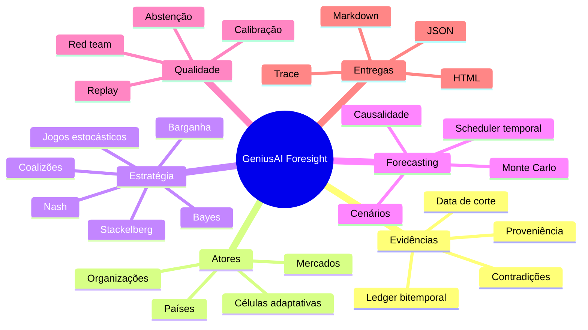
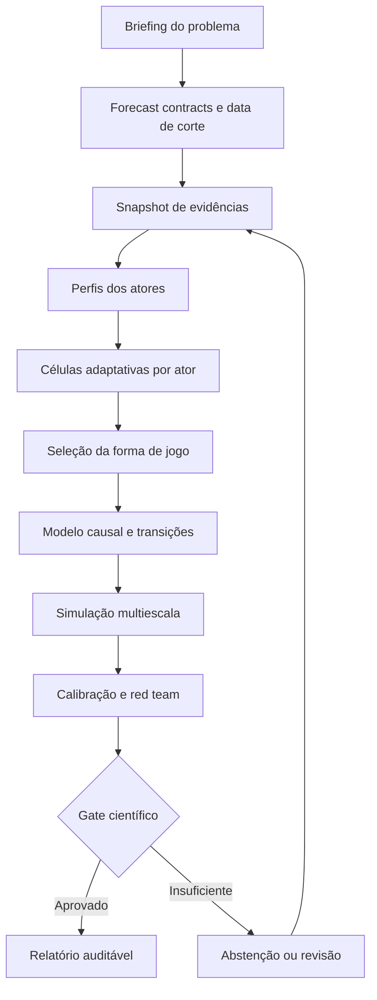

<div align="center">

# GeniusAI Foresight

### Simulação prospectiva multiagente com Teoria dos Jogos, causalidade e evidências auditáveis

[](./squad.yaml)
[](./pyproject.toml)
[](./LICENSE)
[](./NOTICE.md)

**Escolha países, instituições ou mercados; formule um problema real; construa células de agentes específicas para cada ator; e explore futuros condicionais ao longo de dias, semanas, meses ou anos.**

</div>

---

## O que é

O **GeniusAI Foresight** é um squad científico para estruturar e executar simulações prospectivas multiagente. Ele combina:

- evidências disponíveis até uma data de corte;
- perfis institucionais e econômicos dos atores;
- células adaptativas de agentes por país, organização ou mercado;
- Teoria dos Jogos clássica e computacional;
- cenários estocásticos com replay determinístico;
- probabilidades explicitamente rotuladas e auditáveis;
- relatórios técnicos, executivos e HTML.

O sistema não tenta “adivinhar o futuro”. Ele compara trajetórias condicionais: **se estes atores tiverem estas informações, preferências e restrições, e se estes choques ocorrerem, quais resultados o modelo produz?**

## Para que serve

- analisar crises geopolíticas e diplomáticas;
- explorar choques de energia, alimentos, minerais e logística;
- simular sanções, tarifas, subsídios e negociações;
- estudar coalizões, alianças e blocos econômicos;
- avaliar risco e contágio em mercados financeiros;
- comparar decisões sob incerteza, informação privada e racionalidade limitada;
- construir cenários históricos contrafactuais com data de corte explícita;
- ensinar Teoria dos Jogos e simulação baseada em agentes.

## O diferencial científico

| Camada | Função | Controle de qualidade |
|---|---|---|
| Evidence ledger | registra versões, validade e disponibilidade temporal | bloqueio de *future leakage*, seleção da vintage ativa e hash do snapshot |
| Perfis de atores | modela instituições, objetivos, capacidades e restrições | objetivos, especialistas, relações e preferências alteram a política simulada |
| Teoria dos Jogos | formaliza ações, informação, incentivos e coalizões | solver transparente, residual verdadeiro e limites explícitos |
| Simulação | propaga variáveis nomeadas a partir do *domain pack* | invariância à ordem do JSON, seed, trace, MCSE e famílias de seeds |
| Calibração | oferece métricas para validação quando houver observações | Brier, log score, reliability bins; MVP permanece `research_only` sem backtest |
| Relatórios | comunica cenários sem converter hipótese em certeza | sanitização, redação, método, cutoff, evidência e limitações visíveis |

## Arquitetura do squad



## Fluxo de trabalho



## Os oito agentes

| Agente | Função | Entrada | Saída |
|---|---|---|---|
| Orquestrador do Estudo | enquadra pergunta, horizonte e contratos | briefing | `study_spec`, forecast contracts |
| Auditor de Evidências | controla cutoff, fonte, revisão e licença | fontes | evidence snapshot |
| Analista Institucional | modela centros de poder e restrições | atores + evidências | actor profiles e cells |
| Modelador de Teoria dos Jogos | seleciona jogo, utilidades e solver | perfis + problema | game model e equilíbrios |
| Cientista Causal | define estado, DAG, priors e baselines | evidências | causal model |
| Engenheiro de Simulação | executa Monte Carlo, scheduler e replay | modelos + cells | runs, trace e cenários |
| Calibrador e Red Team | mede erro, sensibilidade e fragilidade | resultados | métricas, gate e go/no-go |
| Editor de Prospectiva | produz síntese sem overclaim | resultados aprovados | JSON, Markdown e HTML |

As células por país não são cortes fixas. O `ActorClusterFactory` inclui somente especialistas pertinentes ao problema — economia, mercado, diplomacia, recursos, política doméstica, segurança, ciência ou clima — mais coordenação e contraditório. No runtime, afinidade entre domínio do especialista e intervenção, objetivos, capacidades, restrições, preferência temporal e relações bilaterais modifica a distribuição de ações de cada ator; as células não são apenas personas descritivas.

## Contrato semântico do *domain pack*

O JSON do estudo declara explicitamente:

- `primary_variable` e modelos nomeados por variável, sem depender da ordem das chaves;
- intervenções com efeitos por variável, domínio, cooperação, capacidades exigidas e restrições expostas;
- relações bilaterais entre atores;
- regras de cenários definidas *ex ante* e mutuamente interpretáveis;
- forecast contract, fonte de resolução e thresholds de eventos;
- efeitos quantitativos de evidências vinculados à vintage ativa.

Alterar forma do jogo, intervenção, objetivo, composição da célula, relação ou efeito de evidência muda a política ou a trajetória simulada. Testes metamórficos garantem que apenas reordenar o JSON não muda resultados.

## Núcleo de Teoria dos Jogos

A versão inicial implementa, com testes canônicos:

- melhores respostas e equilíbrios de Nash puros;
- solução mista analítica para jogos `2×2`;
- dominância estrita, Pareto e níveis de segurança;
- residual de `ε`-Nash e equilíbrio correlacionado;
- valor de Shapley exato e amostral;
- solução de barganha de Nash em conjunto viável finito;
- Stackelberg puro com desempate forte ou fraco;
- Quantal Response Equilibrium logit;
- regret matching e arrependimento externo;
- limiar de cooperação em jogos repetidos;
- dinâmica replicadora;
- rollout de Markov game.

Métodos de grande escala — CFR completo, Nash-Q geral, Dec-POMDP e mean-field PDE — aparecem no PRD como módulos experimentais futuros, não como capacidades já entregues.

## Como executar

### Requisitos

- Python 3.11 ou superior;
- nenhuma dependência externa obrigatória para o MVP.

### Validar o squad

```bash
cd geniusai-foresight
python scripts/validate_squad.py --root .
python -m unittest discover -s tests -v
```

### Executar o cenário demonstrativo

```bash
python scripts/run_demo.py --output generated/demo
```

Ou pela CLI:

```bash
python -m foresight.cli demo --output generated/demo
```

### Analisar um jogo canônico

```bash
python -m foresight.cli game --fixture matching-pennies
python -m foresight.cli game --fixture prisoners-dilemma
```

### Executar seu próprio estudo

Use [`examples/soy-trade-shock.json`](examples/soy-trade-shock.json) como contrato inicial:

```bash
python -m foresight.cli validate --input examples/soy-trade-shock.json
python -m foresight.cli simulate \
  --input examples/soy-trade-shock.json \
  --output generated/meu-estudo
python -m foresight.cli replay \
  --input examples/soy-trade-shock.json \
  --expected generated/meu-estudo/result.json
```

Por segurança, arquivos existentes não são sobrescritos. Use `--force` somente quando a substituição for intencional. Os comandos `simulate` e `report` executam o mesmo workflow de oito gates; a saída permanece rotulada como `research_only` enquanto não existir calibração empírica point-in-time.

O diretório de saída contém:

| Arquivo | Conteúdo |
|---|---|
| `result.json` | resultados, MCSE/IC95%, ações, métodos, workflow e trace |
| `report.md` | relatório auditável, sanitizado e com limitações explícitas |
| `report.html` | dashboard autocontido, responsivo e com payload escapado |

## Estrutura do repositório

```text
geniusai-foresight/
├── agents/                 # contratos dos oito agentes
├── tasks/                  # oito tarefas com dependências e gates
├── workflows/              # ciclo prospectivo principal
├── foresight/              # kernel científico Python
│   ├── game_theory.py
│   ├── evidence.py
│   ├── actors.py
│   ├── simulation.py
│   ├── calibration.py
│   ├── orchestration.py
│   ├── safety.py
│   ├── reporting.py
│   └── cli.py
├── examples/               # briefing executável
├── scripts/                # demo e validador
├── tests/                  # jogos canônicos, leakage, replay e integração
├── docs/                   # metodologia científica e Teoria dos Jogos
├── PRD.md                  # Product Requirements Document canônico
├── squad.yaml              # manifesto executável
└── LICENSE
```

## Métodos e documentação

- [PRD completo](PRD.md)
- [Metodologia científica de forecasting](docs/METODOLOGIA-CIENTIFICA.md)
- [Núcleo matemático de Teoria dos Jogos](docs/METODOLOGIA-TEORIA-DOS-JOGOS.md)

## Segurança e privacidade

- input JSON limitado a 5 MiB, com budgets para atores, variáveis, evidências, runs e horizonte;
- `NaN`, `Infinity`, IDs duplicados, URLs fora de HTTP(S) e coeficientes inválidos são recusados;
- relatórios redigem padrões de segredos, e-mail e telefone e neutralizam HTML/links ativos;
- escrita é atômica, recusa symlinks e não sobrescreve arquivos sem `--force`;
- gate executável recusa targeting, sabotagem, planejamento militar tático, evasão de sanções e exploração de infraestrutura crítica;
- a fixture pública usa dados sintéticos e não incorpora material sensível.

Consulte [SECURITY.md](SECURITY.md) para o processo de reporte responsável.

## Limites

- O cenário incluído é uma **fixture sintética**, não uma afirmação sobre eventos atuais.
- As probabilidades do MVP são geradas pelo modelo e ainda não representam calibração empírica de uma classe de referência.
- Os coeficientes de transição precisam ser substituídos por *domain packs* calibrados antes de uso preditivo real.
- LLMs podem sugerir hipóteses e ações, mas não podem inventar evidências, declarar equilíbrio sem solver ou alterar diretamente o estado quantitativo.
- O produto não constitui recomendação financeira, militar, jurídica ou de política pública.

## Licença e autoria

Licenciado sob [MIT](LICENSE).

**Criado por Marcio Bisognin**
Instagram: [@marciobisognin](https://instagram.com/marciobisognin)
