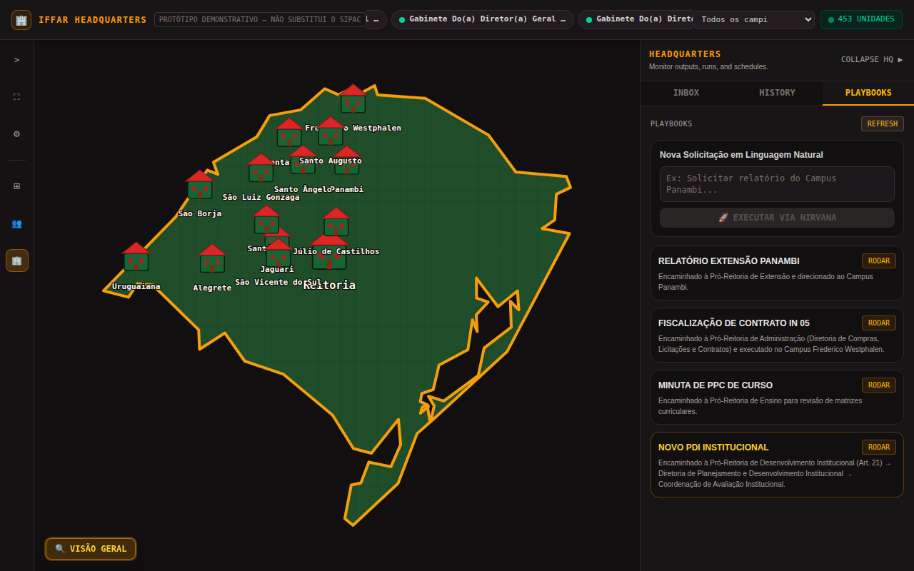
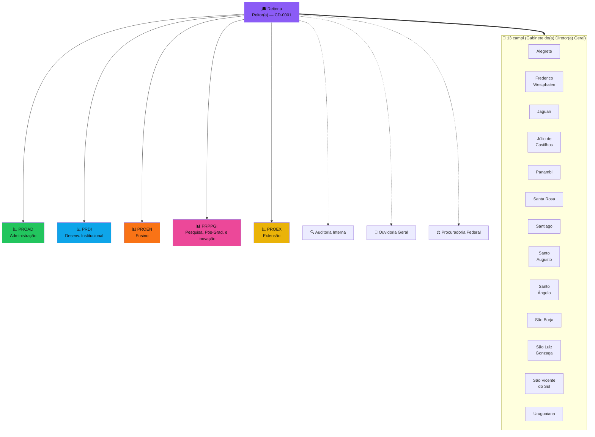
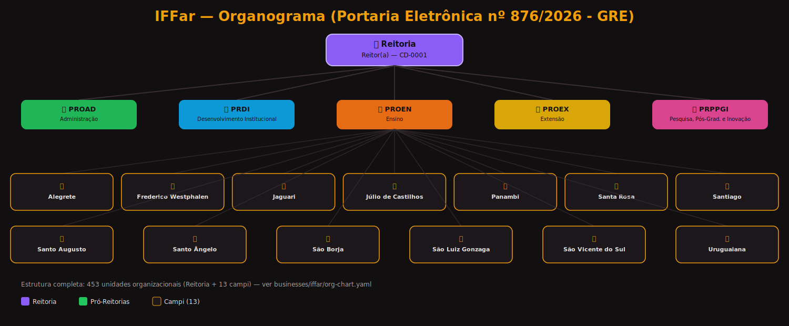
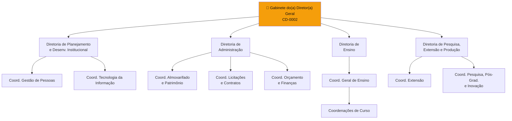
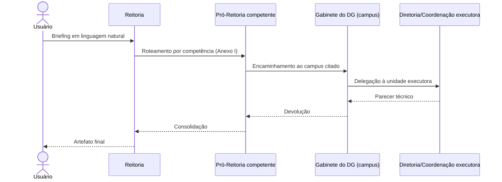
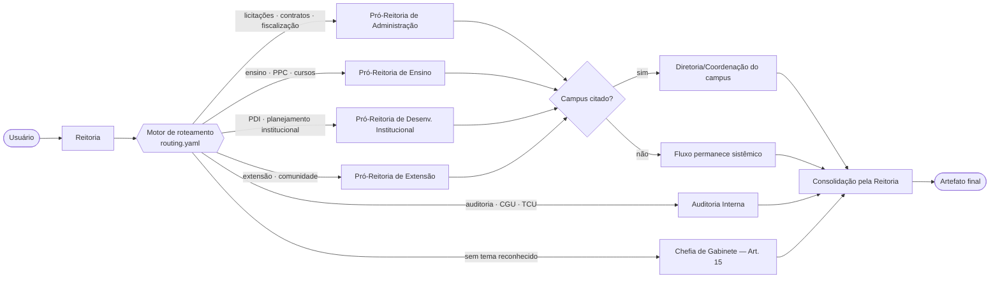
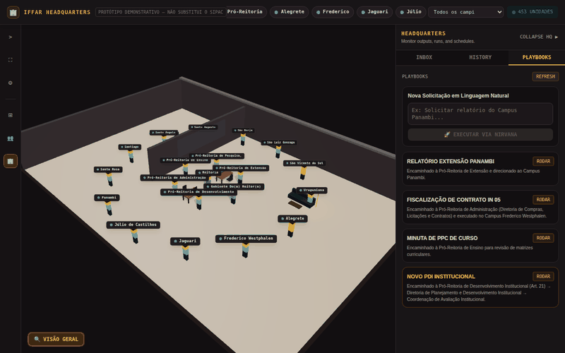
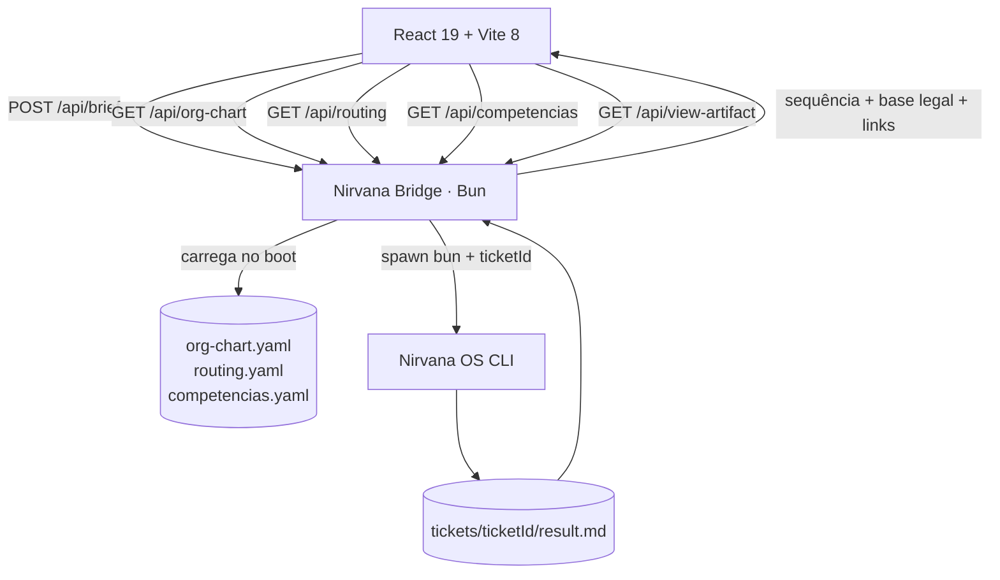
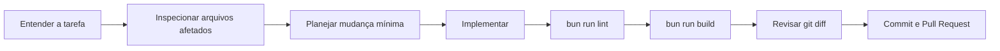

<div align="center">


# IFFar 3D Town

### Um escritório virtual 2D (estilo Gather Town) sobre o mapa do Rio Grande do Sul, para explorar agentes, responsabilidades e fluxos institucionais do Instituto Federal Farroupilha.

<p>
  
  
  
  
  
</p>

<p>
  <a href="#-visão-geral">Visão geral</a> •
  <a href="#-início-rápido">Início rápido</a> •
  <a href="#-como-usar">Como usar</a> •
  <a href="#-organograma-completo-do-iffar">Organograma</a> •
  <a href="#-demonstração-elaborando-o-novo-pdi">Demo em vídeo</a> •
  <a href="#-camada-de-dados-institucional">Dados institucionais</a> •
  <a href="#-arquitetura">Arquitetura</a> •
  <a href="#-uso-com-llms-e-agentes-de-codificação">LLMs de codificação</a> •
  <a href="#-solução-de-problemas">Solução de problemas</a>
</p>

</div>

---

## ✨ Visão geral

O **IFFar 3D Town** transforma o organograma real do Instituto Federal Farroupilha — extraído da **Portaria Eletrônica nº 876/2026 - GRE** — em um escritório virtual demonstrativo, no espírito de um [virtual office](https://www.gather.town/pt/virtual-office): um mapa 2D com a Reitoria e os 13 campi como prédios estilizados, e uma câmera que "entra" no escritório certo — com as pessoas e a função de cada uma — assim que uma tarefa é despachada. A cena é montada **dinamicamente** a partir de `businesses/iffar/org-chart.yaml`: nenhuma unidade é fixa no frontend. Uma demanda em linguagem natural é classificada por um motor de regras declarativo (`routing.yaml`) que segue as competências reais do Anexo I da portaria, e a interface reproduz visualmente a cadeia de handoffs entre Reitoria, setor responsável e campus.

O projeto combina uma experiência visual em **React + SVG/CSS 2D** com um bridge local em **Bun**. Esse bridge conecta a interface ao **Nirvana OS**, dispara o fluxo institucional e devolve os artefatos produzidos para leitura dentro da própria aplicação.

> [!IMPORTANT]
> O organograma e o motor de roteamento já vêm prontos para uso (Opção A). Para executar orquestrações **reais** via Nirvana OS (Opção B), aponte o `.env` para uma instalação existente do Nirvana OS e para os diretórios de execução do negócio `iffar`.

<table>
<tr>
<td width="33%" valign="top">

### 🗺️ Mapa real do Rio Grande do Sul

A Reitoria (Santa Maria) e os 13 campi ficam na coordenada geográfica real deles, sobre o contorno oficial do RS (dados do IBGE), cada um como um prédio desenhado em verde e vermelho. Ao processar uma demanda, a câmera faz um zoom estilo drone até o prédio certo e revela o escritório por dentro — estilo [Gather Town](https://www.gather.town/pt/virtual-office) — com um corte de cenário sempre que a cadeia muda de campus.

</td>
<td width="33%" valign="top">

### 🧭 Roteamento por competência real

Um motor de regras (`routing.yaml`) classifica a demanda pelas atribuições do Anexo I da Portaria 876/2026 — auditável, sem `if/else` escondido.

</td>
<td width="33%" valign="top">

### 📄 Artefatos vinculados por ticket

Cada execução gera um `ticketId` único; o artefato só entra no Inbox depois que `/api/view-artifact` confirma 200.

</td>
</tr>
</table>



---

## 🎓 Missão, visão e a Portaria 876/2026

> Missão, visão e valores citados verbatim da página institucional oficial do IFFar — [iffarroupilha.edu.br/missao-pdi](https://www.iffarroupilha.edu.br/missao-pdi).

<table>
<tr>
<td width="33%" valign="top">

**🎯 Missão**

> "Promover a educação profissional, científica e tecnológica, pública e gratuita, por meio do ensino, pesquisa e extensão, com foco na formação integral do cidadão e no desenvolvimento sustentável."

</td>
<td width="33%" valign="top">

**🔭 Visão**

> "Ser excelência na formação de técnicos de nível médio, professores para a educação básica e demais profissionais de nível superior, por meio da pesquisa, da extensão e da inovação."

</td>
<td width="33%" valign="top">

**💎 Valores**

Ética • Solidariedade • Responsabilidade Social, Ambiental e Econômica • Comprometimento • Transparência • Respeito • Gestão Democrática • Inovação

</td>
</tr>
</table>

### Por que a Portaria 876/2026 importa

A **Portaria Eletrônica nº 876/2026 - GRE** (03/07/2026, processo 23873.000543/2026-09) atualiza a estrutura administrativa e o quadro de funções comissionadas do IFFar, revogando a Portaria 398/2026. Ela formaliza a expansão institucional em curso: os campi **Uruguaiana**, **São Luiz Gonzaga** e **Santiago** ganham diretorias e funções comissionadas próprias, e o **Campus Caçapava do Sul** — recém-autorizado pelo MEC — aparece com sua Diretoria vinculada diretamente ao Gabinete da Reitoria (1.1.4.1), refletindo o estágio inicial de estruturação de um campus novo.

É essa mesma portaria — não uma versão simplificada ou hipotética — que alimenta `businesses/iffar/org-chart.yaml`, `competencias.yaml` e `routing.yaml`: cada unidade, cargo e regra de roteamento deste protótipo é rastreável a um artigo real do Anexo I.

---

## 🏛️ Organograma completo do IFFar

A estrutura abaixo é a mesma servida dinamicamente por `GET /api/org-chart` — o diagrama documenta o nível Reitoria + Pró-Reitorias + 13 campi; a árvore completa (453 unidades, até coordenações e setores) está em `businesses/iffar/org-chart.yaml` e pode ser explorada clicando em qualquer prédio do mapa.





### Responsabilidades por cargo (Anexo I da Portaria 876/2026)

Resumos abaixo são o primeiro inciso real de cada artigo — extraídos e disponíveis por completo em `businesses/iffar/competencias.yaml` (campo `resumo`, com `total_incisos` indicando quantos itens cada artigo tem).

| Cargo | Unidade | Base legal | Resumo da competência |
| ----- | ------- | :--------: | ---------------------- |
| 🎓 Reitor(a) | Gabinete da Reitoria | Art. 14 | "Organizar, assistir, coordenar, fomentar e articular a ação política e administrativa da Reitoria, prestando assistência técnico-administrativa ao(à) Reitor(a)." |
| 🗂️ Chefe de Gabinete | Chefia do Gabinete | Art. 15 | "Assistir o(a) Reitor(a) no seu relacionamento institucional e administrativo em suas representações política e social." |
| 📊 Pró-Reitor(a) de Administração | PROAD | Art. 38 | "Planejar, desenvolver, controlar e avaliar [...] a administração orçamentária, financeira e patrimonial [...], os projetos de infraestrutura, as licitações e os contratos." |
| 📊 Pró-Reitor(a) de Desenv. Institucional | PRDI | Art. 21 | "Promover a integração entre a Reitoria e os campi" e coordenar planejamento estratégico e avaliação institucional — inclui a elaboração do **PDI**. |
| 📊 Pró-Reitor(a) de Ensino | PROEN | Art. 61 | "Planejar, desenvolver, controlar e avaliar a execução das políticas de ensino homologadas pelo Conselho Superior." |
| 📊 Pró-Reitor(a) de Pesquisa, Pós-Grad. e Inovação | PRPPGI | Art. 71 | "Propor, planejar, desenvolver, articular, controlar e avaliar a execução das políticas de Pesquisa, Pós-Graduação e Inovação." |
| 📊 Pró-Reitor(a) de Extensão | PROEX | Art. 76 | "Planejar, desenvolver, controlar e avaliar as políticas de extensão, de integração e de intercâmbio da instituição com o setor produtivo e a sociedade." |
| 🏫 Diretor(a) Geral (campus) | Gabinete do(a) Diretor(a) Geral | Art. 82 | "Administrar, coordenar e superintender todas as atividades do campus, assessorado por diretorias, coordenações e assessorias." |
| 🔍 Auditoria Interna | Auditoria Interna | Art. 3 | "Acompanhar o cumprimento das metas do Plano Plurianual" e examinar a prestação de contas — órgão de **controle**, não executa contratos/licitações. |

> [!NOTE]
> Essa distinção entre Auditoria Interna (controle) e PROAD (execução de compras/licitações/contratos) é exatamente o que o motor de roteamento (`routing.yaml`) respeita — ver a nota na seção [Rotas demonstradas](#-visão-geral).

---

## 🏫 Estrutura interna de um campus

Todo campus segue o mesmo desenho geral (Colegiado + Gabinete do(a) Diretor(a) Geral + 3-4 diretorias), com pequenas variações — os campi menores usam a estrutura reduzida dos Arts. 114-120 (diretorias combinadas). Abaixo, o Campus Frederico Westphalen como referência (estrutura completa, sem combinação):



### Como uma decisão flui entre níveis hierárquicos



---

## 🎯 O que você consegue fazer

| Experiência                                  | O que acontece na prática                                                                                 |
| --------------------------------------------- | ----------------------------------------------------------------------------------------------------------- |
| **Explorar a sede virtual**                    | Navegue pelo mapa do RS e pelos escritórios montados a partir do organograma real; filtre por campus no cabeçalho. |
| **Enviar uma demanda em linguagem natural**    | Digite um briefing ou use um playbook pronto para iniciar uma execução.                                      |
| **Observar o handoff entre agentes**           | A câmera reproduz a cadeia devolvida pelo bridge, derivada da hierarquia real do organograma.                |
| **Aplicar rotas por competência**              | O tema da demanda (contratos, ensino, extensão, auditoria, TI, gestão de pessoas...) segue a Uorg competente conforme o Anexo I. |
| **Ver o fundamento legal de cada passo**       | Cada handoff carrega os artigos do Anexo I que embasam a rota (transparência do roteamento).                 |
| **Consultar o organograma por hover**          | Passe o mouse sobre uma unidade para ver cargo, função (CD/FG/FCC) e um resumo da competência.               |
| **Acompanhar Inbox e histórico reais**         | Artefatos só entram no Inbox após confirmação; o History lista as execuções desta sessão.                    |

### Rotas demonstradas



> [!NOTE]
> Diferente da versão anterior, **contratos, licitações e fiscalização não vão mais para a Auditoria Interna** — a Auditoria é órgão de controle interno (Art. 3º do Anexo I); quem executa essas competências é a Pró-Reitoria de Administração (Arts. 57-59, 92-93).

---

## ⚠️ Limites atuais do protótipo

Esta versão é uma **simulação visual determinística**, não um monitor operacional em tempo real.

| Limite atual                                                | Impacto prático                                                                                                                                 |
| ----------------------------------------------------------- | ----------------------------------------------------------------------------------------------------------------------------------------------- |
| **Timeline reproduzida após o processo**                    | Os handoffs são animados por temporizadores depois que o bridge recebe a saída do processo Bun; não há streaming ou telemetria ao vivo (ver "Próximas evoluções").|
| **Histórico limitado à sessão**                              | O History lista execuções reais, mas apenas as feitas nesta sessão do navegador — não há persistência entre recarregamentos.                    |
| **Sucesso parcialmente validado**                           | A interface ainda não diferencia todos os cenários em que o processo termina com erro.                                                          |
| **Nível de detalhe da cena**                                 | Por padrão a cena mostra Reitoria + Pró-Reitorias + Gabinetes de campus (~20 prédios); diretorias/coordenações só aparecem ao expandir um campus, para não colocar as ~450 unidades na cena de uma vez. |
| **Sem health check de autenticação nem isolamento por origem** | `/api/health` reporta status de configuração, mas o bridge continua sem autenticação e usa CORS `*`; mantenha-o em `127.0.0.1` e não o trate como fronteira de segurança de produção. |

> [!CAUTION]
> Use dados fictícios ou previamente sanitizados. O protótipo não deve processar documentos institucionais sensíveis sem endurecimento adicional do bridge, autenticação e testes de integração.

---

## ⚡ Início rápido

O mapa e os escritórios são montados a partir do organograma real servido pelo bridge (`GET /api/org-chart`) — **não há mais agentes fixos no frontend**, então o bridge precisa estar rodando em ambas as opções abaixo. A diferença entre elas é só se você quer orquestrações reais via Nirvana OS ou não.

### Opção A — explorar organograma e roteamento, sem o Nirvana OS

Use esta opção para conhecer o ambiente visual e o motor de roteamento sem precisar de nenhuma instalação externa: `org-chart.yaml`, `routing.yaml` e `competencias.yaml` já vêm prontos no repositório, e o bridge usa `tools/stub-engine.ts` como stand-in do Nirvana OS.

**Requisitos:** [Bun](https://bun.sh/) e Git.

```bash
git clone https://github.com/marciobisognin/GeniusAI.git
cd GeniusAI/iffar-3d-town
bun install
```

Abra dois terminais no diretório `iffar-3d-town` (nenhum `.env` é necessário):

<table>
<tr>
<td width="50%" valign="top">

**Terminal 1 — bridge**

```bash
bun run nirvana-bridge.ts
```

Ficará escutando em `http://127.0.0.1:4000`.

</td>
<td width="50%" valign="top">

**Terminal 2 — interface**

```bash
bun run dev
```

Abra `http://localhost:5173`.

</td>
</tr>
</table>

Envie um briefing pela interface: o `stub-engine.ts` grava um artefato de exemplo, o suficiente para ver o Inbox e a leitura de artefato funcionando de ponta a ponta. Nenhum parecer real é gerado nesse modo.

### Opção B — orquestrações reais via Nirvana OS

**Requisitos adicionais:**

- uma instalação funcional do Nirvana OS;
- o negócio `iffar` configurado na sua instalação do Nirvana OS.

```bash
cp .env.example .env
```

Edite `.env` e defina `NIRVANA_ENGINE_PATH` para o `brief-business.ts` real (opcionalmente também `IFFAR_TICKETS_DIR`/`IFFAR_OUTPUTS_DIR`, se quiser usar diretórios fora de `.data/`). Repita os dois terminais da Opção A — o bridge detecta a configuração e passa a executar o Nirvana OS de verdade.

### Verificação mínima

```bash
bun run lint
bun run build
```

Resultado esperado:

- lint sem erros;
- build produzido em `dist/`;
- interface acessível na porta `5173`;
- `GET http://127.0.0.1:4000/api/health` responde `{"ok": true, ...}`.

---

## 🕹️ Como usar

### 1. Entenda a tela

```text
┌─────────────────────────────────────────────────────────────────┐
│ Cabeçalho: status, filtros e identificação da central           │
├───────────────────────────────────────────┬─────────────────────┤
│                                           │ PLAYBOOKS           │
│     Mapa do RS + escritórios do IFFar     │ INBOX               │
│                                           │ HISTORY             │
│   câmera + avatares + mesas de trabalho   │ prompt personalizado│
│                                           │ artefatos gerados   │
└───────────────────────────────────────────┴─────────────────────┘
```

### 2. Escolha uma forma de entrada

- **Playbook pronto:** use um dos cenários demonstrativos do painel lateral.
- **Prompt personalizado:** descreva a demanda, o tema e (se fizer sentido) o campus de destino.
- **Filtro de campus:** use o seletor no cabeçalho para restringir a cena a um único campus.

Exemplos (baseados nos 10 briefings de validação do roteador):

```text
Fiscalizar o contrato de limpeza do Campus Frederico Westphalen (IN 05/2017).
```

```text
Atualizar o PPC do curso de Sistemas no Campus Santo Augusto.
```

```text
Projeto de extensão com a comunidade em São Luiz Gonzaga.
```

```text
Atender recomendação da CGU sobre diárias.
```

### 3. Acompanhe a reprodução visual

1. A Reitoria recebe o briefing.
2. O motor de roteamento (`routing.yaml`) pontua o texto por palavras-chave e escolhe a Uorg responsável — sem campus citado, a cadeia permanece sistêmica (não há mais fallback para um campus arbitrário).
3. O processo configurado em `NIRVANA_ENGINE_PATH` é executado com um `ticketId` próprio da execução.
4. Ao término, o bridge devolve a cadeia de handoff derivada da hierarquia real do organograma, com o fundamento legal (Anexo I) de cada passo.
5. A câmera reproduz os handoffs; um passo cuja unidade não está entre os agentes exibidos no momento é pulado (com aviso no console), nunca anima o prédio errado.
6. O bridge confirma que o artefato responde 200 antes de colocá-lo no **Inbox** e o abre automaticamente.

### 4. Abra o resultado

Clique no item do Inbox. A rota `/api/view-artifact` solicita o arquivo ao bridge, que exige extensão `.md`, resolve symlinks (`realpathSync`) e aplica uma verificação de caminho em relação a `IFFAR_TICKETS_DIR` e `IFFAR_OUTPUTS_DIR` antes de servir o conteúdo como Markdown.

Essa verificação reduz exposições acidentais, mas **não substitui autenticação, isolamento do processo ou uma política de acesso de produção**.

> [!NOTE]
> `GET /api/routing` expõe as regras usadas pelo motor de classificação — é a mesma fonte que embasa o tooltip institucional e o rodapé "por que esta demanda foi para esta unidade".

---

## 🎬 Demonstração: elaborando o novo PDI

O GIF abaixo é uma gravação real da interface (não uma montagem) processando o playbook **"Novo PDI Institucional"**: um briefing pedindo a elaboração do novo Plano de Desenvolvimento Institucional do IFFar, alinhado a tendências como IA, ensino híbrido, inclusão digital e sustentabilidade.



O motor de roteamento reconhece "PDI" como tema institucional (Art. 21 do Anexo I — não confundir com o PPC de um curso específico, que é atribuição da Pró-Reitoria de Ensino) e monta a cadeia real:

```
Reitoria
  → Pró-Reitoria de Desenvolvimento Institucional (PRDI)
    → Diretoria de Planejamento e Desenvolvimento Institucional
      → Coordenação de Avaliação Institucional
        ⇄ parecer devolvido pela mesma cadeia até o artefato final
```

Sem `NIRVANA_ENGINE_PATH` configurado, quem gera o artefato é o `tools/stub-engine.ts` (ver [Início rápido](#-início-rápido)) — por isso o parecer no GIF se identifica como simulação. Apontando `NIRVANA_ENGINE_PATH` para uma instalação real do Nirvana OS, o mesmo fluxo dispara a elaboração de verdade.

---

## ⚙️ Configuração

Copie `.env.example` para `.env` e altere apenas os valores locais. O arquivo `.env` não deve ser versionado. **Todas as variáveis abaixo têm um padrão que funciona sem editar nada** — é assim que a Opção A funciona sem instalar o Nirvana OS.

| Variável                  |                                Padrão | Finalidade                                                                                              |
| ------------------------- | -------------------------------------: | --------------------------------------------------------------------------------------------------------- |
| `VITE_BRIDGE_URL`         |                `http://localhost:4000` | URL usada pelo frontend para acessar o bridge.                                                            |
| `NIRVANA_BRIDGE_HOST`     |                            `127.0.0.1` | Interface de rede do servidor. Mantenha o padrão local nesta versão.                                      |
| `NIRVANA_BRIDGE_PORT`     |                                 `4000` | Porta HTTP do bridge.                                                                                     |
| `PUBLIC_BRIDGE_URL`       |                       vazio (opcional) | URL pública para montar links de artefato; vazio usa o header `Host` da própria requisição.               |
| `NIRVANA_ENGINE_PATH`     |            `tools/stub-engine.ts` | Caminho de `brief-business.ts` no Nirvana OS. Sem instalação real, cai no stub que só grava um artefato de exemplo. |
| `IFFAR_ORG_CHART_PATH`    |  `businesses/iffar/org-chart.yaml` | Organograma real extraído da Portaria 876/2026 (Art. 1º), já versionado no repositório.                    |
| `IFFAR_ROUTING_PATH`      |     `businesses/iffar/routing.yaml` | Regras declarativas de roteamento por competência (Anexo I), já versionadas no repositório.                |
| `IFFAR_COMPETENCIAS_PATH` | `businesses/iffar/competencias.yaml` | Atribuições por artigo do Anexo I, usadas para enriquecer os tooltips da UI (opcional).                    |
| `IFFAR_TICKETS_DIR`       |                     `.data/tickets` | Diretório onde as execuções produzem tickets; criado automaticamente se não existir.                       |
| `IFFAR_OUTPUTS_DIR`       |                     `.data/outputs` | Diretório de resultados consolidados; criado automaticamente se não existir.                               |

`NIRVANA_ENGINE_PATH`, `IFFAR_ORG_CHART_PATH` e `IFFAR_ROUTING_PATH` **precisam apontar para um arquivo que já existe** — o bridge falha ao subir (fail-fast, ver `/api/health`) se qualquer um deles estiver ausente ou incorreto, em vez de responder 503 por requisição.

Exemplo para apontar para uma instalação real do Nirvana OS (Opção B):

```dotenv
VITE_BRIDGE_URL=http://localhost:4000
NIRVANA_BRIDGE_HOST=127.0.0.1
NIRVANA_BRIDGE_PORT=4000
NIRVANA_ENGINE_PATH=/home/usuario/nirvana-os/skills/businesses/scripts/brief-business.ts
IFFAR_TICKETS_DIR=/home/usuario/businesses/iffar/tickets
IFFAR_OUTPUTS_DIR=/home/usuario/businesses/iffar/outputs
```

---

## 🏛️ Camada de dados institucional

A cena e o roteamento derivam inteiramente de três arquivos versionados em `businesses/iffar/`, extraídos da **Portaria Eletrônica nº 876/2026 - GRE** (03/07/2026, processo 23873.000543/2026-09):

| Arquivo             | Conteúdo                                                                              | Extraído por                        |
| ------------------- | -------------------------------------------------------------------------------------- | ------------------------------------ |
| `org-chart.yaml`     | As 452 unidades do Art. 1º (Reitoria + 13 campi): id, nome, cargo, função, parentesco. | `tools/extrair_organograma.py`       |
| `competencias.yaml`  | As 120 atribuições do Anexo I: artigo, unidade e resumo (primeiro inciso).             | `tools/extrair_competencias.py`      |
| `routing.yaml`       | 24 regras de roteamento (tema → palavras-chave → cadeia → base legal), curadoria manual. | — (mapeia negócio, não é extraído)   |

Se a portaria for atualizada novamente (como a 876/2026 revogou a 398/2026), **re-execute os scripts — nunca edite `org-chart.yaml` ou `competencias.yaml` à mão**:

```bash
cd iffar-3d-town/tools
python3 extrair_organograma.py caminho/para/nova-portaria.pdf > ../businesses/iffar/org-chart.yaml
python3 extrair_competencias.py caminho/para/nova-portaria.pdf > ../businesses/iffar/competencias.yaml
```

Os scripts usam `pdfplumber` para ler a tabela vetorial real do PDF (não apenas texto alinhado por espaços), o que resolve com exatidão nomes de unidade quebrados em várias linhas. Depois de gerar um novo `org-chart.yaml`, confira manualmente ao menos as seções 1.1 (Reitoria), 1.9 (Frederico Westphalen) e 1.13 (São Luiz Gonzaga, estrutura reduzida) contra o PDF antes de commitar.

> [!NOTE]
> `routing.yaml` é curadoria manual (mapeia temas de negócio às Uorgs competentes) e pode ser editado diretamente — é o único dos três que não vem de extração automática.

---

## 🧱 Arquitetura



<table>
<tr>
<td width="33%" valign="top">

### Frontend

- React 19
- TypeScript 6
- SVG + CSS 2D (mapa e escritório)
- Tailwind CSS 4
- Lucide React

</td>
<td width="33%" valign="top">

### Bridge

- Runtime Bun
- HTTP local
- CORS para o frontend
- spawn do Nirvana OS
- leitura do organograma
- entrega controlada de artefatos

</td>
<td width="33%" valign="top">

### Orquestração

- briefing em linguagem natural
- classificação por competência (score de keywords × prioridade)
- cadeia de handoff derivada da hierarquia real (não hardcoded)
- resolução por nome com fallback para estrutura reduzida (campi menores)
- atualização visual da câmera
- resultado vinculado por ticket, enviado ao Inbox só após confirmação

</td>
</tr>
</table>

### Endpoints locais

| Método | Endpoint                      | Uso                                                                                          |
| ------ | ------------------------------ | ----------------------------------------------------------------------------------------------- |
| `POST` | `/api/brief`                  | Recebe `{ "problem": "..." }`, executa o fluxo e devolve sequência, `ticketId` e artefatos.      |
| `GET`  | `/api/org-chart`              | Serve o `org-chart.yaml` carregado no boot.                                                     |
| `GET`  | `/api/routing`                | Serve as regras de `routing.yaml` — transparência de "por que esta demanda foi para esta unidade". |
| `GET`  | `/api/competencias`           | Serve `competencias.yaml` (enriquecimento dos tooltips institucionais).                          |
| `GET`  | `/api/view-artifact?file=...` | Serve o conteúdo com tipo Markdown; exige extensão `.md` e resolve symlinks antes da checagem.   |
| `GET`  | `/api/health`                 | Retorna `{ ok, engine, orgChart, unidades, rules, competencias }` — status real de configuração. |

### Estrutura do projeto

```text
iffar-3d-town/
├── public/                 # assets públicos
├── src/
│   ├── assets/             # identidade visual
│   ├── App.tsx             # mapa, escritório, interface, estados e integração HTTP
│   ├── App.css             # estilos específicos da aplicação
│   ├── index.css           # estilos globais e Tailwind
│   └── main.tsx            # entrada do React
├── businesses/iffar/       # camada de dados institucional (versionada)
│   ├── org-chart.yaml      # estrutura real (Portaria 876/2026, Art. 1º)
│   ├── competencias.yaml   # atribuições reais (Anexo I)
│   └── routing.yaml        # regras de roteamento por competência
├── tools/                  # scripts de (re-)extração a partir do PDF da portaria
│   ├── extrair_organograma.py
│   ├── extrair_competencias.py
│   └── stub-engine.ts      # stand-in do Nirvana OS para a Opção A
├── .env.example            # contrato de configuração local
├── nirvana-bridge.ts       # API local, motor de roteamento e conexão com Nirvana OS
├── package.json            # scripts e dependências
├── vite.config.ts          # Vite + React + Tailwind
└── README.md               # guia visual e operacional
```

---

## 🧪 Desenvolvimento e qualidade

| Comando                     | O que faz                                      |
| --------------------------- | ---------------------------------------------- |
| `bun run dev`               | Inicia o frontend Vite em desenvolvimento.     |
| `bun run nirvana-bridge.ts` | Inicia o bridge local.                         |
| `bun run lint`              | Executa o Oxlint sobre os arquivos do projeto. |
| `bun run build`             | Gera o bundle de produção em `dist/`.          |
| `bun run preview`           | Serve localmente o build de produção.          |

### Fluxo recomendado para qualquer alteração



---

## 🤖 Uso com LLMs e agentes de codificação

O projeto pode ser trabalhado por agentes locais, IDEs com modo agente ou serviços em nuvem. A regra mais importante é fornecer **contexto, escopo, critérios de aceite e comandos de validação**.

### Preparação comum a todos os agentes

```bash
git clone https://github.com/marciobisognin/GeniusAI.git
cd GeniusAI/iffar-3d-town
bun install
bun run lint
bun run build
```

Antes de pedir alterações, informe ao agente:

- o objetivo funcional;
- quais arquivos ele pode modificar;
- o que não deve ser alterado;
- como verificar o resultado;
- que `.env`, credenciais, `tickets/`, `outputs/`, `dist/` e `node_modules/` não devem entrar no commit.

### Prompt-base recomendado

```text
Você está trabalhando no projeto iffar-3d-town do monorepo GeniusAI.

Antes de editar:
1. Leia README.md, package.json, src/App.tsx, nirvana-bridge.ts e .env.example.
2. Explique brevemente a arquitetura e identifique os arquivos afetados.
3. Proponha um plano mínimo e aguarde minha aprovação se houver mudança arquitetural.

Tarefa:
[DESCREVA A ALTERAÇÃO]

Restrições:
- Preserve React + TypeScript + Bun (mapa/escritório em SVG + CSS 2D, sem engine 3D).
- Não exponha segredos nem caminhos locais reais.
- Não versione .env, node_modules, dist, tickets ou outputs.
- Mantenha o bridge limitado a 127.0.0.1 por padrão.
- Preserve a validação de acesso aos artefatos.

Critérios de aceite:
[LISTE O COMPORTAMENTO ESPERADO]

Validação obrigatória:
- bun run lint
- bun run build
- git diff --check

Ao terminar, resuma os arquivos alterados, os testes executados e qualquer limitação real.
```

<details>
<summary><strong>OpenAI Codex CLI — instalação, análise e implementação</strong></summary>

### Instalação

```bash
npm install -g @openai/codex
codex
```

No primeiro uso, escolha **Sign in with ChatGPT** ou configure a autenticação indicada pela documentação oficial.

### Como usar neste projeto

```bash
cd GeniusAI/iffar-3d-town
codex
```

Primeiro prompt, somente para entendimento:

```text
Leia o README e os arquivos principais deste diretório. Não altere nada ainda.
Mapeie o fluxo entre App.tsx, nirvana-bridge.ts, org-chart, tickets e outputs.
Liste riscos técnicos e os comandos de validação disponíveis.
```

Depois, envie o prompt-base desta seção com sua tarefa. Peça explicitamente para o Codex executar `bun run lint`, `bun run build` e revisar o diff antes de concluir.

**Documentação oficial:** [Codex CLI](https://developers.openai.com/codex/cli/)

</details>

<details>
<summary><strong>Claude Code — contexto amplo e mudanças em múltiplos arquivos</strong></summary>

### Instalação

Instale o pacote oficial ou use um método nativo listado na documentação da Anthropic:

```bash
npm install -g @anthropic-ai/claude-code
```

Depois de executar `claude`, siga o fluxo de autenticação apresentado no terminal. Em ambientes corporativos, confirme previamente a política de uso, o provedor e a forma de autenticação autorizada.

### Como usar neste projeto

```bash
cd GeniusAI/iffar-3d-town
claude
```

Prompt inicial:

```text
Faça uma leitura do projeto sem editar arquivos. Explique a arquitetura em cinco blocos:
interface, mapa/escritório, roteamento, bridge e artefatos. Depois proponha um plano para [TAREFA].
```

Após revisar o plano, autorize a implementação e exija os três gates:

```bash
bun run lint
bun run build
git diff --check
```

Revise o diff apresentado pelo Claude antes de aceitar qualquer commit.

**Documentação oficial:** [Claude Code](https://code.claude.com/docs/en/overview)

</details>

<details>
<summary><strong>Google Gemini CLI — exploração do repositório e execução pelo terminal</strong></summary>

### Instalação

```bash
# executar sem instalação global
npx @google/gemini-cli

# ou instalar globalmente
npm install -g @google/gemini-cli
```

### Como usar neste projeto

```bash
cd GeniusAI/iffar-3d-town
gemini
```

Na primeira execução, escolha uma forma de autenticação suportada, como login com Google, chave da Gemini API ou Vertex AI. Nunca escreva chaves no prompt, no README ou em arquivos versionados; use as variáveis e mecanismos indicados pelo provedor.

Prompt recomendado:

```text
Analise README.md, package.json, src/App.tsx e nirvana-bridge.ts.
Crie primeiro um plano para [TAREFA], indicando arquivos, riscos e critérios de aceite.
Não faça mudanças fora de iffar-3d-town.
```

Você também pode executar uma análise não interativa:

```bash
gemini -p "Explique a arquitetura do projeto iffar-3d-town sem modificar arquivos"
```

Antes de encerrar, peça ao Gemini para executar:

```bash
bun run lint
bun run build
git diff --check
```

Revise o diff final antes de autorizar um commit.

**Documentação oficial:** [Gemini CLI](https://github.com/google-gemini/gemini-cli)

</details>

<details>
<summary><strong>GitHub Copilot cloud agent — trabalhar por issue e Pull Request</strong></summary>

O agente em nuvem do GitHub trabalha em um ambiente efêmero, cria uma branch e pode abrir um Pull Request. Ele exige uma assinatura compatível do GitHub Copilot, acesso habilitado no repositório e permissões adequadas.

### Como delegar

1. Abra uma issue no repositório `marciobisognin/GeniusAI`.
2. Use um título objetivo, como `feat(iffar-3d-town): adicionar filtro de campus`.
3. No corpo, cole o modelo abaixo.
4. Atribua a issue ao Copilot ou inicie uma sessão pelo painel de agentes.
5. Confirme que o ambiente do agente instala Bun antes dos gates; se necessário, adicione etapas de setup do Copilot ao repositório.
6. Revise o plano, os logs, o diff e os checks do PR antes do merge.

```text
Escopo: somente iffar-3d-town/

Objetivo:
[DESCREVA A MUDANÇA]

Contexto obrigatório:
- Ler iffar-3d-town/README.md
- Ler iffar-3d-town/src/App.tsx
- Ler iffar-3d-town/nirvana-bridge.ts

Não alterar:
- outros projetos do monorepo
- arquivos de credenciais ou outputs locais

Aceite:
[LISTE OS RESULTADOS OBSERVÁVEIS]

Checks:
cd iffar-3d-town
bun install
bun run lint
bun run build
git diff --check
```

**Documentação oficial:** [GitHub Copilot cloud agent](https://docs.github.com/en/copilot/concepts/agents/coding-agent/about-coding-agent)

</details>

<details>
<summary><strong>Cursor Agent — desenvolvimento visual dentro da IDE</strong></summary>

### Preparação

1. Instale o [Cursor](https://cursor.com/downloads).
2. Abra a pasta raiz `GeniusAI`.
3. Selecione `iffar-3d-town` como contexto principal.
4. Abra o Agent e comece em **Plan Mode** para mudanças não triviais.

Prompt inicial:

```text
Use apenas a pasta iffar-3d-town como escopo.
Leia o README e os arquivos principais, explique a arquitetura e planeje [TAREFA].
Não implemente até que o plano identifique arquivos, riscos e validações.
```

Depois de aprovar o plano:

1. peça a implementação;
2. confira cada arquivo no painel de revisão;
3. rode `bun run lint`, `bun run build` e `git diff --check` no terminal integrado;
4. rejeite alterações fora do escopo;
5. só então crie o commit ou Pull Request.

**Documentação oficial:** [Cursor Agent](https://docs.cursor.com/agent/overview)

</details>

<details>
<summary><strong>OpenCode — agente open source com múltiplos provedores</strong></summary>

### Instalação

```bash
npm install -g opencode-ai
```

### Configuração e uso

```bash
cd GeniusAI/iffar-3d-town
opencode
```

Dentro da interface:

1. use `/connect` para selecionar e autenticar um provedor;
2. use `/init` para analisar o projeto e criar contexto persistente quando apropriado;
3. comece em modo de planejamento para mudanças amplas;
4. envie o prompt-base desta seção;
5. revise o diff e execute lint, build e `git diff --check`.

Prompt curto recomendado:

```text
Planeje uma implementação para [TAREFA] limitada a iffar-3d-town.
Preserve a segurança do bridge e não altere outros projetos do monorepo.
Depois do meu aceite, implemente e execute os gates do README.
```

**Documentação oficial:** [OpenCode](https://opencode.ai/docs/)

</details>

### Checklist humano antes de aceitar código de qualquer agente

- [ ] O agente respeitou o escopo `iffar-3d-town/`.
- [ ] Nenhum segredo ou caminho pessoal foi incluído.
- [ ] `.env`, `dist/`, `node_modules/`, `tickets/` e `outputs/` continuam fora do commit.
- [ ] O bridge continua preso a `127.0.0.1` por padrão.
- [ ] A leitura de artefatos continua limitada aos diretórios configurados.
- [ ] `bun run lint` passou.
- [ ] `bun run build` passou.
- [ ] `git diff --check` passou.
- [ ] O diff foi revisado por uma pessoa antes do merge.

---

## 🔐 Segurança e privacidade

- O bridge usa `127.0.0.1` por padrão; não o exponha publicamente sem autenticação, proxy e revisão de segurança.
- A rota de artefatos exige extensão `.md`, resolve symlinks (`realpathSync`) e checa o caminho sob `IFFAR_TICKETS_DIR` ou `IFFAR_OUTPUTS_DIR` antes de servir o conteúdo.
- O bridge não possui autenticação e responde com CORS `*`; mantenha o host em `127.0.0.1`. `/api/health` reporta status de configuração, não é um mecanismo de autenticação.
- Nunca coloque tokens, chaves, credenciais ou caminhos pessoais no repositório.
- Não versione `.env`, logs, outputs de execução ou documentos institucionais sensíveis.
- Revise o conteúdo dos artefatos antes de compartilhá-los fora do ambiente autorizado.

---

## 🧯 Solução de problemas

<details>
<summary><strong>A interface abre, mas aparece “Erro ao conectar com Nirvana Bridge”</strong></summary>

1. Confirme se `bun run nirvana-bridge.ts` está em execução.
2. Verifique `VITE_BRIDGE_URL` em `.env`.
3. Confirme que frontend e bridge usam as portas `5173` e `4000`.
4. Reinicie o Vite depois de alterar variáveis `VITE_*`.

</details>

<details>
<summary><strong>O bridge sai imediatamente com "Configuração incompleta — abortando inicialização"</strong></summary>

Esse é o boot fail-fast: o bridge nunca sobe com configuração incompleta (evita responder 503 por requisição). A mensagem lista exatamente qual variável falta ou aponta para um caminho inexistente — `NIRVANA_ENGINE_PATH`, `IFFAR_ORG_CHART_PATH` ou `IFFAR_ROUTING_PATH`. Se você não editou `.env`, confirme que `tools/stub-engine.ts` e `businesses/iffar/*.yaml` continuam no lugar (são os padrões usados quando as variáveis não são definidas).

</details>

<details>
<summary><strong>Quero rodar orquestrações reais, não o stub-engine</strong></summary>

Defina `NIRVANA_ENGINE_PATH` no `.env` apontando para o `brief-business.ts` de uma instalação real do Nirvana OS. Sem essa variável, o bridge usa `tools/stub-engine.ts`, que só grava um artefato de exemplo — suficiente para explorar a interface, não para orquestração real.

</details>

<details>
<summary><strong>O organograma não carrega ("ORGANOGRAMA OFFLINE" no cabeçalho)</strong></summary>

Confirme que o bridge está rodando e que `VITE_BRIDGE_URL` aponta para o endereço correto. `GET /api/health` deve responder `{"ok": true, ...}`; se não responder, veja o log do bridge para a causa do fail-fast.

</details>

<details>
<summary><strong>O artefato retorna 404</strong></summary>

O arquivo precisa existir dentro de `IFFAR_TICKETS_DIR` ou `IFFAR_OUTPUTS_DIR`, com extensão `.md`. Caminhos externos ou outras extensões são bloqueados intencionalmente.

</details>

<details>
<summary><strong>npm ou Vite informa versão incompatível do Node.js</strong></summary>

Use Node.js `^20.19.0` ou `>=22.12.0`, conforme exigido pelo Vite 8 utilizado no projeto.

</details>

---

## 🗺️ Próximas evoluções possíveis

- timeline por eventos reais (`events.jsonl` + SSE ou WebSocket) em vez de temporizadores após o fim do processo;
- persistência de Inbox/History entre recarregamentos (hoje é por sessão do navegador);
- testes automatizados para o motor de classificação e para a extração do PDF;
- autenticação para cenários além do uso local;
- telemetria de handoffs e tempo de execução;
- captura de screenshots e demonstração em vídeo no README.

---

## 🤝 Contribuição

1. Crie uma branch a partir da `main`.
2. Mantenha a alteração limitada ao objetivo do PR.
3. Atualize este README quando mudar instalação, configuração ou comportamento.
4. Execute lint, build e `git diff --check`.
5. Abra um Pull Request com resumo, evidências e limitações reais.

---

<div align="center">

### Uma leitura visual e didática de como responsabilidades institucionais podem ser representadas em um escritório virtual.

**Projeto:** [GeniusAI](https://github.com/marciobisognin/GeniusAI)<br>
**Autor:** Marcio Bisognin<br>
**Licença:** [MIT](../LICENSE)

</div>
