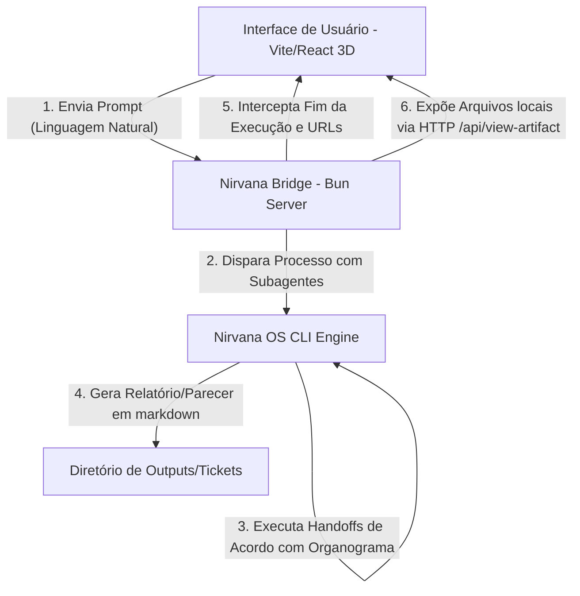
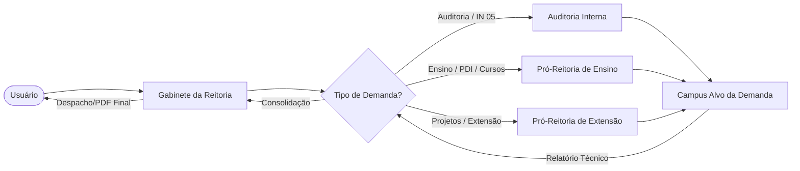

# 🏢 IFFar Headquarters (Claw3D Edition)

Este repositório contém o **Gêmeo Digital 3D Isométrico** da estrutura organizacional do **Instituto Federal Farroupilha (IFFar)**. O design e as interações foram totalmente inspirados na interface do projeto **Claw3D**, integrando visualização tridimensional em tempo real à engine de orquestração de agentes **Nirvana OS**.

---

## 📸 Arquitetura Geral do Sistema

A aplicação é dividida em três camadas principais:



1. **Frontend (Vite + React + Three.js + React Three Fiber)**:
   - Apresenta um layout de monitoramento estilo central cibernética.
   - Mostra o escritório do quartel-general (HQ) em projeção isométrica ortográfica 3D, com mobília procedimental (mesas de reunião, lounges de descanso e baias de trabalho).
   - Renderiza 175 personagens/agentes em estilo bloco (Voxel) com plaquinhas de identificação flutuantes e balões de pensamento.
   - Contém um **Visualizador de Documentos integrado** (modal na tela) que carrega os arquivos gerados sem barreiras de segurança do navegador.

2. **Nirvana Bridge (Bun HTTP Server)**:
   - Comunica-se com o frontend e escuta na porta `4000`.
   - Lê a hierarquia real em `org-chart.yaml`.
   - Executa o roteamento estrito de tarefas analisando palavras-chave do prompt.
   - Serve os relatórios gerados localmente via protocolo HTTP na rota `/api/view-artifact`.

3. **Nirvana OS (Agentes autônomos)**:
   - CLI que orquestra os subagentes e gera os artefatos de entrega na pasta `tickets/` ou `outputs/`.

---

## 🗺️ Mapa de Responsabilidades e Roteamento (Organograma)

As tarefas enviadas na caixa de linguagem natural ou via **Playbooks** são roteadas seguindo estritamente as regras de subordinação e áreas do IFFar:



- **Demandas de Fiscalização e Contratos (IN 05):** A câmera foca e a tarefa segue de: `Reitoria` ➔ `Auditoria Interna` ➔ `Campus Destino`.
- **Demandas de Ensino e Currículo:** `Reitoria` ➔ `Pró-Reitoria de Ensino` ➔ `Campus Destino`.
- **Demandas de Projetos e Ação Comunitária:** `Reitoria` ➔ `Pró-Reitoria de Extensão` ➔ `Campus Destino`.

---

## 📽️ Sistema de Câmera Dinâmica (HQ Tracking)

A câmera do ambiente 3D reage dinamicamente conforme os subagentes trabalham:

- **Visão Geral:** O sistema inicia centralizado no escritório mostrando o panorama completo do quartel-general.
- **Rastreamento Dinâmico (Camera Lerp):** Ao iniciar uma atividade, a câmera translada de forma suave (_camera lerp animation_) e dá um foco de zoom na baia do agente ativo na tarefa.
- **Thought Bubbles:** Um balão de pensamento animado (💬) surge sobre o agente focado descrevendo o que ele está fazendo.
- **Reset:** Ao finalizar, a câmera abre suavemente de volta à Visão Geral.

---

## 🚀 Como Executar Localmente

### Pré-requisitos

- Ter o [Bun](https://bun.sh) ou [Node.js](https://nodejs.org) instalado na máquina.
- Ter o Nirvana OS instalado para executar a ponte de agentes.

Copie `.env.example` para `.env` e ajuste os caminhos da sua instalação. O bridge escuta apenas em `127.0.0.1` por padrão e só permite abrir artefatos dentro dos diretórios configurados.

### Passos de Inicialização

1. Instalar as dependências do Frontend e do Servidor:

   ```bash
   bun install
   ```

2. Iniciar o servidor da ponte de dados (Nirvana Bridge):

   ```bash
   bun run nirvana-bridge.ts
   ```

3. Iniciar o servidor de desenvolvimento do Frontend Vite:

   ```bash
   bun run dev
   ```

4. Acesse o sistema pelo seu navegador de preferência:
   👉 **http://localhost:5173**

---

## 📁 Estrutura de Arquivos

```text
├── dist/                  # Build estático de produção do frontend
├── public/                # Modelos 3D (CesiumMan.glb) e assets
├── src/
│   ├── App.tsx            # Lógica 3D Isométrica, UI e Câmera Dinâmica
│   ├── index.css          # Estilos globais e tema Claw3D
│   └── main.tsx           # Entrypoint da aplicação React
├── vite.config.ts         # Configuração do Vite com suporte ao Tailwind v4
├── nirvana-bridge.ts      # Servidor HTTP/API Bridge de Handoffs e Artefatos
├── package.json           # Dependências e scripts do projeto
└── README.md              # Este manual de documentação
```
