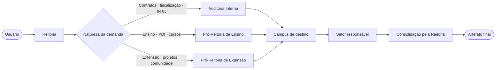
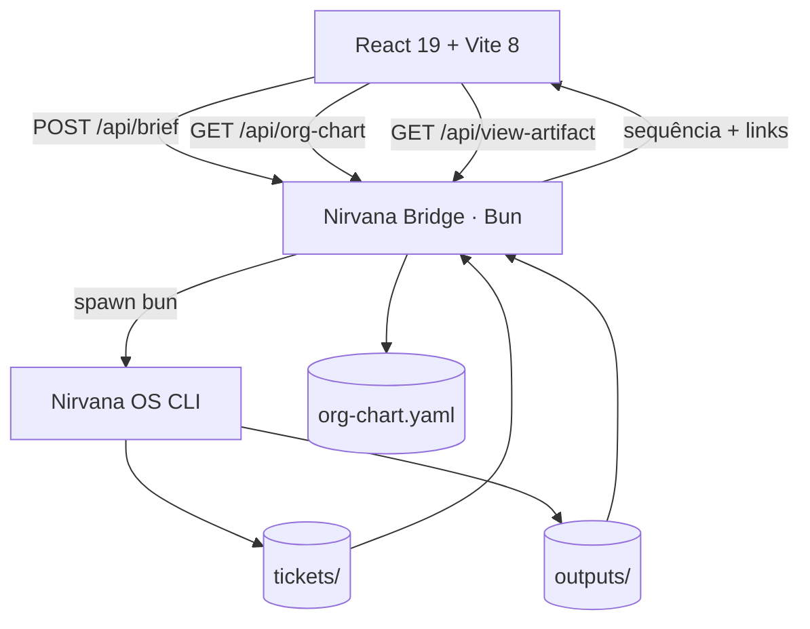
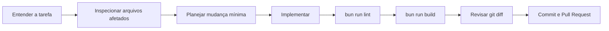

<div align="center">


# IFFar 3D Town

### Uma simulação visual 3D do Instituto Federal Farroupilha para explorar agentes, responsabilidades e fluxos institucionais.

<p>
  
  
  
  
  
</p>

<p>
  <a href="#-visão-geral">Visão geral</a> •
  <a href="#-início-rápido">Início rápido</a> •
  <a href="#-como-usar">Como usar</a> •
  <a href="#-arquitetura">Arquitetura</a> •
  <a href="#-uso-com-llms-e-agentes-de-codificação">LLMs de codificação</a> •
  <a href="#-solução-de-problemas">Solução de problemas</a>
</p>

</div>

---

## ✨ Visão geral

O **IFFar 3D Town** transforma uma representação mapeada do organograma do Instituto Federal Farroupilha em uma central tridimensional demonstrativa. As unidades implementadas aparecem como partes de um ambiente isométrico; após o processamento de uma demanda, a interface reproduz visualmente uma sequência de handoffs entre Reitoria, setores especializados e campi.

O projeto combina uma experiência visual em **React + Three.js** com um bridge local em **Bun**. Esse bridge conecta a interface ao **Nirvana OS**, dispara o fluxo institucional e devolve os artefatos produzidos para leitura dentro da própria aplicação.

> [!IMPORTANT]
> O repositório contém uma interface funcional e um bridge configurável. Para executar orquestrações reais, você precisa apontar o arquivo `.env` para uma instalação existente do Nirvana OS e para os diretórios do negócio `iffar`.

<table>
<tr>
<td width="33%" valign="top">

### 🏙️ Espaço 3D

Visualização isométrica com unidades, agentes, áreas de trabalho, câmera orbital e foco automático.

</td>
<td width="33%" valign="top">

### 🧭 Roteamento institucional

Demandas seguem uma cadeia visível entre Reitoria, área responsável, campus e consolidação final.

</td>
<td width="33%" valign="top">

### 📄 Artefatos integrados

Caminhos de artefatos retornados pelo bridge podem entrar no Inbox e ser lidos sem sair da interface.

</td>
</tr>
</table>

---

## 🎯 O que você consegue fazer

| Experiência                                 | O que acontece na prática                                                                    |
| ------------------------------------------- | -------------------------------------------------------------------------------------------- |
| **Explorar a sede virtual**                 | Navegue pelo ambiente 3D, altere o enquadramento e identifique unidades institucionais.      |
| **Enviar uma demanda em linguagem natural** | Digite um briefing ou use um playbook pronto para iniciar uma execução.                      |
| **Observar o handoff entre agentes**        | A câmera reproduz a sequência devolvida pelo bridge e exibe a ação prevista naquele estágio. |
| **Aplicar rotas por responsabilidade**      | Termos de contratos, ensino, extensão e campi direcionam a demanda para cadeias distintas.   |
| **Acompanhar Inbox e histórico**            | Artefatos localizados pelo bridge entram no Inbox; o histórico atual é demonstrativo.        |
| **Ler artefatos locais**                    | O bridge faz uma checagem lexical para aceitar caminhos sob os diretórios configurados.      |

### Rotas demonstradas



---

## ⚠️ Limites atuais do protótipo

Esta versão é uma **simulação visual determinística**, não um monitor operacional em tempo real.

| Limite atual                                                | Impacto prático                                                                                                                                 |
| ----------------------------------------------------------- | ----------------------------------------------------------------------------------------------------------------------------------------------- |
| **Nove agentes definidos no frontend**                      | A cena não é criada dinamicamente a partir de `org-chart.yaml`.                                                                                 |
| **Timeline reproduzida após o processo**                    | Os handoffs são animados por temporizadores depois que o bridge recebe a saída do processo Bun; não há streaming ou telemetria ao vivo.         |
| **Histórico demonstrativo**                                 | Os itens exibidos na aba History são estáticos nesta versão.                                                                                    |
| **Sucesso parcialmente validado**                           | A interface ainda não diferencia todos os cenários em que o processo termina com erro.                                                          |
| **Seleção heurística de artefato**                          | O bridge procura `result.md` no diretório de ticket mais recente ou usa um caminho de fallback; isso não comprova vínculo com a execução atual. |
| **URL de artefato fixa**                                    | Os links retornados e o indicador visual assumem `localhost:4000`, mesmo que host ou porta sejam alterados.                                     |
| **Sem health check, autenticação ou isolamento por origem** | A raiz retorna 404 e o bridge usa CORS `*`; mantenha-o em `127.0.0.1` e não trate a API como fronteira de segurança de produção.                |

> [!CAUTION]
> Use dados fictícios ou previamente sanitizados. O protótipo não deve processar documentos institucionais sensíveis sem endurecimento adicional do bridge, autenticação e testes de integração.

---

## ⚡ Início rápido

### Opção A — explorar somente a interface 3D

Use esta opção quando você quer conhecer o ambiente visual sem executar agentes do Nirvana OS.

**Requisitos:** Node.js `^20.19.0` ou `>=22.12.0` e npm.

```bash
git clone https://github.com/marciobisognin/GeniusAI.git
cd GeniusAI/iffar-3d-town
npm install --no-package-lock
npm run dev
```

Abra [http://localhost:5173](http://localhost:5173).

A interface será carregada normalmente. Os comandos que dependem do bridge informarão erro de conexão até que a opção completa seja configurada.

### Opção B — executar interface + Nirvana Bridge

**Requisitos:**

- [Bun](https://bun.sh/) para o bridge e os scripts do projeto;
- uma instalação funcional do Nirvana OS;
- o negócio `iffar` com `org-chart.yaml`, `tickets/` e `outputs/`;
- Git.

```bash
git clone https://github.com/marciobisognin/GeniusAI.git
cd GeniusAI/iffar-3d-town
bun install
cp .env.example .env
```

Edite `.env` com os caminhos reais da sua instalação. Depois, abra dois terminais no diretório `iffar-3d-town`.

<table>
<tr>
<td width="50%" valign="top">

**Terminal 1 — bridge**

```bash
bun run nirvana-bridge.ts
```

Ficará escutando em `http://127.0.0.1:4000`.

</td>
<td width="50%" valign="top">

**Terminal 2 — interface**

```bash
bun run dev
```

Abra `http://localhost:5173`.

</td>
</tr>
</table>

### Verificação mínima

```bash
bun run lint
bun run build
```

Resultado esperado:

- lint sem erros;
- build produzido em `dist/`;
- interface acessível na porta `5173`;
- bridge acessível na porta `4000` quando configurado.

---

## 🕹️ Como usar

### 1. Entenda a tela

```text
┌─────────────────────────────────────────────────────────────────┐
│ Cabeçalho: status, filtros e identificação da central           │
├───────────────────────────────────────────┬─────────────────────┤
│                                           │ PLAYBOOKS           │
│          Ambiente 3D do IFFar             │ INBOX               │
│                                           │ HISTORY             │
│   câmera + agentes + áreas de trabalho    │ prompt personalizado│
│                                           │ artefatos gerados   │
└───────────────────────────────────────────┴─────────────────────┘
```

### 2. Escolha uma forma de entrada

- **Playbook pronto:** use um dos cenários demonstrativos do painel lateral.
- **Prompt personalizado:** descreva a demanda, o tema e o campus de destino.

Exemplos:

```text
Fiscalizar o contrato de manutenção predial do Campus Alegrete conforme a IN 05/2017.
```

```text
Elaborar uma análise preliminar para atualização do PDI, envolvendo a Pró-Reitoria de Ensino e o Campus Panambi.
```

```text
Consolidar um relatório de projetos de extensão com impacto comunitário no Campus Santo Ângelo.
```

### 3. Acompanhe a reprodução visual

1. A Reitoria recebe o briefing.
2. O bridge identifica a área responsável pelas palavras-chave.
3. O processo do Nirvana OS é executado.
4. Ao término do processo, o bridge devolve uma sequência determinística.
5. A câmera reproduz os handoffs simulados por temporizadores.
6. Se o bridge localizar um caminho de artefato, ele entra no **Inbox**.

### 4. Abra o resultado

Clique no item do Inbox. A rota `/api/view-artifact` solicita o arquivo ao bridge, que aplica uma verificação lexical de caminho em relação a `IFFAR_TICKETS_DIR` e `IFFAR_OUTPUTS_DIR` antes de servir o conteúdo como Markdown.

Essa verificação ainda não resolve caminhos reais de links simbólicos e não restringe a extensão do arquivo. Portanto, ela reduz exposições acidentais, mas **não substitui autenticação, isolamento do processo ou uma política de acesso de produção**.

> [!NOTE]
> O roteamento atual é determinístico e baseado em palavras-chave. Ele é uma camada demonstrativa e pode ser substituído futuramente por regras declarativas derivadas do organograma.

---

## ⚙️ Configuração

Copie `.env.example` para `.env` e altere apenas os valores locais. O arquivo `.env` não deve ser versionado.

| Variável               |                  Padrão | Finalidade                                                                       |
| ---------------------- | ----------------------: | -------------------------------------------------------------------------------- |
| `VITE_BRIDGE_URL`      | `http://localhost:4000` | URL usada pelo frontend para acessar o bridge.                                   |
| `NIRVANA_BRIDGE_HOST`  |             `127.0.0.1` | Interface de rede do servidor. Mantenha o padrão local nesta versão.             |
| `NIRVANA_BRIDGE_PORT`  |                  `4000` | Porta HTTP do bridge. Os links de artefatos atuais ainda assumem a porta `4000`. |
| `NIRVANA_ENGINE_PATH`  |              sem padrão | Caminho completo de `brief-business.ts` no Nirvana OS.                           |
| `IFFAR_ORG_CHART_PATH` |              sem padrão | Caminho completo do `org-chart.yaml` do IFFar.                                   |
| `IFFAR_TICKETS_DIR`    |              sem padrão | Diretório onde as execuções produzem tickets.                                    |
| `IFFAR_OUTPUTS_DIR`    |              sem padrão | Diretório de resultados consolidados.                                            |

Exemplo conceitual:

```dotenv
VITE_BRIDGE_URL=http://localhost:4000
NIRVANA_BRIDGE_HOST=127.0.0.1
NIRVANA_BRIDGE_PORT=4000
NIRVANA_ENGINE_PATH=/home/usuario/nirvana-os/skills/businesses/scripts/brief-business.ts
IFFAR_ORG_CHART_PATH=/home/usuario/businesses/iffar/org-chart.yaml
IFFAR_TICKETS_DIR=/home/usuario/businesses/iffar/tickets
IFFAR_OUTPUTS_DIR=/home/usuario/businesses/iffar/outputs
```

---

## 🧱 Arquitetura



<table>
<tr>
<td width="33%" valign="top">

### Frontend

- React 19
- TypeScript 6
- Three.js
- React Three Fiber
- Drei
- Tailwind CSS 4
- Lucide React

</td>
<td width="33%" valign="top">

### Bridge

- Runtime Bun
- HTTP local
- CORS para o frontend
- spawn do Nirvana OS
- leitura do organograma
- entrega controlada de artefatos

</td>
<td width="33%" valign="top">

### Orquestração

- briefing em linguagem natural
- classificação por responsabilidade
- sequência de handoffs
- atualização visual da câmera
- resultado enviado ao Inbox

</td>
</tr>
</table>

### Endpoints locais

| Método | Endpoint                      | Uso                                                                                  |
| ------ | ----------------------------- | ------------------------------------------------------------------------------------ |
| `POST` | `/api/brief`                  | Recebe `{ "problem": "..." }`, executa o fluxo e devolve sequência e artefatos.      |
| `GET`  | `/api/org-chart`              | Lê o organograma configurado em `IFFAR_ORG_CHART_PATH`.                              |
| `GET`  | `/api/view-artifact?file=...` | Serve o conteúdo com tipo Markdown após uma checagem lexical do caminho configurado. |

### Estrutura do projeto

```text
iffar-3d-town/
├── public/                 # modelo 3D e assets públicos
├── src/
│   ├── assets/             # identidade visual
│   ├── App.tsx             # cena, interface, estados e integração HTTP
│   ├── App.css             # estilos específicos da aplicação
│   ├── index.css           # estilos globais e Tailwind
│   └── main.tsx            # entrada do React
├── .env.example            # contrato de configuração local
├── nirvana-bridge.ts       # API local e conexão com Nirvana OS
├── package.json            # scripts e dependências
├── vite.config.ts          # Vite + React + Tailwind
└── README.md               # guia visual e operacional
```

---

## 🧪 Desenvolvimento e qualidade

| Comando                     | O que faz                                      |
| --------------------------- | ---------------------------------------------- |
| `bun run dev`               | Inicia o frontend Vite em desenvolvimento.     |
| `bun run nirvana-bridge.ts` | Inicia o bridge local.                         |
| `bun run lint`              | Executa o Oxlint sobre os arquivos do projeto. |
| `bun run build`             | Gera o bundle de produção em `dist/`.          |
| `bun run preview`           | Serve localmente o build de produção.          |

### Fluxo recomendado para qualquer alteração



---

## 🤖 Uso com LLMs e agentes de codificação

O projeto pode ser trabalhado por agentes locais, IDEs com modo agente ou serviços em nuvem. A regra mais importante é fornecer **contexto, escopo, critérios de aceite e comandos de validação**.

### Preparação comum a todos os agentes

```bash
git clone https://github.com/marciobisognin/GeniusAI.git
cd GeniusAI/iffar-3d-town
bun install
bun run lint
bun run build
```

Antes de pedir alterações, informe ao agente:

- o objetivo funcional;
- quais arquivos ele pode modificar;
- o que não deve ser alterado;
- como verificar o resultado;
- que `.env`, credenciais, `tickets/`, `outputs/`, `dist/` e `node_modules/` não devem entrar no commit.

### Prompt-base recomendado

```text
Você está trabalhando no projeto iffar-3d-town do monorepo GeniusAI.

Antes de editar:
1. Leia README.md, package.json, src/App.tsx, nirvana-bridge.ts e .env.example.
2. Explique brevemente a arquitetura e identifique os arquivos afetados.
3. Proponha um plano mínimo e aguarde minha aprovação se houver mudança arquitetural.

Tarefa:
[DESCREVA A ALTERAÇÃO]

Restrições:
- Preserve React + TypeScript + Three.js + Bun.
- Não exponha segredos nem caminhos locais reais.
- Não versione .env, node_modules, dist, tickets ou outputs.
- Mantenha o bridge limitado a 127.0.0.1 por padrão.
- Preserve a validação de acesso aos artefatos.

Critérios de aceite:
[LISTE O COMPORTAMENTO ESPERADO]

Validação obrigatória:
- bun run lint
- bun run build
- git diff --check

Ao terminar, resuma os arquivos alterados, os testes executados e qualquer limitação real.
```

<details>
<summary><strong>OpenAI Codex CLI — instalação, análise e implementação</strong></summary>

### Instalação

```bash
npm install -g @openai/codex
codex
```

No primeiro uso, escolha **Sign in with ChatGPT** ou configure a autenticação indicada pela documentação oficial.

### Como usar neste projeto

```bash
cd GeniusAI/iffar-3d-town
codex
```

Primeiro prompt, somente para entendimento:

```text
Leia o README e os arquivos principais deste diretório. Não altere nada ainda.
Mapeie o fluxo entre App.tsx, nirvana-bridge.ts, org-chart, tickets e outputs.
Liste riscos técnicos e os comandos de validação disponíveis.
```

Depois, envie o prompt-base desta seção com sua tarefa. Peça explicitamente para o Codex executar `bun run lint`, `bun run build` e revisar o diff antes de concluir.

**Documentação oficial:** [Codex CLI](https://developers.openai.com/codex/cli/)

</details>

<details>
<summary><strong>Claude Code — contexto amplo e mudanças em múltiplos arquivos</strong></summary>

### Instalação

Instale o pacote oficial ou use um método nativo listado na documentação da Anthropic:

```bash
npm install -g @anthropic-ai/claude-code
```

Depois de executar `claude`, siga o fluxo de autenticação apresentado no terminal. Em ambientes corporativos, confirme previamente a política de uso, o provedor e a forma de autenticação autorizada.

### Como usar neste projeto

```bash
cd GeniusAI/iffar-3d-town
claude
```

Prompt inicial:

```text
Faça uma leitura do projeto sem editar arquivos. Explique a arquitetura em cinco blocos:
interface, cena 3D, roteamento, bridge e artefatos. Depois proponha um plano para [TAREFA].
```

Após revisar o plano, autorize a implementação e exija os três gates:

```bash
bun run lint
bun run build
git diff --check
```

Revise o diff apresentado pelo Claude antes de aceitar qualquer commit.

**Documentação oficial:** [Claude Code](https://code.claude.com/docs/en/overview)

</details>

<details>
<summary><strong>Google Gemini CLI — exploração do repositório e execução pelo terminal</strong></summary>

### Instalação

```bash
# executar sem instalação global
npx @google/gemini-cli

# ou instalar globalmente
npm install -g @google/gemini-cli
```

### Como usar neste projeto

```bash
cd GeniusAI/iffar-3d-town
gemini
```

Na primeira execução, escolha uma forma de autenticação suportada, como login com Google, chave da Gemini API ou Vertex AI. Nunca escreva chaves no prompt, no README ou em arquivos versionados; use as variáveis e mecanismos indicados pelo provedor.

Prompt recomendado:

```text
Analise README.md, package.json, src/App.tsx e nirvana-bridge.ts.
Crie primeiro um plano para [TAREFA], indicando arquivos, riscos e critérios de aceite.
Não faça mudanças fora de iffar-3d-town.
```

Você também pode executar uma análise não interativa:

```bash
gemini -p "Explique a arquitetura do projeto iffar-3d-town sem modificar arquivos"
```

Antes de encerrar, peça ao Gemini para executar:

```bash
bun run lint
bun run build
git diff --check
```

Revise o diff final antes de autorizar um commit.

**Documentação oficial:** [Gemini CLI](https://github.com/google-gemini/gemini-cli)

</details>

<details>
<summary><strong>GitHub Copilot cloud agent — trabalhar por issue e Pull Request</strong></summary>

O agente em nuvem do GitHub trabalha em um ambiente efêmero, cria uma branch e pode abrir um Pull Request. Ele exige uma assinatura compatível do GitHub Copilot, acesso habilitado no repositório e permissões adequadas.

### Como delegar

1. Abra uma issue no repositório `marciobisognin/GeniusAI`.
2. Use um título objetivo, como `feat(iffar-3d-town): adicionar filtro de campus`.
3. No corpo, cole o modelo abaixo.
4. Atribua a issue ao Copilot ou inicie uma sessão pelo painel de agentes.
5. Confirme que o ambiente do agente instala Bun antes dos gates; se necessário, adicione etapas de setup do Copilot ao repositório.
6. Revise o plano, os logs, o diff e os checks do PR antes do merge.

```text
Escopo: somente iffar-3d-town/

Objetivo:
[DESCREVA A MUDANÇA]

Contexto obrigatório:
- Ler iffar-3d-town/README.md
- Ler iffar-3d-town/src/App.tsx
- Ler iffar-3d-town/nirvana-bridge.ts

Não alterar:
- outros projetos do monorepo
- arquivos de credenciais ou outputs locais

Aceite:
[LISTE OS RESULTADOS OBSERVÁVEIS]

Checks:
cd iffar-3d-town
bun install
bun run lint
bun run build
git diff --check
```

**Documentação oficial:** [GitHub Copilot cloud agent](https://docs.github.com/en/copilot/concepts/agents/coding-agent/about-coding-agent)

</details>

<details>
<summary><strong>Cursor Agent — desenvolvimento visual dentro da IDE</strong></summary>

### Preparação

1. Instale o [Cursor](https://cursor.com/downloads).
2. Abra a pasta raiz `GeniusAI`.
3. Selecione `iffar-3d-town` como contexto principal.
4. Abra o Agent e comece em **Plan Mode** para mudanças não triviais.

Prompt inicial:

```text
Use apenas a pasta iffar-3d-town como escopo.
Leia o README e os arquivos principais, explique a arquitetura e planeje [TAREFA].
Não implemente até que o plano identifique arquivos, riscos e validações.
```

Depois de aprovar o plano:

1. peça a implementação;
2. confira cada arquivo no painel de revisão;
3. rode `bun run lint`, `bun run build` e `git diff --check` no terminal integrado;
4. rejeite alterações fora do escopo;
5. só então crie o commit ou Pull Request.

**Documentação oficial:** [Cursor Agent](https://docs.cursor.com/agent/overview)

</details>

<details>
<summary><strong>OpenCode — agente open source com múltiplos provedores</strong></summary>

### Instalação

```bash
npm install -g opencode-ai
```

### Configuração e uso

```bash
cd GeniusAI/iffar-3d-town
opencode
```

Dentro da interface:

1. use `/connect` para selecionar e autenticar um provedor;
2. use `/init` para analisar o projeto e criar contexto persistente quando apropriado;
3. comece em modo de planejamento para mudanças amplas;
4. envie o prompt-base desta seção;
5. revise o diff e execute lint, build e `git diff --check`.

Prompt curto recomendado:

```text
Planeje uma implementação para [TAREFA] limitada a iffar-3d-town.
Preserve a segurança do bridge e não altere outros projetos do monorepo.
Depois do meu aceite, implemente e execute os gates do README.
```

**Documentação oficial:** [OpenCode](https://opencode.ai/docs/)

</details>

### Checklist humano antes de aceitar código de qualquer agente

- [ ] O agente respeitou o escopo `iffar-3d-town/`.
- [ ] Nenhum segredo ou caminho pessoal foi incluído.
- [ ] `.env`, `dist/`, `node_modules/`, `tickets/` e `outputs/` continuam fora do commit.
- [ ] O bridge continua preso a `127.0.0.1` por padrão.
- [ ] A leitura de artefatos continua limitada aos diretórios configurados.
- [ ] `bun run lint` passou.
- [ ] `bun run build` passou.
- [ ] `git diff --check` passou.
- [ ] O diff foi revisado por uma pessoa antes do merge.

---

## 🔐 Segurança e privacidade

- O bridge usa `127.0.0.1` por padrão; não o exponha publicamente sem autenticação, proxy e revisão de segurança.
- A rota de artefatos faz uma checagem lexical sob `IFFAR_TICKETS_DIR` ou `IFFAR_OUTPUTS_DIR`, mas ainda não resolve links simbólicos nem restringe extensões.
- O bridge não possui autenticação e responde com CORS `*`; mantenha o host em `127.0.0.1`.
- Nunca coloque tokens, chaves, credenciais ou caminhos pessoais no repositório.
- Não versione `.env`, logs, outputs de execução ou documentos institucionais sensíveis.
- Revise o conteúdo dos artefatos antes de compartilhá-los fora do ambiente autorizado.

---

## 🧯 Solução de problemas

<details>
<summary><strong>A interface abre, mas aparece “Erro ao conectar com Nirvana Bridge”</strong></summary>

1. Confirme se `bun run nirvana-bridge.ts` está em execução.
2. Verifique `VITE_BRIDGE_URL` em `.env`.
3. Confirme que frontend e bridge usam as portas `5173` e `4000`.
4. Reinicie o Vite depois de alterar variáveis `VITE_*`.

</details>

<details>
<summary><strong>O bridge responde que NIRVANA_ENGINE_PATH não existe</strong></summary>

Abra `.env` e informe o caminho completo de `brief-business.ts`. Verifique o caminho no mesmo sistema operacional em que o bridge está rodando.

</details>

<details>
<summary><strong>O organograma não carrega</strong></summary>

Confirme que `IFFAR_ORG_CHART_PATH` aponta para um arquivo YAML existente e legível.

</details>

<details>
<summary><strong>O artefato retorna 404</strong></summary>

O arquivo precisa existir dentro de `IFFAR_TICKETS_DIR` ou `IFFAR_OUTPUTS_DIR`. Arquivos externos são bloqueados intencionalmente.

</details>

<details>
<summary><strong>npm ou Vite informa versão incompatível do Node.js</strong></summary>

Use Node.js `^20.19.0` ou `>=22.12.0`, conforme exigido pelo Vite 8 utilizado no projeto.

</details>

<details>
<summary><strong>O build alerta sobre chunk maior que 500 kB</strong></summary>

É um aviso de otimização, não uma falha. A cena 3D concentra bibliotecas grandes no bundle principal. Uma evolução futura pode aplicar code splitting e carregamento sob demanda.

</details>

---

## 🗺️ Próximas evoluções possíveis

- organograma carregado dinamicamente em vez de agentes fixos no frontend;
- regras de roteamento declarativas e auditáveis;
- testes automatizados para bridge e classificação de demandas;
- code splitting da cena 3D;
- autenticação para cenários além do uso local;
- telemetria de handoffs e tempo de execução;
- captura de screenshots e demonstração em vídeo no README.

---

## 🤝 Contribuição

1. Crie uma branch a partir da `main`.
2. Mantenha a alteração limitada ao objetivo do PR.
3. Atualize este README quando mudar instalação, configuração ou comportamento.
4. Execute lint, build e `git diff --check`.
5. Abra um Pull Request com resumo, evidências e limitações reais.

---

<div align="center">

### Uma leitura visual e didática de como responsabilidades institucionais podem ser representadas em uma experiência 3D.

**Projeto:** [GeniusAI](https://github.com/marciobisognin/GeniusAI)<br>
**Autor:** Marcio Bisognin<br>
**Licença:** [MIT](../LICENSE)

</div>
