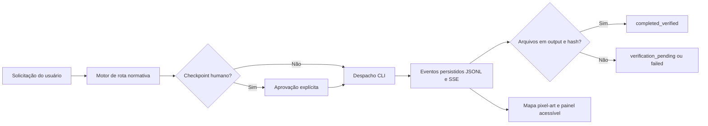

# IFFar Pixel Art

> Centro operacional espacial do IFFar para transformar uma demanda em uma rota institucional, executar o trabalho por CLI e só declarar entrega após a verificação de artefatos.

## O que é

IFFar Pixel Art é uma aplicação local completa, distinta do squad de conhecimento. Ela reúne quatro camadas no mesmo produto:

1. **Rede institucional gerada**: 453 agentes técnicos (um por posição normativa), cada um com manifesto, skills operacionais delimitadas, runbook e proveniência na Portaria.
2. **Console visual** em React/Vite: recebe a solicitação, mostra Reitoria e campi em mapa pixel-art, permite inspecionar todos os agentes de cada espaço e apresenta eventos de execução.
3. **Bridge operacional** em Node.js: interpreta a rota normativa, aplica checkpoints humanos, inicia um executor CLI registrado e persiste evidências de cada run.
4. **Contrato de entrega verificável**: cada demanda recebe um perfil proporcional. A entrega padrão exige índice documentado; `ppc-complete` é um cenário especializado de teste que exige PDF estruturalmente válido, relatório, planilha válida e curso explicitamente informado. Cada arquivo é registrado com SHA-256.

A ferramenta aceita qualquer solicitação: regras conhecidas produzem uma rota especializada; solicitações sem regra entram em **triagem institucional** e recebem uma entrega documentada padrão. PPC não é a única finalidade do produto — é apenas o perfil mais rigoroso para testar a verificação de artefatos compostos.

## Fluxo operacional



## Dados institucionais

A base é a Portaria Eletrônica nº 876/2026-GRE, de 03/07/2026:

- 14 raízes: Reitoria e 13 campi.
- 438 Uorgs e 453 posições, convertidas em 453 perfis de agentes técnicos.
- `node_id` é a identidade técnica da unidade. Códigos podem ser ambíguos.
- Cada manifesto traz página/linha de origem, skills com proveniência `operational-derived` e um runbook; nenhum perfil representa ocupante real do cargo.
- Títulos de posição iguais a `-` aparecem como **Cargo não especificado na fonte**.
- As inconsistências de origem são preservadas em `data/source-anomalies.yaml`; o sistema não as corrige por suposição.

## Início rápido

```bash
cd iffar-pixel-art
npm install
npm run generate:agents
cp config/executors.example.json config/executors.json
npm run dev
```

Em outro terminal:

```bash
npm run web -- --host 127.0.0.1
```

- Interface: `http://127.0.0.1:5174`
- Bridge local: `http://127.0.0.1:4310`
- Diagnóstico de executores: `curl http://127.0.0.1:4310/health`

O bridge usa `127.0.0.1` por padrão. Para permitir que uma CLI escreva em um projeto externo, defina uma ou mais raízes permitidas antes de iniciar o bridge:

```bash
export IFFAR_ALLOWED_WORK_ROOTS="$HOME/projetos:$HOME/Documentos"
npm run dev
```

## Executores

`config/executors.example.json` documenta os adaptadores de Codex CLI, Claude Code e OpenCode. O bridge verifica **separadamente** a existência do binário e a autenticação quando o adaptador possui uma checagem configurada. Nenhum desses sinais é presumido.

- **Codex CLI:** recebe o brief por stdin com `codex exec`.
- **Claude Code/OpenCode:** recebem o brief como argumento, conforme o adaptador configurado.
- **Antigravity ou outra CLI:** adicione uma entrada explícita no arquivo local `config/executors.json`, com vetor de argumentos conhecido e revisado. Esse arquivo é ignorado pelo Git para não expor configuração local ou credenciais.

O usuário ainda precisa estar autenticado no executor escolhido. Executar um run é uma ação explícita da interface. Atividades com efeito administrativo, financeiro, contratual ou externo exigem aprovação humana autenticada: configure `IFFAR_APPROVAL_TOKEN` no servidor e informe identificador, motivo e token no checkpoint. O token não é persistido nem registrado nos eventos.

## Estados que não se confundem

| Estado | Significado |
|---|---|
| `prepared` | rota e brief foram preparados; nada foi executado |
| `awaiting_human_approval` | o gateway bloqueou o despacho até uma aprovação explícita |
| `running` | o processo filho foi iniciado pelo bridge |
| `verification_pending` | a CLI encerrou sem artefato, ou o processo foi interrompido |
| `prepared` com `phase: blocked` | rota preservada, mas despacho bloqueado por executor sem autenticação ou indisponível |
| `completed_verified` | saída não vazias foram encontradas e receberam hash SHA-256 |
| `failed` | a CLI não iniciou ou retornou erro |

## Qualidade e segurança

```bash
npm test
npm run build
npm run check
```

Os testes cobrem rota genérica, catálogo de agentes, PPC como perfil especializado, curso obrigatório, assinaturas mínimas de PDF/XLSX, rejeição de arquivos renomeados, contenção contra symlink, normalização de cargo, allowlist de artefatos e execução de runbook com `--event-file`. O bridge não usa shell para executar CLIs, só aceita executores registrados e canoniza o diretório de trabalho dentro das raízes autorizadas.

## Estrutura

```text
iffar-pixel-art/
├── src/                 # interface React e mapa pixel-art acessível
├── server/              # bridge, rota, persistência, SSE e validação
├── data/                # estrutura, catálogo de agentes e evidências normativas
├── agent-manifests/     # 453 perfis técnicos gerados a partir das posições
├── scripts/             # gerador do catálogo e runbook operacional
├── config/              # exemplo de adaptadores CLI
├── docs/                # arquitetura e operação
└── workspace/           # área padrão local para trabalho dos executores, ignorada pelo Git
```

## Limites honestos

A aplicação fornece o mecanismo de execução real, mas não instala nem autentica CLIs de terceiros. Um executor indisponível continua indisponível, e não é substituído por animação ou resultado inventado. A publicação, envio de mensagens, atos administrativos e qualquer saída externa permanecem dependentes de autorização humana no fluxo.

---

Licença: MIT. Criado por Marcio Bisognin. Instagram: @marciobisognin.
