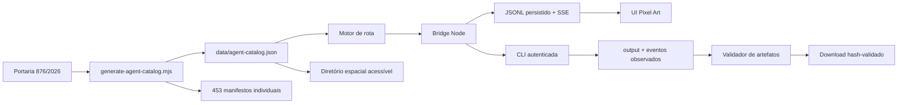

# Arquitetura operacional

## Delimitação e fonte de verdade

O IFFar Pixel Art é um **produto executável** no GeniusAI, não apenas um squad ou um mapa. O squad homônimo no `Squads-Genius` e o protótipo `iffar-3d-town` são fontes de referência; o runtime deste produto é independente.

A Portaria Eletrônica nº 876/2026-GRE é a fonte institucional. Dela são extraídos 14 raízes, 438 Uorgs e 453 posições. A aplicação não identifica pessoas ocupantes de cargos e não transforma metadados de organograma em autorização humana.



## Agentes institucionais

Cada posição normativa se torna um perfil técnico em `data/agent-catalog.json` e em `agent-manifests/`.

| Campo | Origem | Regra |
|---|---|---|
| `id`, Uorg, código, raiz e cargo | Portaria | identidade técnica estável; `node_id` não é substituído por código ambíguo |
| página e linha de tabela | Portaria | evidência de proveniência |
| referências de artigos | Portaria | correlação textual, sempre apresentada como referência |
| skills | derivação operacional | têm `provenance: operational-derived`; não são atribuídas à Portaria como competência legal específica |
| runbook | contrato do produto | não é uma pessoa e não autoriza atos externos |

O comando `npm run generate:agents` recria o catálogo e os 453 manifestos a partir do dado institucional. Não edite manifestos individualmente: a correção deve ocorrer na fonte ou no gerador.

## Processo, eventos e visualização

O mapa é uma projeção, não uma fonte de verdade. Ele permite inspeção por Uorg e mostra todos os agentes da Reitoria ou do campus selecionado. Uma rota seleciona apenas as unidades pertinentes à demanda; não é correto fazer todo pedido passar pelos 453 agentes.

Há três categorias de evento:

1. **Planejamento persistido:** `run.prepared` e `run.awaiting_human_approval`. Eles mostram a rota, mas não movimentam avatares.
2. **Bridge observado:** `run.dispatched`, `run.started`, falhas e validações. Prova que o bridge iniciou ou observou o processo filho, não prova a entrega.
3. **Atividade de agente observada:** `agent.work_completed` e `agent.handoff_observed`. A CLI só pode registrar esses eventos depois de executar uma atividade; o bridge aceita IDs presentes na rota e retransmite os registros via SSE. Somente esses eventos destacam o avatar correspondente.

O runbook local pode ser exercitado sem LLM:

```bash
npm run runbook -- \
  --agent 'agent:1.1.1:1:presidente' \
  --event-file /tmp/observed-events.jsonl \
  --brief /tmp/brief.md
```

Ele escreve um `handoff.md` e um evento `agent.runbook_completed`. Isso comprova apenas esse runbook local, não um ato institucional ou artefato final.

## Contrato de execução e artefatos

| Camada | Responsabilidade | Evidência |
|---|---|---|
| UI React | entrada, diretório de agentes, mapa, timeline e downloads | dados recebidos da API |
| Motor de rota | tema, campus, Uorgs, agentes, handoffs e perfil de entrega | `route` em `run.json` |
| Gate humano | bloqueia risco administrativo, financeiro, contratual ou externo | token do servidor + identificador + motivo, sem persistir o token |
| Bridge Node | inicia CLI registrada sem shell e persiste evidência | `events.jsonl`, `stdout.log`, `stderr.log`, `run.json` |
| Coletor de eventos | lê `output/observed-events.jsonl`, valida agente, rota e `runbookId` | eventos SSE normalizados |
| Verificador | aplica allowlist, hash, assinatura estrutural e perfil | `artifacts` e `artifactCheck` |
| Entrega | serve somente artefato confinado e hash-validado | endpoint de download local |

Toda solicitação entra pela rota: temas reconhecidos usam cadeia especializada; temas desconhecidos seguem para triagem institucional com entrega documentada padrão. `ppc-complete` é um **perfil especializado de teste** para uma demanda de PPC e exige simultaneamente:

- curso informado explicitamente no campo próprio;
- documento em **PDF** com cabeçalho, EOF e tamanho mínimo;
- relatório de consistência/auditoria com conteúdo textual material;
- planilha curricular em CSV estruturado ou XLSX com pacote OOXML reconhecido.

A saída sem qualquer requisito fica em `verification_pending`, mesmo se a CLI retornar código zero. Essa checagem estrutural não substitui a revisão pedagógica ou humana do conteúdo.

## Estados independentes

`state`, `liveness`, `gate`, `completion`, `delivery` e `integrity` são eixos distintos. Em especial:

- `prepared` não é execução;
- `dispatched` e `running` não são entrega;
- `completed_verified` exige arquivos aceitos, hashes e perfil de artefato atendido;
- após reinicialização durante `dispatched` ou `running`, o bridge reduz o run a `verification_pending`;
- executor ausente ou sem login mantém a rota auditável, mas registra `phase: blocked` e não cria processo filho.

## Segurança por padrão

1. O bridge escuta somente em loopback por padrão.
2. Não usa shell, `eval` ou comando livre: apenas `argv` de executor registrado.
3. Disponibilidade e autenticação são verificadas separadamente; o texto “Not logged in” é tratado como não autenticado mesmo com código de saída zero.
4. Diretórios de trabalho têm ancestral e destino canonizados por `realpath()` contra `IFFAR_ALLOWED_WORK_ROOTS`; symlinks que escapam são rejeitados.
5. O checkpoint humano requer `IFFAR_APPROVAL_TOKEN`, identificador e motivo; o token nunca entra em `run.json` ou eventos.
6. A saída fica confinada a `output/` da execução.
7. O bridge não entrega `observed-events.jsonl`, arquivos vazios ou extensões fora da allowlist.
8. O download recalcula SHA-256 antes de servir o arquivo.
9. Configuração local de executor é ignorada pelo Git.

## Acessibilidade

O mapa usa botões semânticos para os espaços. A mesma informação é exposta como diretório navegável de Uorgs/agentes, rota textual, checklist de entregas, timeline e status. Há foco visível, contraste reforçado e respeito a `prefers-reduced-motion`.
