# SO-IA — Sistema Operacional de IA

> Um sistema de agentes de IA que se monta sozinho a partir do organograma
> da sua empresa ou órgão público — em vez de vir pronto com um catálogo
> genérico que ninguém pediu.

Baseado no [PRD v2.0](docs/PRD-so-ia-v2.md), pensado para atender tanto
**empresas privadas (20–500 colaboradores)** quanto o **setor público
brasileiro** (âncora: Instituto Federal Farroupilha / Coordenação de
Licitação e Contratos).

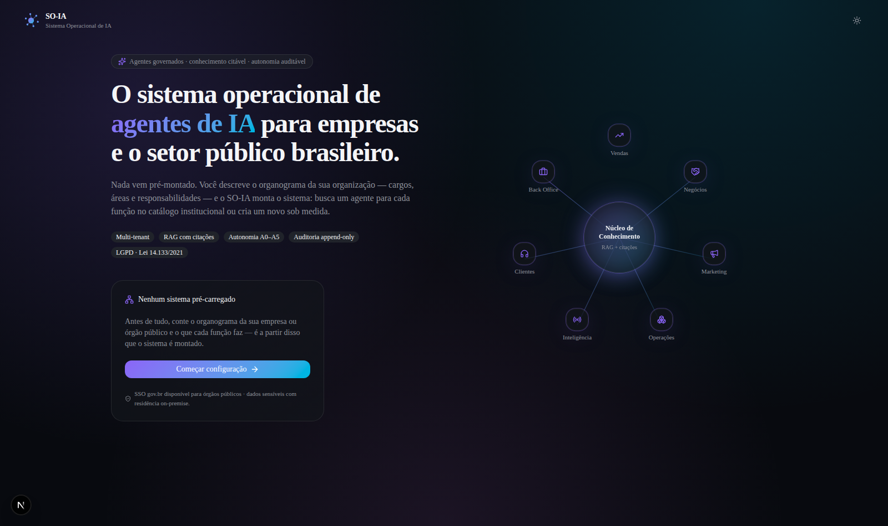

---

## Em uma frase

Você conta **quem faz o quê** na sua organização, e o SO-IA monta, para
cada função, um agente de IA — reaproveitando um agente pronto do catálogo
quando ele serve, ou criando um novo na hora quando não serve.

## Por que não vem tudo pronto?

Porque "um catálogo genérico de agentes" raramente encaixa na estrutura
real de uma empresa ou de um órgão público — cada organização tem seus
próprios cargos, suas próprias responsabilidades e sua própria hierarquia.
Em vez de forçar isso num molde fixo (o antigo "Modo Empresa" / "Modo
Governo" pré-carregado), o SO-IA começa **em branco** e só monta o sistema
depois de entender a sua organização.

---

## Como funciona, passo a passo

### 1. Você diz o tipo de organização

Empresa privada ou órgão público, e o nome da organização. Isso só ajusta o
vocabulário e o tema visual (cores) do restante do sistema.

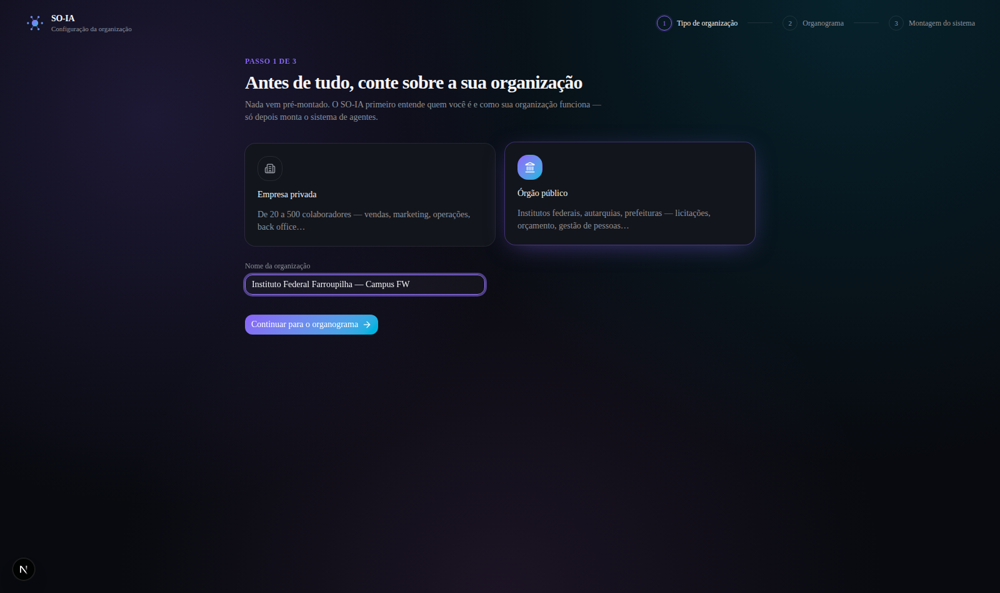

### 2. Você monta o organograma

Para cada cargo/função: **qual é o nome**, **em qual área** ele fica, **quais
são as responsabilidades** (em texto livre, viram tags) e **a quem ele se
reporta** — isso monta a hierarquia. Dá para começar do zero ou carregar um
exemplo pronto só para acelerar (e depois editar à vontade).

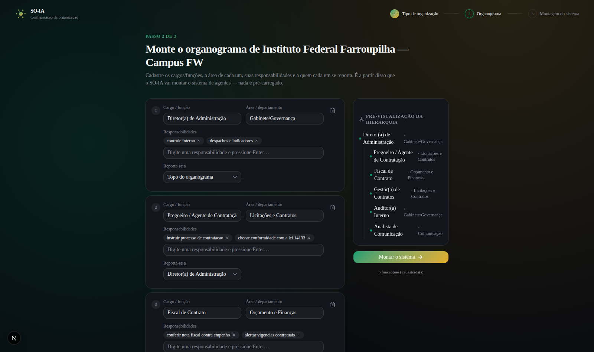

### 3. O sistema é montado sozinho

Para cada função, o SO-IA:

1. Compara as responsabilidades cadastradas com a descrição e as *skills*
   de cada agente do **catálogo institucional** (uma biblioteca de agentes
   já prontos, comum a todas as organizações).
2. Se encontra um agente com sobreposição suficiente, **reaproveita** esse
   agente para a função.
3. Se não encontra nada parecido, **cria um agente novo na hora** — com
   nome, descrição e *skills* derivados das responsabilidades daquele
   cargo.

O mesmo raciocínio vale para as **áreas**: cada área do organograma vira um
**squad** (um time de agentes com um líder). Antes de criar um squad, o
sistema consulta o **repositório de squads**; só quando nenhum serve, a
**Ferramenta de Criação de Squads** é acionada — operada pelo melhor squad
do repositório, o *Squad de Fundação*.

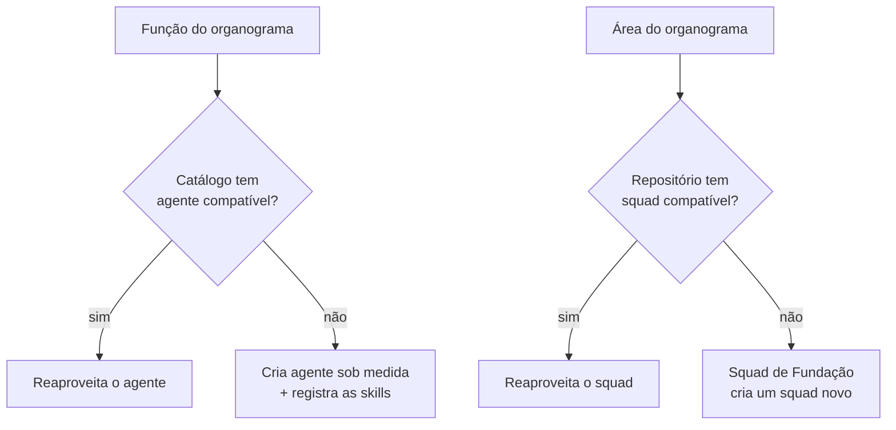

Isso acontece com uma pequena animação, função por função — não é uma
tabela estática, é um processo que você acompanha acontecendo:

<table>
<tr>
<td width="50%">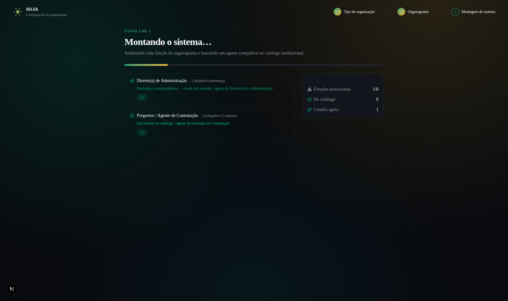<br/><sub>Durante — buscando um agente compatível</sub></td>
<td width="50%">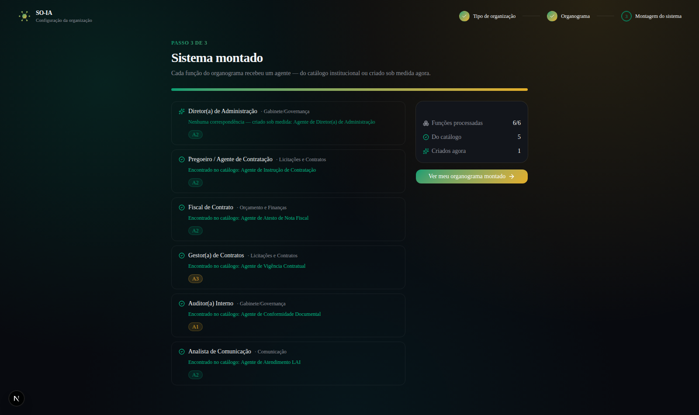<br/><sub>Ao final — cada função resolvida</sub></td>
</tr>
</table>

### 4. Pronto: cada função tem seu agente

O resultado vira uma árvore navegável — o seu organograma, agora com um
agente de IA atribuído a cada caixinha, pronto para ser executado.

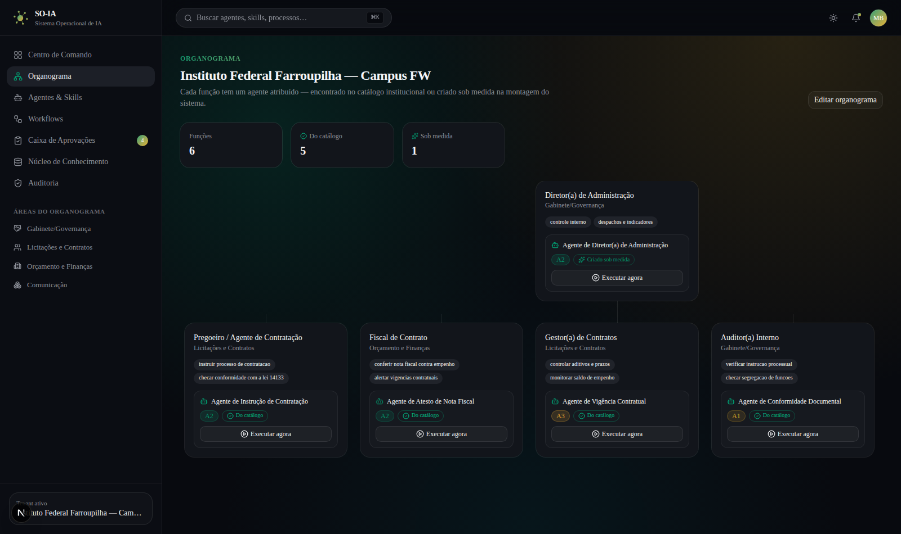

E o catálogo de agentes passa a mostrar exatamente os agentes que foram
atribuídos ao *seu* organograma — não mais uma lista genérica:

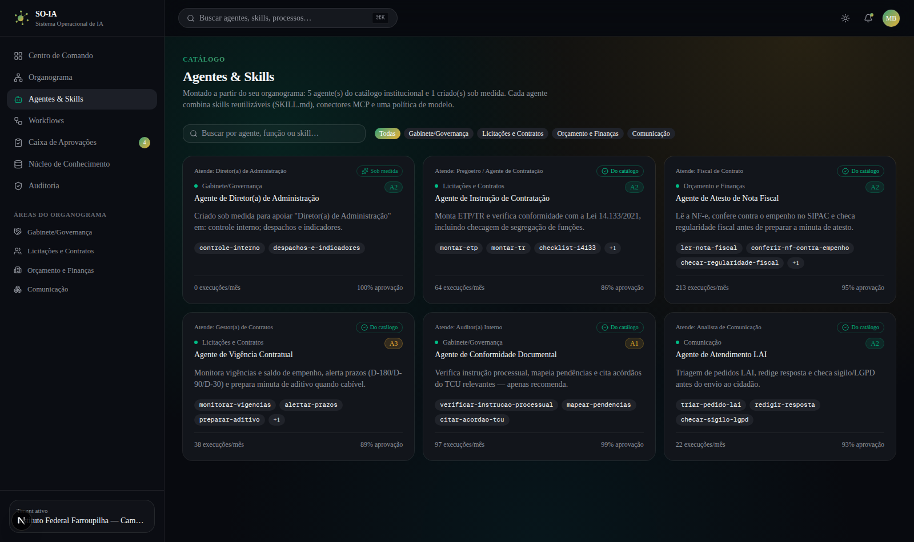

E o resto do sistema — Centro de Comando incluído — já reconhece a sua
organização pelo nome real, não por um tenant fictício:

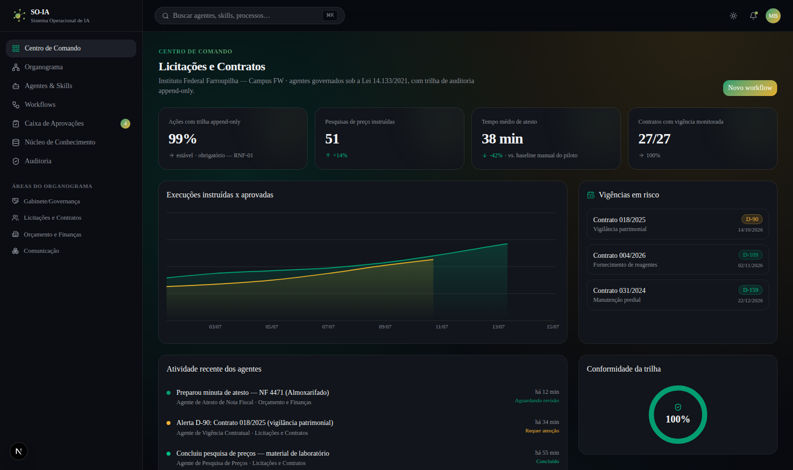

### 5. Squads por área — reaproveitados ou criados

A página **Squads** mostra um squad por área do organograma, cada um com
seu líder (a função mais alta daquela área na hierarquia), e ao lado o
repositório institucional — deixando claro o que foi reaproveitado e o que
o *Squad de Fundação* criou na hora:

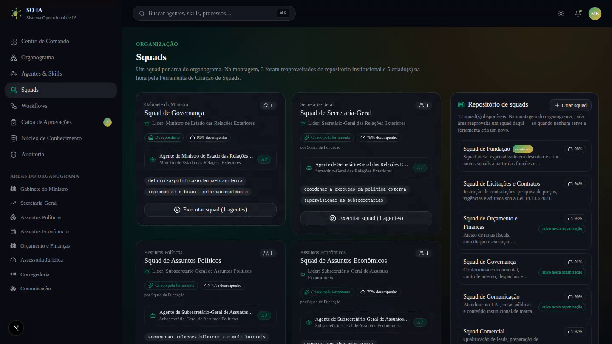

### 6. O grafo é operacional, não decorativo

No **Núcleo de Conhecimento**, cada nó maior do grafo é um agente real do
seu organograma e cada ponto menor é uma skill dele. Dá para clicar num
agente e **executá-lo dali** — a execução fica registrada e aparece no feed
do Centro de Comando:

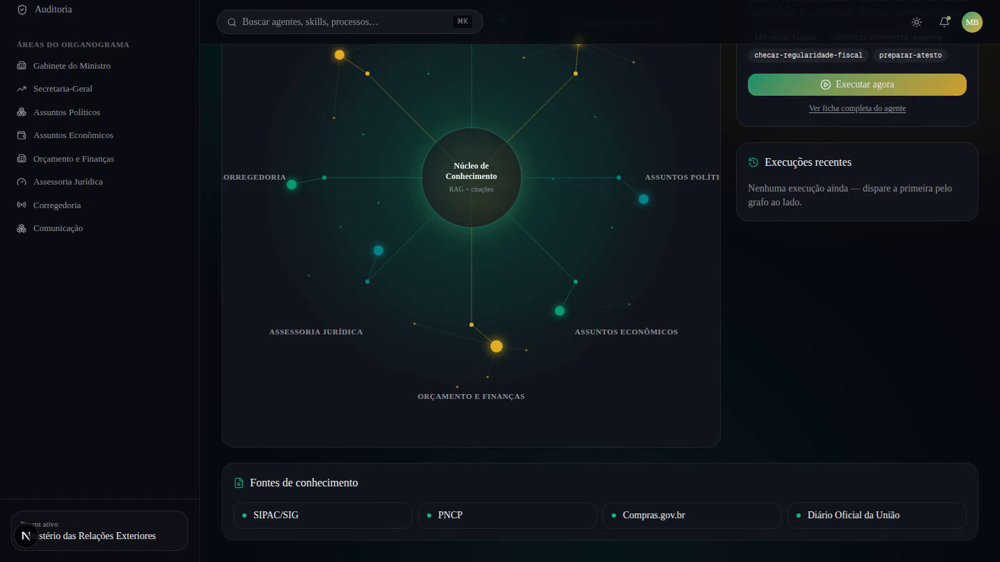

### 7. Sem área no organograma, sem ferramenta no sistema

Esta é a regra que governa todo o conteúdo: **pendências, KPIs, widgets,
fontes de conhecimento e workflows só existem se o organograma tiver a área
correspondente** (ou responsabilidades que cubram o assunto).

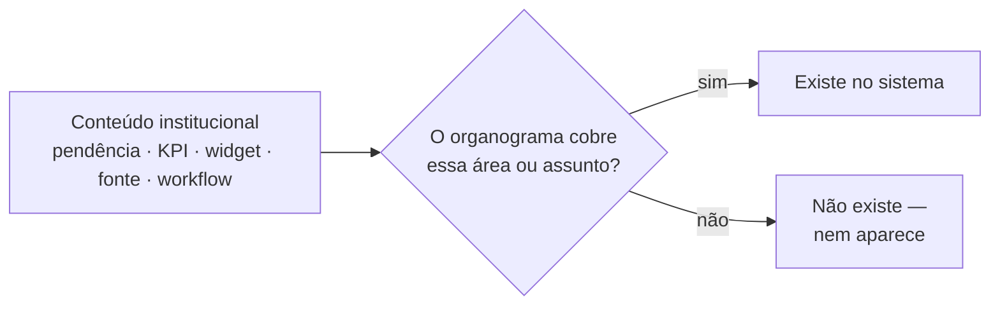

Na prática:

- Organograma **sem área financeira/contratos** → nenhuma pendência de nota
  fiscal, nenhum widget de vigência de contrato, nenhuma fonte PNCP/Compras.gov.br,
  nenhum workflow de pesquisa de preços. A Caixa de Aprovações fica vazia
  e explica o porquê.
- Organograma **com** essas áreas → as ferramentas correspondentes aparecem.
- Os KPIs do Centro de Comando são derivados do estado real: funções,
  agentes (do catálogo × sob medida), squads (reaproveitados × criados) e
  aprovações pendentes — e o contador da Caixa de Aprovações na barra
  lateral é a contagem real, não um número fixo.
- Se nenhum workflow de exemplo cobre as suas áreas, o sistema **gera um
  workflow a partir de uma função real do seu organograma** (as skills do
  agente + um gate de revisão humana no final).

<table>
<tr>
<td width="50%">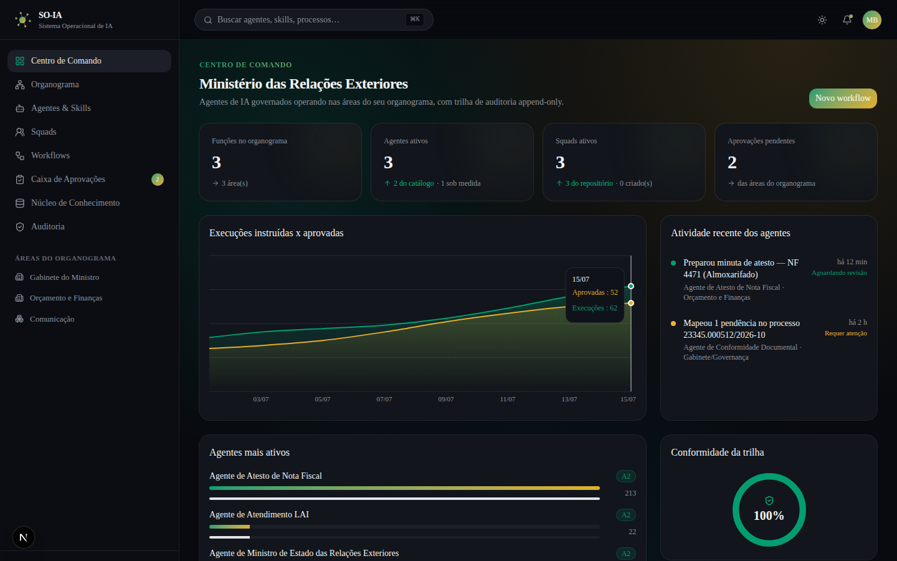<br/><sub>KPIs reais: funções, agentes, squads e pendências do organograma</sub></td>
<td width="50%">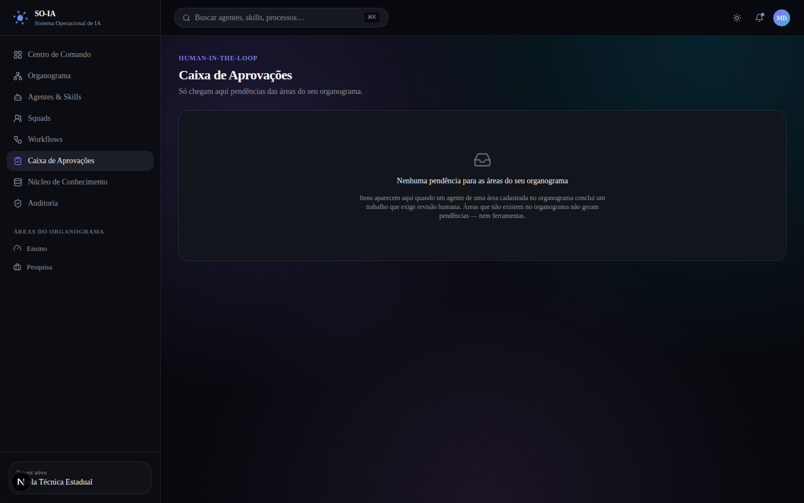<br/><sub>Organograma de ensino, sem área financeira → caixa vazia, sem ferramentas de NF</sub></td>
</tr>
</table>

---

## Conceitos-chave

| Termo | O que significa aqui |
|---|---|
| **Organograma** | A estrutura de cargos/funções que você cadastra: título, área, responsabilidades e hierarquia. É o único "input" que o sistema precisa para se montar. |
| **Catálogo institucional** | A biblioteca de agentes de IA já existentes (ex.: *Agente de Atesto de Nota Fiscal*, *Agente de Triagem de Tickets*) que o sistema tenta reaproveitar antes de criar algo novo. |
| **Agente "do catálogo"** | Quando uma função do organograma encontrou um agente pronto compatível o suficiente. |
| **Agente "sob medida"** | Quando nenhum agente do catálogo serviu, e um novo foi criado especificamente para aquela função. |
| **Skill (SKILL.md)** | Uma capacidade reutilizável de um agente (ex.: `conferir-nf-contra-empenho`), no formato aberto SKILL.md da Anthropic. Skills geradas na montagem entram no registro com origem "gerada". |
| **Squad** | O time de agentes de uma área do organograma, com um líder (a função mais alta da área). |
| **Repositório de squads** | A biblioteca de squads institucionais consultada antes de criar qualquer squad novo. Squads criados ficam salvos para as próximas montagens. |
| **Squad de Fundação** | O squad-meta com melhor desempenho do repositório — é ele quem opera a Ferramenta de Criação de Squads quando um squad novo precisa nascer. |
| **Cobertura do organograma** | A regra que decide se um conteúdo (pendência, KPI, fonte, workflow) existe no sistema: só quando o organograma tem a área ou responsabilidades que cubram o assunto (`src/lib/org/relevance.ts`). |
| **Autonomia (A0–A5)** | O quanto um agente pode agir sem revisão humana — de A0 (só observa) até A5 (autonomia ampliada). Atos administrativos vinculados ficam travados em A2 (prepara, mas não decide). |
| **Auditoria append-only** | Todo registro de execução/decisão de agente é imutável e rastreável — nunca sobrescrito. |
| **Conector MCP** | A forma padronizada (Model Context Protocol) como um agente se conecta a um sistema externo (SIPAC, PNCP, CRM etc.). |

---

## Rodando localmente

```bash
cd so-ia
npm install
npm run dev
```

Abra `http://localhost:3000`. Sem uma organização configurada, qualquer
tela do app (`/app/*`) redireciona automaticamente para o onboarding — não
tem como "pular" a etapa de configuração.

## Mapa de telas

| Rota | O que você encontra |
|---|---|
| `/` | Landing — apresenta o produto e leva para o onboarding (ou direto para o Centro de Comando, se você já configurou uma organização antes). |
| `/onboarding/tipo` | Passo 1 — tipo de organização + nome. |
| `/onboarding/organograma` | Passo 2 — construtor de organograma. |
| `/onboarding/montagem` | Passo 3 — console animado da montagem (busca no catálogo / criação de agente, função por função). |
| `/app/organograma` | O organograma final, em árvore, com o agente de cada função e um botão "Executar agora". |
| `/app/agentes` | Catálogo de Agentes & Skills — os agentes realmente atribuídos ao seu organograma (aba Agentes) e o registro de skills com origem catálogo/gerada (aba Skills). |
| `/app/squads` | Um squad por área do organograma + o repositório de squads, com a Ferramenta de Criação de Squads (operada pelo Squad de Fundação). |
| `/app/conhecimento` | Núcleo de Conhecimento — o grafo operacional (agentes e skills reais, executáveis dali) e as fontes conectadas, filtradas pelas áreas do organograma. |
| `/app/dashboard` | Centro de Comando — KPIs derivados do estado real da organização, execuções disparadas pelo grafo e atividade filtrada pelas áreas do organograma. |
| `/app/workflows` | O workflow de exemplo da sua área (pesquisa de preços / funil comercial) — ou, se o organograma não tem essa área, um workflow **gerado de uma função real** do organograma. |
| `/app/aprovacoes` | Caixa de aprovações *human-in-the-loop* — só pendências das áreas do seu organograma, com citações verificáveis. |
| `/app/aprovacoes/atesto-nf` | Cenário de referência (§9.1 do PRD): um atesto de nota fiscal completo, do início ao fim, com citações e trilha de auditoria. |
| `/app/auditoria` | Trilha de auditoria append-only dos atos dos agentes. |

## Stack técnica

- **Next.js 16** (App Router, Turbopack) + **TypeScript**
- **Tailwind CSS v4**
- **shadcn/ui** (sobre `@base-ui/react`) para os componentes de base
- **Framer Motion** para as animações (onboarding, gráfico radial, console de montagem, contadores)
- **Recharts** para os gráficos do Centro de Comando
- **next-themes** para dark/light mode

Todo o estado do organograma e da montagem vive em `OrganizationProvider`
(`src/components/providers/organization-provider.tsx`) e fica salvo no
`localStorage` do navegador. Os motores do sistema:

| Motor | Arquivo | O que faz |
|---|---|---|
| Correspondência/criação de agentes | `src/lib/org/matching.ts` | Casa cada função com o catálogo ou sintetiza um agente novo. |
| Registro de skills | `src/lib/org/skills-registry.ts` | Registra skills geradas na montagem (origem catálogo/gerada). |
| Squads + repositório | `src/lib/org/squads.ts` + `squad-registry.ts` | Um squad por área: reaproveita do repositório ou cria via Squad de Fundação. |
| Cobertura do organograma | `src/lib/org/relevance.ts` | Decide se um conteúdo institucional existe para esta organização. |
| Gerador de workflows | `src/lib/org/workflow-builder.ts` | Gera um workflow a partir de uma função real quando nenhum exemplo cobre as áreas. |

## O que ainda é simulado (por enquanto)

Este é o primeiro incremento do produto: a camada de apresentação.

- A "criação de um agente novo" (e de squads) é uma síntese determinística
  no cliente (compara palavras-chave), não uma chamada real a um LLM.
- Os cenários de referência (pendências de aprovação, feed de atividade,
  vigências) são **filtrados pelo organograma** — só aparecem se a área
  existir — mas o conteúdo interno de cada item (valores, números de
  processo) ainda é um exemplo ilustrativo fixo.
- Nenhuma integração real (SIPAC, PNCP, Compras.gov.br, SIAFI etc.) foi
  implementada ainda.

## Próximos passos

Ver o roadmap em 5 fases no PRD (§25). Depois desta camada de apresentação,
faltam: multi-tenancy real, geração de agentes via LLM de verdade, RAG com
citações vivas, motor de autonomia A0–A5 com guardrails, e os conectores
MCP para os sistemas governamentais e de CRM.
